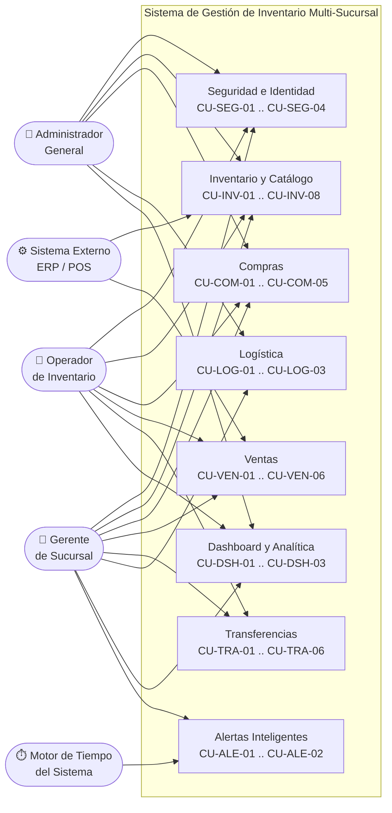
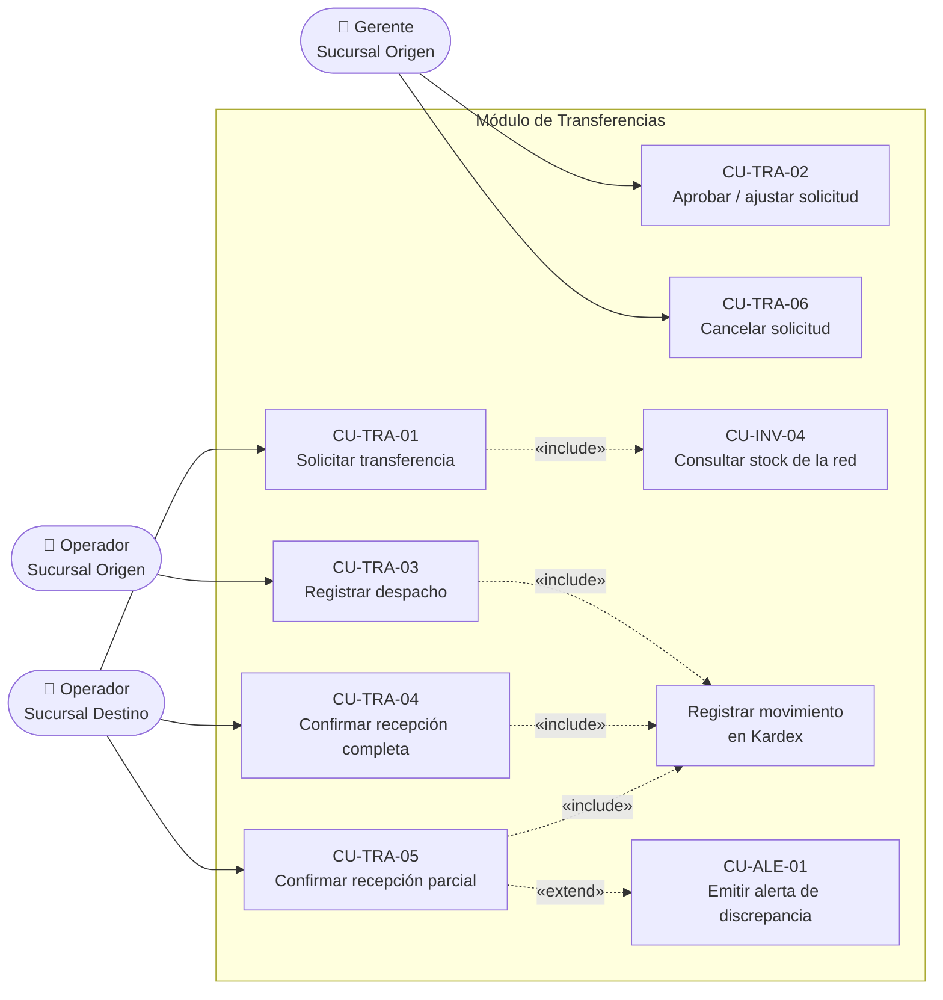

# Modelo de Casos de Uso
## Sistema de Gestión de Inventario Multi-Sucursal — OptiPlant Consultores
### Cumplimiento: Sección 6.2 — Casos de Uso | Insumo de la Sección 7.1 — Diagrama de Casos de Uso

---

## 1. Propósito y Alcance del Documento

Este documento formaliza los **actores** del sistema, sus **responsabilidades**, el **catálogo completo de casos de uso** y la **especificación detallada** de los casos de uso críticos del dominio.

Cada caso de uso posee un identificador unívoco `CU-<MÓDULO>-<NN>` y está trazado contra los requerimientos funcionales definidos en [`especificacion_requerimientos.md`](./especificacion_requerimientos.md), garantizando trazabilidad bidireccional entre el levantamiento de requerimientos, el modelado y la implementación.

**Criterio de granularidad aplicado:** un caso de uso representa una **unidad de valor de negocio completa** para un actor (una transacción que deja el sistema en un estado consistente), no una operación técnica aislada (`GET /products` no es un caso de uso; *"consultar disponibilidad de stock en la red"* sí lo es).

---

## 2. Actores del Sistema

### 2.1. Clasificación de Actores

| Tipo | Actor | Descripción |
| :--- | :--- | :--- |
| **Primario** | Administrador General (`ADMIN`) | Actor humano con visibilidad y potestad corporativa transversal sobre toda la red de sucursales. |
| **Primario** | Gerente de Sucursal (`BRANCH_MANAGER`) | Actor humano responsable de la operación, la aprobación y el control de una única sucursal. |
| **Primario** | Operador de Inventario (`OPERATOR`) | Actor humano de ejecución operativa diaria dentro de una única sucursal. |
| **Secundario** | Sistema Externo (ERP / POS) | Actor no humano que consume la API mediante credenciales de servicio para integraciones de terceros. |
| **Secundario** | Motor de Tiempo del Sistema (*Scheduler*) | Actor no humano interno que dispara procesos programados (evaluación de umbrales de stock y detección de demoras logísticas). |

> **Nota de modelado:** el *Scheduler* se modela explícitamente como actor porque inicia casos de uso sin intervención humana (`CU-ALE-01`). Omitirlo dejaría casos de uso sin actor iniciador, lo que constituye un error clásico de modelado.

### 2.2. Responsabilidades por Actor

#### 2.2.1. Administrador General (`ADMIN`)
* Administra el ciclo de vida de sucursales, usuarios y roles del sistema.
* Administra el catálogo maestro de productos, categorías y unidades de medida.
* Posee visibilidad de **lectura y escritura sobre cualquier sucursal** de la red.
* Accede al tablero corporativo consolidado y a la comparativa de desempeño entre sucursales.
* Consulta la bitácora inmutable de auditoría y los eventos sensibles del sistema.
* Parametriza rutas logísticas, prioridades y listas de precios corporativas.

#### 2.2.2. Gerente de Sucursal (`BRANCH_MANAGER`)
* Supervisa la operación completa de **su propia sucursal**.
* Aprueba, ajusta o rechaza solicitudes de transferencia dirigidas a su sucursal como origen.
* Aprueba órdenes de compra y ajustes manuales de inventario de alto impacto.
* Consulta el dashboard analítico de su sucursal y sus reportes de cumplimiento logístico.
* Posee visibilidad de **solo lectura** sobre el inventario de las demás sucursales.
* Gestiona y resuelve las alertas operativas de su sucursal.

#### 2.2.3. Operador de Inventario (`OPERATOR`)
* Registra ingresos de mercancía por recepción de órdenes de compra.
* Registra salidas por ventas, mermas, daños y caducidad.
* Registra ventas validando previamente la disponibilidad de stock.
* Solicita transferencias de producto a otras sucursales indicando urgencia.
* Prepara, despacha y confirma la recepción física de transferencias.
* Consulta el catálogo, el stock local y el stock de la red (solo lectura).

#### 2.2.4. Sistema Externo (ERP / POS) — *Opcional*
* Consulta disponibilidad de inventario consolidado vía API REST autenticada.
* Notifica ventas originadas en puntos de venta externos para su registro transaccional.
* Consume contratos versionados y estables; nunca accede directamente a la base de datos.

#### 2.2.5. Motor de Tiempo del Sistema (*Scheduler*)
* Evalúa periódicamente los umbrales de stock mínimo y emite alertas de reabastecimiento.
* Detecta transferencias cuya fecha estimada de arribo fue superada y emite alertas de demora logística.

### 2.3. Matriz de Autorización por Rol (RBAC)

Materializa el requerimiento **RNF-SEC-01** (control de acceso basado en roles) y **RNF-SEC-03** (aislamiento de sucursal por contexto).

| Capacidad | `ADMIN` | `BRANCH_MANAGER` | `OPERATOR` | Sistema Externo |
| :--- | :---: | :---: | :---: | :---: |
| Gestionar sucursales | ✅ | ❌ | ❌ | ❌ |
| Gestionar usuarios | ✅ | ⚠️ *(solo `OPERATOR` de su sucursal)* | ❌ | ❌ |
| Gestionar catálogo maestro y unidades de medida | ✅ | ❌ | ❌ | ❌ |
| Registrar y editar clientes | ✅ | ✅ | ✅ | ❌ |
| Activar / desactivar clientes | ✅ | ❌ | ❌ | ❌ |
| Consultar stock de la sucursal propia | ✅ | ✅ | ✅ | ✅ |
| Consultar stock de otras sucursales (lectura) | ✅ | ✅ | ✅ | ✅ |
| Mutar stock de otra sucursal | ✅ | ❌ | ❌ | ❌ |
| Registrar ventas | ✅ | ✅ | ✅ | ✅ *(vía integración)* |
| Anular ventas | ✅ | ✅ | ❌ | ❌ |
| Crear órdenes de compra | ✅ | ✅ | ✅ | ❌ |
| Aprobar órdenes de compra | ✅ | ✅ | ❌ | ❌ |
| Registrar recepción de mercancía | ✅ | ✅ | ✅ | ❌ |
| Solicitar transferencias | ✅ | ✅ | ✅ | ❌ |
| Aprobar / rechazar transferencias como origen | ✅ | ✅ | ❌ | ❌ |
| Despachar y confirmar recepción de transferencias | ✅ | ✅ | ✅ | ❌ |
| Registrar ajustes manuales de stock | ✅ | ✅ | ❌ | ❌ |
| Registrar mermas y daños | ✅ | ✅ | ✅ | ❌ |
| Parametrizar stock mínimo | ✅ | ✅ | ❌ | ❌ |
| Parametrizar rutas logísticas | ✅ | ❌ | ❌ | ❌ |
| Dashboard de sucursal propia | ✅ | ✅ | ✅ | ❌ |
| Dashboard corporativo comparativo | ✅ | ❌ | ❌ | ❌ |
| Consultar bitácora de auditoría | ✅ | ⚠️ *(solo su sucursal)* | ❌ | ❌ |

---

## 3. Catálogo de Casos de Uso

### 3.1. Módulo de Seguridad e Identidad (IAM)

| ID | Caso de Uso | Actor Principal | RF Asociado |
| :--- | :--- | :--- | :--- |
| **CU-SEG-01** | Autenticarse en el sistema | Todos los actores | RF-SEG-01 |
| **CU-SEG-02** | Gestionar usuarios y roles | Administrador General | RF-SEG-02 |
| **CU-SEG-03** | Gestionar sucursales de la red | Administrador General | RF-SEG-03 |
| **CU-SEG-04** | Consultar bitácora de auditoría | Administrador General | RF-SEG-04, RF-VAL-02 |

### 3.2. Módulo de Inventario y Catálogo

| ID | Caso de Uso | Actor Principal | RF Asociado |
| :--- | :--- | :--- | :--- |
| **CU-INV-01** | Gestionar catálogo de productos y categorías | Administrador General | RF-INV-01 |
| **CU-INV-02** | Gestionar unidades de medida y factores de conversión | Administrador General | RF-INV-02 |
| **CU-INV-03** | Consultar stock de la sucursal propia | Operador de Inventario | RF-INV-03 |
| **CU-INV-04** | Consultar disponibilidad de stock en la red | Operador de Inventario | RF-INV-04 |
| **CU-INV-05** | Registrar ajuste manual de inventario | Gerente de Sucursal | RF-INV-05, RF-INV-06 |
| **CU-INV-06** | Registrar merma, daño o caducidad | Operador de Inventario | RF-INV-06 |
| **CU-INV-07** | Parametrizar umbral de stock mínimo | Gerente de Sucursal | RF-INV-07 |
| **CU-INV-08** | Consultar histórico de movimientos (Kardex) | Gerente de Sucursal | RF-INV-08 |

### 3.3. Módulo de Compras

| ID | Caso de Uso | Actor Principal | RF Asociado |
| :--- | :--- | :--- | :--- |
| **CU-COM-01** | Gestionar proveedores | Administrador General | RF-COM-06 |
| **CU-COM-02** | Crear orden de compra | Operador de Inventario | RF-COM-01 |
| **CU-COM-03** | Aprobar o cancelar orden de compra | Gerente de Sucursal | RF-COM-05 |
| **CU-COM-04** | Registrar recepción de mercancía y recalcular CPP | Operador de Inventario | RF-COM-02, RF-COM-04 |
| **CU-COM-05** | Consultar histórico de compras | Gerente de Sucursal | RF-COM-03 |

### 3.4. Módulo de Ventas

| ID | Caso de Uso | Actor Principal | RF Asociado |
| :--- | :--- | :--- | :--- |
| **CU-VEN-01** | Registrar venta con validación de stock | Operador de Inventario | RF-VEN-01, RF-VEN-02 |
| **CU-VEN-02** | Aplicar lista de precios y descuentos | Operador de Inventario | RF-VEN-03 |
| **CU-VEN-03** | Anular venta y revertir stock | Gerente de Sucursal | RF-VEN-05 |
| **CU-VEN-04** | Consultar comprobante y detalle de venta | Operador de Inventario | RF-VEN-04 |
| **CU-VEN-05** | Administrar clientes (registrar, editar; desactivar solo Administrador) | Operador de Inventario | RF-VEN-06, RF-VAL-02 |
| **CU-VEN-06** | Consultar histórico de compras de un cliente | Operador de Inventario | RF-VEN-06 |

### 3.5. Módulo de Transferencias entre Sucursales

| ID | Caso de Uso | Actor Principal | RF Asociado |
| :--- | :--- | :--- | :--- |
| **CU-TRA-01** | Solicitar transferencia de producto | Operador de Inventario *(sucursal destino)* | RF-TRA-01 |
| **CU-TRA-02** | Aprobar, ajustar o rechazar solicitud de transferencia | Gerente de Sucursal *(sucursal origen)* | RF-TRA-02 |
| **CU-TRA-03** | Registrar despacho y generar stock en tránsito | Operador de Inventario *(sucursal origen)* | RF-TRA-03 |
| **CU-TRA-04** | Confirmar recepción completa de transferencia | Operador de Inventario *(sucursal destino)* | RF-TRA-04 |
| **CU-TRA-05** | Confirmar recepción parcial y registrar discrepancia | Operador de Inventario *(sucursal destino)* | RF-TRA-05 |
| **CU-TRA-06** | Cancelar solicitud de transferencia previa al despacho | Gerente de Sucursal | RF-TRA-06 |

### 3.6. Módulo de Logística

| ID | Caso de Uso | Actor Principal | RF Asociado |
| :--- | :--- | :--- | :--- |
| **CU-LOG-01** | Parametrizar rutas logísticas entre sucursales | Administrador General | RF-LOG-03 |
| **CU-LOG-02** | Monitorear estado de transferencias activas | Gerente de Sucursal | RF-LOG-01 |
| **CU-LOG-03** | Consultar reporte de cumplimiento logístico | Gerente de Sucursal | RF-LOG-02, RF-LOG-04 |

### 3.7. Módulo de Dashboard y Analítica

| ID | Caso de Uso | Actor Principal | RF Asociado |
| :--- | :--- | :--- | :--- |
| **CU-DSH-01** | Visualizar dashboard operativo de sucursal | Gerente de Sucursal | RF-DSH-01, RF-DSH-02, RF-DSH-03 |
| **CU-DSH-02** | Visualizar indicadores de reabastecimiento crítico | Operador de Inventario | RF-DSH-04 |
| **CU-DSH-03** | Visualizar tablero corporativo comparativo | Administrador General | RF-DSH-05 |

### 3.8. Módulo de Alertas Inteligentes (Valor Agregado)

| ID | Caso de Uso | Actor Principal | RF Asociado |
| :--- | :--- | :--- | :--- |
| **CU-ALE-01** | Generar alertas automáticas de stock y logística | Motor de Tiempo del Sistema | RF-VAL-01 |
| **CU-ALE-02** | Consultar y resolver alertas operativas | Gerente de Sucursal | RF-VAL-01 |

### 3.9. Módulo de Integración Externa (Opcional)

| ID | Caso de Uso | Actor Principal | RF Asociado |
| :--- | :--- | :--- | :--- |
| **CU-EXT-01** | Consultar disponibilidad consolidada vía API | Sistema Externo | RF-EXT-01 |
| **CU-EXT-02** | Notificar venta originada en POS externo | Sistema Externo | RF-EXT-02 |

---

## 4. Diagrama de Casos de Uso

### 4.1. Vista General: Actores y Módulos del Sistema

### 4.2. Vista Detallada: Ciclo de Transferencia entre Sucursales

Se detalla este módulo por ser el flujo de negocio de mayor complejidad, con dos sucursales participando como actores contrapuestos y relaciones `«include»` y `«extend»` significativas.

### 4.3. Archivos de Diagrama Versionados

El modelado visual se descompone en **un diagrama por módulo** en lugar de un único lienzo saturado. Cada vista contiene solo los casos de uso de su módulo y los actores que efectivamente participan en él, de modo que ninguna vista requiera esfuerzo de lectura.

| Archivo | Contenido |
| :--- | :--- |
| [`diagrams/casos_de_uso.excalidraw`](./diagrams/casos_de_uso.excalidraw) | **Mapa general.** Los 8 módulos y los actores que participan en cada uno, con la referencia al diagrama de detalle correspondiente. |
| [`diagrams/casos_de_uso_01_seguridad.excalidraw`](./diagrams/casos_de_uso_01_seguridad.excalidraw) | Módulo de Seguridad e Identidad (CU-SEG-01 … CU-SEG-04). |
| [`diagrams/casos_de_uso_02_inventario.excalidraw`](./diagrams/casos_de_uso_02_inventario.excalidraw) | Módulo de Inventario y Catálogo (CU-INV-01 … CU-INV-08). |
| [`diagrams/casos_de_uso_03_compras.excalidraw`](./diagrams/casos_de_uso_03_compras.excalidraw) | Módulo de Compras y Reabastecimiento (CU-COM-01 … CU-COM-05). |
| [`diagrams/casos_de_uso_04_ventas.excalidraw`](./diagrams/casos_de_uso_04_ventas.excalidraw) | Módulo de Ventas y Salidas Comerciales (CU-VEN-01 … CU-VEN-06). |
| [`diagrams/casos_de_uso_05_transferencias.excalidraw`](./diagrams/casos_de_uso_05_transferencias.excalidraw) | Módulo de Transferencias con su máquina de estados completa (CU-TRA-01 … CU-TRA-06). |
| [`diagrams/casos_de_uso_06_logistica.excalidraw`](./diagrams/casos_de_uso_06_logistica.excalidraw) | Módulo de Logística y Tiempos de Envío (CU-LOG-01 … CU-LOG-03). |
| [`diagrams/casos_de_uso_07_dashboard.excalidraw`](./diagrams/casos_de_uso_07_dashboard.excalidraw) | Módulo de Dashboard y Análisis Visual (CU-DSH-01 … CU-DSH-03). |
| [`diagrams/casos_de_uso_08_alertas_integracion.excalidraw`](./diagrams/casos_de_uso_08_alertas_integracion.excalidraw) | Módulos de Alertas Inteligentes e Integración Externa (CU-ALE-01 … CU-EXT-02). |
| [`diagrams/casos_de_uso.puml`](./diagrams/casos_de_uso.puml) | Notación UML estricta con los 37 casos de uso y todas sus relaciones `«include»` / `«extend»` en una sola vista. |

> Los archivos `.excalidraw` se abren arrastrándolos sobre [excalidraw.com](https://excalidraw.com) o mediante la extensión de Excalidraw para VS Code.

---

## 5. Especificación Detallada de Casos de Uso Críticos

Se especifican en formato extendido los casos de uso que concentran la complejidad transaccional del sistema: aquellos que mutan saldos de stock, valorizan inventario o atraviesan fronteras de sucursal.

---

### CU-VEN-01 — Registrar venta con validación de stock

| Campo | Detalle |
| :--- | :--- |
| **Identificador** | CU-VEN-01 |
| **Actor principal** | Operador de Inventario |
| **Actores secundarios** | Gerente de Sucursal (supervisión), Sistema Externo POS (vía CU-EXT-02) |
| **Requerimientos** | RF-VEN-01, RF-VEN-02, RF-VEN-03, RF-VEN-04, RF-INV-06, RF-INV-08 |
| **Precondiciones** | El actor está autenticado con un rol habilitado y posee contexto de sucursal activo. Los productos de la venta existen y están activos en el catálogo. |
| **Postcondición de éxito** | Se persiste la venta con estado `COMPLETED`, se descuenta el stock disponible de la sucursal, se inserta un movimiento `SALE` por ítem en el Kardex y se genera el comprobante consultable. |
| **Postcondición de fallo** | No se persiste ningún cambio: la transacción completa se revierte (*rollback* atómico) y el stock permanece intacto. |
| **Disparador** | El operador inicia el registro de una transacción comercial en el punto de atención. |
| **Frecuencia** | Muy alta (operación de mayor volumen del sistema). |
| **Criticidad** | Máxima — impacta stock, valorización y facturación. |

**Flujo principal**
1. El operador selecciona la opción de registro de venta.
2. El sistema presenta el formulario de venta con la sucursal del operador precargada e inmutable.
3. El operador agrega uno o más productos indicando cantidad y unidad de medida.
4. El sistema resuelve el precio unitario aplicable según la lista de precios vigente (**«include» CU-VEN-02**).
5. El operador aplica los descuentos autorizados por política comercial.
6. El sistema calcula subtotal, descuentos, impuestos y total.
7. El operador confirma la venta.
8. El sistema **abre una transacción atómica** y aplica bloqueo pesimista (`SELECT ... FOR UPDATE`) sobre los registros de inventario involucrados.
9. El sistema valida que `current_stock - reserved_stock >= cantidad_solicitada` para cada ítem.
10. El sistema descuenta el stock disponible de la sucursal.
11. El sistema inserta un movimiento inmutable de tipo `SALE` en el Kardex por cada ítem, con producto, sucursal, cantidad, costo unitario vigente, stock previo, stock resultante, usuario responsable y referencia a la venta.
12. El sistema confirma la transacción (*commit*) y emite el comprobante con identificador único.
13. El sistema evalúa los umbrales de stock mínimo afectados y, de corresponder, dispara **«extend» CU-ALE-01**.

**Flujos alternativos**
* **FA-01 — Venta multi-unidad de medida (paso 3):** si el operador selecciona una unidad distinta a la unidad base del producto, el sistema convierte la cantidad aplicando el `conversion_factor` registrado y opera internamente en unidad base.
* **FA-02 — Descuento superior al autorizado (paso 5):** si el descuento excede el máximo del rol, el sistema bloquea la confirmación y exige autorización de un Gerente de Sucursal.
* **FA-03 — Origen externo (paso 1):** cuando la venta proviene de un POS integrado (CU-EXT-02), los pasos 1 a 7 se sustituyen por la recepción del payload autenticado; los pasos 8 a 13 se ejecutan sin variación.

**Excepciones**
* **EX-01 — Stock insuficiente (paso 9):** el sistema aborta la transacción, revierte todos los cambios y responde con error de negocio explícito indicando producto, cantidad solicitada y cantidad disponible. La venta **no** se registra. *(Restricción de negocio: prohibición de stock negativo.)*
* **EX-02 — Concurrencia sobre el mismo producto (paso 8):** una transacción concurrente que intente descontar el mismo registro de inventario queda en espera del bloqueo; al liberarse, revalida la disponibilidad antes de operar, evitando sobreventa.
* **EX-03 — Producto inactivo o inexistente (paso 3):** el sistema rechaza el ítem e impide su incorporación a la venta.
* **EX-04 — Fallo de persistencia (pasos 10-12):** cualquier error de infraestructura provoca *rollback* completo; el Kardex nunca queda desalineado respecto del saldo de stock.

**Reglas de negocio aplicables**
* RN-01: ninguna venta puede dejar el stock físico en valores negativos.
* RN-02: toda salida de inventario genera obligatoriamente un asiento en el Kardex; no existe mutación de stock sin traza.
* RN-03: el costo unitario registrado en el movimiento es el Costo Promedio Ponderado vigente al momento de la venta, no el precio de venta.

**Requerimientos no funcionales asociados:** RNF-PER-02 (< 500 ms), RNF-INT-01 (atomicidad ACID), RNF-INT-02 (inmutabilidad del Kardex), RNF-SEC-03 (aislamiento por sucursal).

---

### CU-COM-04 — Registrar recepción de mercancía y recalcular CPP

| Campo | Detalle |
| :--- | :--- |
| **Identificador** | CU-COM-04 |
| **Actor principal** | Operador de Inventario |
| **Actores secundarios** | Gerente de Sucursal |
| **Requerimientos** | RF-COM-02, RF-COM-04, RF-INV-05, RF-INV-08 |
| **Precondiciones** | Existe una orden de compra en estado `APPROVED` o `PARTIALLY_RECEIVED` asociada a la sucursal del operador. |
| **Postcondición de éxito** | El stock de la sucursal se incrementa, el Costo Promedio Ponderado del producto se recalcula, se inserta un movimiento `PURCHASE_RECEIPT` en el Kardex y la orden pasa a `RECEIVED` o `PARTIALLY_RECEIVED`. |
| **Disparador** | Arribo físico de mercancía del proveedor a la sucursal. |
| **Criticidad** | Alta — determina la valorización del inventario. |

**Flujo principal**
1. El operador localiza la orden de compra pendiente de recepción.
2. El sistema muestra los ítems con cantidad ordenada, cantidad ya recibida y saldo pendiente.
3. El operador registra la cantidad físicamente recibida por ítem.
4. El sistema abre una transacción atómica y bloquea los registros de inventario afectados.
5. El sistema recalcula el Costo Promedio Ponderado por producto aplicando:
   `CPP_nuevo = ((stock_actual × CPP_actual) + (cantidad_recibida × costo_unitario_compra)) / (stock_actual + cantidad_recibida)`
6. El sistema incrementa el stock disponible de la sucursal receptora.
7. El sistema inserta el movimiento `PURCHASE_RECEIPT` en el Kardex con referencia a la orden de compra.
8. El sistema actualiza el estado de la orden: `RECEIVED` si todos los ítems fueron completados, `PARTIALLY_RECEIVED` en caso contrario.
9. El sistema confirma la transacción y notifica el resultado.

**Flujos alternativos**
* **FA-01 — Recepción parcial (paso 3):** si la cantidad recibida es menor a la ordenada, la orden permanece en `PARTIALLY_RECEIVED` y conserva el saldo pendiente para recepciones posteriores.
* **FA-02 — Recepción excedente (paso 3):** si la cantidad supera lo ordenado, el sistema exige autorización de un Gerente de Sucursal y registra la observación en la bitácora de auditoría.

**Excepciones**
* **EX-01 — Orden cancelada o ya recibida (paso 1):** el sistema impide registrar la recepción y notifica el estado inválido.
* **EX-02 — Costo unitario ausente o inválido (paso 5):** el sistema bloquea la operación para no corromper la valorización del inventario.

**Requerimientos no funcionales asociados:** RNF-PER-02, RNF-INT-01, RNF-INT-02.

---

### CU-TRA-03 — Registrar despacho y generar stock en tránsito

| Campo | Detalle |
| :--- | :--- |
| **Identificador** | CU-TRA-03 |
| **Actor principal** | Operador de Inventario *(sucursal origen)* |
| **Actores secundarios** | Sucursal destino (receptora), Transportista (externo, no usuario del sistema) |
| **Requerimientos** | RF-TRA-03, RF-LOG-01, RF-LOG-02, RF-INV-08 |
| **Precondiciones** | Existe una transferencia en estado `IN_PREPARATION` cuya sucursal origen es la del operador y con cantidades aprobadas. |
| **Postcondición de éxito** | La transferencia pasa a `IN_TRANSIT`, el stock disponible de la sucursal origen se descuenta, el stock en tránsito de la sucursal destino se incrementa y se registra un movimiento `TRANSFER_OUT` en el Kardex de origen. |
| **Disparador** | La mercancía es entregada al transportista. |
| **Criticidad** | Alta — mueve inventario entre fronteras de sucursal. |

**Flujo principal**
1. El operador de la sucursal origen abre la transferencia aprobada.
2. El operador registra transportista, número de seguimiento y fecha/hora estimada de arribo.
3. El operador confirma el despacho.
4. El sistema abre una transacción atómica y bloquea los inventarios de origen y destino involucrados.
5. El sistema revalida que la sucursal origen conserve stock disponible suficiente **al momento del despacho** (la aprobación no reserva indefinidamente).
6. El sistema descuenta la cantidad despachada del stock disponible de la sucursal origen.
7. El sistema incrementa el stock en tránsito de la sucursal destino, haciéndolo visible en su proyección de disponibilidad futura sin considerarlo aún vendible.
8. El sistema inserta el movimiento `TRANSFER_OUT` en el Kardex de la sucursal origen.
9. El sistema cambia el estado de la transferencia a `IN_TRANSIT` y persiste `dispatched_at` y `estimated_arrival_at`.
10. El sistema confirma la transacción y notifica a la sucursal destino.

**Flujos alternativos**
* **FA-01 — Despacho parcial respecto de lo aprobado (paso 3):** el operador ajusta la cantidad efectivamente despachada; el sistema opera sobre esa cantidad y registra la diferencia como observación de la transferencia.

**Excepciones**
* **EX-01 — Stock insuficiente al despachar (paso 5):** el sistema aborta la operación, mantiene la transferencia en `IN_PREPARATION` y notifica al Gerente de la sucursal origen para su reevaluación.
* **EX-02 — Estado inválido (paso 1):** una transferencia que no esté en `IN_PREPARATION` no admite despacho; el sistema rechaza la operación preservando la máquina de estados.

**Reglas de negocio aplicables**
* RN-04: el stock en tránsito nunca es vendible en la sucursal destino hasta la confirmación de recepción.
* RN-05: ninguna transferencia puede saltar estados; el flujo `REQUESTED → IN_PREPARATION → IN_TRANSIT → RECEIVED / RECEIVED_WITH_DISCREPANCY` es obligatorio.

**Requerimientos no funcionales asociados:** RNF-PER-02, RNF-INT-01, RNF-SEC-03.

---

### CU-TRA-05 — Confirmar recepción parcial y registrar discrepancia

| Campo | Detalle |
| :--- | :--- |
| **Identificador** | CU-TRA-05 |
| **Actor principal** | Operador de Inventario *(sucursal destino)* |
| **Actores secundarios** | Gerente de Sucursal destino, Gerente de Sucursal origen |
| **Requerimientos** | RF-TRA-05, RF-LOG-01, RF-VAL-01, RF-INV-08 |
| **Precondiciones** | Existe una transferencia en estado `IN_TRANSIT` cuya sucursal destino es la del operador. |
| **Postcondición de éxito** | Se ingresa al inventario únicamente la cantidad efectivamente recibida, se registra la discrepancia, se libera el stock en tránsito, la transferencia pasa a `RECEIVED_WITH_DISCREPANCY` y se emite una alerta de tipo `TRANSFER_DISCREPANCY`. |
| **Disparador** | Arribo físico de la mercancía con faltantes, sobrantes o daños respecto de lo despachado. |
| **Criticidad** | Alta — resuelve inconsistencias entre inventarios de dos sucursales. |

**Flujo principal**
1. El operador de la sucursal destino abre la transferencia en tránsito.
2. El sistema presenta las cantidades despachadas por ítem.
3. El operador registra la cantidad físicamente recibida por ítem y el motivo de la diferencia (faltante, daño o pérdida en tránsito).
4. El sistema detecta que la cantidad recibida difiere de la despachada.
5. El sistema abre una transacción atómica y bloquea el inventario de la sucursal destino.
6. El sistema incrementa el stock disponible de la sucursal destino **únicamente por la cantidad recibida**.
7. El sistema descuenta la totalidad de la cantidad despachada del stock en tránsito de la sucursal destino, evitando saldos fantasma.
8. El sistema persiste la cantidad de discrepancia por ítem.
9. El sistema inserta el movimiento `TRANSFER_IN` en el Kardex de la sucursal destino por la cantidad efectivamente recibida.
10. El sistema cambia el estado de la transferencia a `RECEIVED_WITH_DISCREPANCY` y persiste `actual_arrival_at`.
11. El sistema genera una alerta `TRANSFER_DISCREPANCY` con severidad `CRITICAL` visible para ambas sucursales (**«extend» CU-ALE-01**).
12. El sistema confirma la transacción.

**Flujos alternativos**
* **FA-01 — Tratamiento por reenvío:** el Gerente de la sucursal destino genera una nueva solicitud de transferencia por el faltante, enlazada a la transferencia original.
* **FA-02 — Tratamiento por merma en tránsito:** el Gerente de la sucursal origen registra la diferencia como movimiento `DAMAGE_WASTE` en su propio Kardex, cerrando contablemente la discrepancia.
* **FA-03 — Tratamiento por reclamación al transportista:** la discrepancia queda documentada como observación y permanece abierta hasta su resolución administrativa.

**Excepciones**
* **EX-01 — Cantidad recibida superior a la despachada (paso 3):** el sistema exige autorización del Gerente de la sucursal destino y registra el evento en la bitácora de auditoría.
* **EX-02 — Recepción sin discrepancia (paso 4):** si las cantidades coinciden, el flujo deriva a **CU-TRA-04** y la transferencia se cierra como `RECEIVED`.

**Reglas de negocio aplicables**
* RN-06: la suma de cantidad recibida más discrepancia debe igualar siempre la cantidad despachada.
* RN-07: toda discrepancia genera obligatoriamente una alerta persistente; nunca se resuelve de forma silenciosa.

**Requerimientos no funcionales asociados:** RNF-INT-01, RNF-INT-02, RNF-USA-02.

---

### CU-INV-05 — Registrar ajuste manual de inventario

| Campo | Detalle |
| :--- | :--- |
| **Identificador** | CU-INV-05 |
| **Actor principal** | Gerente de Sucursal |
| **Actores secundarios** | Administrador General (auditoría posterior) |
| **Requerimientos** | RF-INV-05, RF-INV-06, RF-INV-08, RF-VAL-02 |
| **Precondiciones** | El actor posee rol `BRANCH_MANAGER` o `ADMIN` y opera sobre un producto existente en su sucursal. |
| **Postcondición de éxito** | El stock queda ajustado al valor físico verificado, se inserta un movimiento `ADJUSTMENT_POS` o `ADJUSTMENT_NEG` en el Kardex y se registra el evento en la bitácora de auditoría. |
| **Disparador** | Diferencia detectada entre el inventario físico y el saldo del sistema durante un conteo. |
| **Criticidad** | Alta — es la única operación que altera stock sin respaldo documental de una transacción comercial. |

**Flujo principal**
1. El gerente selecciona el producto y la sucursal a ajustar.
2. El sistema muestra el saldo teórico actual del producto.
3. El gerente ingresa la cantidad física real verificada y un motivo obligatorio.
4. El sistema calcula la diferencia y determina el tipo de movimiento (`ADJUSTMENT_POS` o `ADJUSTMENT_NEG`).
5. El sistema abre una transacción atómica y bloquea el registro de inventario.
6. El sistema actualiza el saldo de stock al valor físico informado.
7. El sistema inserta el movimiento de ajuste en el Kardex con stock previo, stock resultante, motivo y usuario responsable.
8. El sistema registra el evento en la bitácora inmutable de auditoría con los payloads previo y posterior.
9. El sistema confirma la transacción.

**Excepciones**
* **EX-01 — Motivo ausente (paso 3):** el sistema bloquea la operación; ningún ajuste manual puede persistirse sin justificación explícita.
* **EX-02 — Ajuste que produce stock negativo (paso 6):** rechazado por restricción de esquema (`CHECK (current_stock >= 0)`) y por validación de dominio previa.
* **EX-03 — Rol insuficiente (paso 1):** un `OPERATOR` no puede ejecutar ajustes; el sistema responde con error de autorización y registra el intento.

**Requerimientos no funcionales asociados:** RNF-SEC-01, RNF-INT-01, RNF-INT-02.

---

### CU-INV-04 — Consultar disponibilidad de stock en la red

| Campo | Detalle |
| :--- | :--- |
| **Identificador** | CU-INV-04 |
| **Actor principal** | Operador de Inventario |
| **Actores secundarios** | Gerente de Sucursal, Administrador General, Sistema Externo |
| **Requerimientos** | RF-INV-04, RF-INV-03 |
| **Precondiciones** | El actor está autenticado y el producto existe en el catálogo maestro. |
| **Postcondición de éxito** | El actor visualiza el stock disponible, reservado y en tránsito del producto en cada sucursal de la red, sin obtener capacidad de mutación sobre sucursales ajenas. |
| **Disparador** | Necesidad de cubrir un faltante local antes de solicitar una transferencia o rechazar una venta. |
| **Criticidad** | Media-alta — habilita la operación multi-sucursal. |

**Flujo principal**
1. El actor busca un producto por SKU, nombre o categoría.
2. El sistema resuelve el contexto de sucursal del actor a partir de su token de sesión.
3. El sistema consulta la disponibilidad consolidada del producto en todas las sucursales activas.
4. El sistema presenta el resultado ordenado, destacando la sucursal propia y las sucursales con excedente.
5. El actor puede derivar directamente a **CU-TRA-01** para solicitar una transferencia desde una sucursal con disponibilidad.

**Excepciones**
* **EX-01 — Producto sin stock en toda la red (paso 3):** el sistema informa el faltante global y sugiere la creación de una orden de compra (**CU-COM-02**).

**Reglas de negocio aplicables**
* RN-08: la consulta cross-branch es estrictamente de lectura; ningún actor no administrador puede mutar inventario ajeno (RNF-SEC-03).
* RN-09: la consulta global no debe degradar el rendimiento transaccional local de las demás sucursales (RNF-PER-03).

**Requerimientos no funcionales asociados:** RNF-PER-01 (< 200 ms), RNF-PER-03, RNF-SEC-03.

---

### CU-SEG-01 — Autenticarse en el sistema

| Campo | Detalle |
| :--- | :--- |
| **Identificador** | CU-SEG-01 |
| **Actor principal** | Todos los actores humanos y de servicio |
| **Requerimientos** | RF-SEG-01 · RNF-SEC-01, RNF-SEC-02, RNF-SEC-03 |
| **Precondiciones** | El usuario existe, está activo y tiene una sucursal asignada (excepto el Administrador General). |
| **Postcondición de éxito** | El actor obtiene un token firmado con su identidad, rol y sucursal de contexto, que condiciona toda autorización posterior. |
| **Criticidad** | Máxima — es precondición transversal de todos los demás casos de uso. |

**Flujo principal**
1. El actor envía sus credenciales a la API de autenticación.
2. El sistema verifica el hash de la contraseña mediante un algoritmo robusto con *salt* (BCrypt/Argon2).
3. El sistema valida que el usuario esté activo y su sucursal habilitada.
4. El sistema emite un token firmado con identificador de usuario, rol y sucursal.
5. El cliente adjunta el token en cada solicitud posterior, y el backend deriva de él el contexto de autorización.

**Excepciones**
* **EX-01 — Credenciales inválidas:** el sistema responde con un error genérico, sin revelar si el usuario existe (prevención de enumeración de cuentas).
* **EX-02 — Usuario o sucursal deshabilitados:** el acceso se deniega aunque las credenciales sean correctas.
* **EX-03 — Token expirado o alterado:** toda solicitud posterior es rechazada; el actor debe reautenticarse.

---

## 6. Matriz de Trazabilidad: Requerimientos ↔ Casos de Uso

| RF | Caso(s) de Uso que lo materializan |
| :--- | :--- |
| RF-SEG-01 | CU-SEG-01 |
| RF-SEG-02 | CU-SEG-02 |
| RF-SEG-03 | CU-SEG-03 |
| RF-SEG-04 | CU-SEG-04 |
| RF-INV-01 | CU-INV-01 |
| RF-INV-02 | CU-INV-02 |
| RF-INV-03 | CU-INV-03, CU-INV-04 |
| RF-INV-04 | CU-INV-04, CU-EXT-01 |
| RF-INV-05 | CU-INV-05, CU-COM-04 |
| RF-INV-06 | CU-INV-05, CU-INV-06, CU-VEN-01 |
| RF-INV-07 | CU-INV-07, CU-ALE-01 |
| RF-INV-08 | CU-INV-08 *(y traza generada por CU-VEN-01, CU-COM-04, CU-TRA-03, CU-TRA-04, CU-TRA-05, CU-INV-05, CU-INV-06)* |
| RF-COM-01 | CU-COM-02 |
| RF-COM-02 | CU-COM-04 |
| RF-COM-03 | CU-COM-05 |
| RF-COM-04 | CU-COM-04 |
| RF-COM-05 | CU-COM-03 |
| RF-COM-06 | CU-COM-01 |
| RF-VEN-01 | CU-VEN-01, CU-EXT-02 |
| RF-VEN-02 | CU-VEN-01 |
| RF-VEN-03 | CU-VEN-02 |
| RF-VEN-04 | CU-VEN-04 |
| RF-VEN-05 | CU-VEN-03 |
| RF-VEN-06 | CU-VEN-05, CU-VEN-06, CU-VEN-01 |
| RF-TRA-01 | CU-TRA-01 |
| RF-TRA-02 | CU-TRA-02 |
| RF-TRA-03 | CU-TRA-03 |
| RF-TRA-04 | CU-TRA-04 |
| RF-TRA-05 | CU-TRA-05 |
| RF-TRA-06 | CU-TRA-06 |
| RF-LOG-01 | CU-LOG-02, CU-TRA-03 |
| RF-LOG-02 | CU-LOG-03 |
| RF-LOG-03 | CU-LOG-01 |
| RF-LOG-04 | CU-LOG-03 |
| RF-DSH-01 | CU-DSH-01 |
| RF-DSH-02 | CU-DSH-01 |
| RF-DSH-03 | CU-DSH-01, CU-LOG-02 |
| RF-DSH-04 | CU-DSH-02 |
| RF-DSH-05 | CU-DSH-03 |
| RF-VAL-01 | CU-ALE-01, CU-ALE-02 |
| RF-VAL-02 | CU-SEG-04, CU-INV-05 |
| RF-EXT-01 | CU-EXT-01 |
| RF-EXT-02 | CU-EXT-02 |

**Verificación de cobertura:** los 42 requerimientos funcionales están cubiertos por al menos un caso de uso, y ningún caso de uso del catálogo carece de requerimiento de respaldo. No existen requerimientos huérfanos ni casos de uso especulativos.

> Las **reglas de negocio (RN-01 … RN-15)** referenciadas en las especificaciones detalladas de la sección 5 están definidas de forma centralizada en la sección 4 de [`especificacion_requerimientos.md`](./especificacion_requerimientos.md).
