# Modelo Entidad-Relación (E-R)
## Sistema de Gestión de Inventario Multi-Sucursal — OptiPlant Consultores
### Cumplimiento: Sección 7.1 — Modelado del Sistema

---

## 1. Descripción del Modelo de Datos

El modelo de datos relacional para **PostgreSQL 17** implementa una arquitectura modular con consistencia **ACID** estricta, diseñada bajo el patrón:
* **Surrogate Clustered PK:** `id BIGINT GENERATED ALWAYS AS IDENTITY` para optimizar el rendimiento de *JOINs* e índices B-Tree.
* **Public Natural Token:** `external_id UUID` para exponer identificadores seguros (anti-IDOR/BOLA) en la API REST pública.
* **Inmutabilidad en Auditoría:** Tablas *append-only* para `kardex_movements` y `audit_logs`.
* **Precios Versionados por Vigencia:** `price_list_items` conserva el histórico de precios mediante `valid_from` / `valid_to`; el precio vigente no se sobrescribe, se cierra y se sucede.
* **Sesiones revocables:** `refresh_tokens` guarda únicamente el digest del token; la rotación cierra el anterior y la reutilización de uno ya rotado revoca la familia completa.

### 1.1. Resolución del Precio de Venta

El precio aplicable a un producto en una sucursal se resuelve en tres pasos, y esa jerarquía es la razón de que `price_list_items.branch_id` sea opcional:

1. Se determina la lista de precios de la operación: la indicada en la venta o, en su defecto, `branches.default_price_list_id`.
2. Dentro de esa lista gana el ítem cuyo `branch_id` coincide con la sucursal; si no existe, se aplica el ítem corporativo (`branch_id IS NULL`).
3. Entre los candidatos se toma el vigente a la fecha de la operación (`valid_from <= hoy` y `valid_to` nulo o posterior).

Dos índices únicos parciales garantizan que no puedan coexistir dos precios vigentes para la misma combinación: `uq_price_current_branch` a nivel de sucursal y `uq_price_current_corporate` a nivel corporativo. El descuento aplicado queda acotado por `price_lists.max_discount_percent`, y `sale_items` congela el `list_unit_price` del momento para que el descuento sea auditable aunque el precio cambie después.

---

## 2. Diagrama Entidad-Relación en Mermaid

```mermaid
erDiagram
    BRANCHES ||--o{ USERS : "emplea"
    BRANCHES ||--o{ BRANCH_INVENTORIES : "almacena"
    BRANCHES ||--o{ KARDEX_MOVEMENTS : "registra"
    BRANCHES ||--o{ PURCHASE_ORDERS : "emite"
    BRANCHES ||--o{ SALES : "factura"
    BRANCHES ||--o{ LOGISTICS_ROUTES : "origen_de"
    BRANCHES ||--o{ LOGISTICS_ROUTES : "destino_de"
    BRANCHES ||--o{ TRANSFERS : "despacha"
    BRANCHES ||--o{ TRANSFERS : "recibe"
    BRANCHES ||--o{ SYSTEM_ALERTS : "reporta"

    CATEGORIES ||--|{ PRODUCTS : "clasifica"
    PRODUCTS ||--|{ PRODUCT_UNITS : "posee"
    PRODUCTS ||--o{ BRANCH_INVENTORIES : "distribuido_en"
    PRODUCTS ||--o{ KARDEX_MOVEMENTS : "traza"
    PRODUCTS ||--o{ PURCHASE_ORDER_ITEMS : "incluido_en"
    PRODUCTS ||--o{ SALE_ITEMS : "vendido_en"
    PRODUCTS ||--o{ TRANSFER_ITEMS : "trasladado_en"
    PRODUCTS ||--o{ PRICE_LIST_ITEMS : "tarifado_en"

    PRICE_LISTS ||--|{ PRICE_LIST_ITEMS : "contiene"
    PRICE_LISTS ||--o{ BRANCHES : "predeterminada_en"
    PRICE_LISTS ||--o{ SALES : "tarifa_aplicada_en"
    BRANCHES ||--o{ PRICE_LIST_ITEMS : "excepcion_local_de"

    SUPPLIERS ||--o{ PURCHASE_ORDERS : "abastece"
    PURCHASE_ORDERS ||--|{ PURCHASE_ORDER_ITEMS : "contiene"
    USERS ||--o{ PURCHASE_ORDERS : "crea"

    SALES ||--|{ SALE_ITEMS : "contiene"
    USERS ||--o{ SALES : "registra"

    TRANSFERS ||--|{ TRANSFER_ITEMS : "contiene"
    USERS ||--o{ TRANSFERS : "solicita"
    USERS ||--o{ TRANSFERS : "despacha"
    USERS ||--o{ TRANSFERS : "recibe"

    USERS ||--o{ KARDEX_MOVEMENTS : "autoriza"
    USERS ||--o{ SYSTEM_ALERTS : "resuelve"
    USERS ||--o{ AUDIT_LOGS : "ejecuta"
    USERS ||--o{ REFRESH_TOKENS : "mantiene"

    BRANCHES {
        bigint id PK
        uuid external_id UK
        varchar code UK
        varchar name
        varchar city
        bigint default_price_list_id FK
        boolean is_active
    }

    USERS {
        bigint id PK
        uuid external_id UK
        bigint branch_id FK
        varchar username UK
        varchar email UK
        varchar role
        boolean is_active
    }

    REFRESH_TOKENS {
        bigint id PK
        uuid external_id UK
        bigint user_id FK
        uuid family_id
        varchar token_hash UK
        timestamptz last_used_at
        timestamptz expires_at
        timestamptz revoked_at
    }

    CATEGORIES {
        bigint id PK
        uuid external_id UK
        varchar name UK
        text description
    }

    PRODUCTS {
        bigint id PK
        uuid external_id UK
        bigint category_id FK
        varchar sku UK
        varchar name
        varchar base_unit
        boolean is_active
    }

    PRODUCT_UNITS {
        bigint id PK
        uuid external_id UK
        bigint product_id FK
        varchar unit_name
        numeric conversion_factor
        boolean is_default_sale_unit
    }

    PRICE_LISTS {
        bigint id PK
        uuid external_id UK
        varchar code UK
        varchar name
        numeric max_discount_percent
        boolean is_default
        boolean is_active
    }

    PRICE_LIST_ITEMS {
        bigint id PK
        uuid external_id UK
        bigint price_list_id FK
        bigint product_id FK
        bigint branch_id FK
        numeric unit_price
        date valid_from
        date valid_to
    }

    BRANCH_INVENTORIES {
        bigint id PK
        uuid external_id UK
        bigint branch_id FK
        bigint product_id FK
        numeric current_stock
        numeric in_transit_stock
        numeric min_stock_threshold
        numeric average_cost
    }

    KARDEX_MOVEMENTS {
        bigint id PK
        uuid external_id UK
        bigint branch_id FK
        bigint product_id FK
        varchar movement_type
        numeric quantity
        numeric unit_cost
        numeric resulting_stock
        varchar reference_id
        bigint user_id FK
    }

    SUPPLIERS {
        bigint id PK
        uuid external_id UK
        varchar tax_id UK
        varchar name
        varchar email
    }

    PURCHASE_ORDERS {
        bigint id PK
        uuid external_id UK
        varchar order_number UK
        bigint branch_id FK
        bigint supplier_id FK
        bigint user_id FK
        varchar status
        numeric total_amount
    }

    PURCHASE_ORDER_ITEMS {
        bigint id PK
        uuid external_id UK
        bigint purchase_order_id FK
        bigint product_id FK
        numeric ordered_quantity
        numeric received_quantity
        numeric unit_cost
        numeric subtotal
    }

    SALES {
        bigint id PK
        uuid external_id UK
        varchar invoice_number UK
        bigint branch_id FK
        bigint user_id FK
        bigint price_list_id FK
        varchar customer_name
        varchar status
        numeric total_amount
    }

    SALE_ITEMS {
        bigint id PK
        uuid external_id UK
        bigint sale_id FK
        bigint product_id FK
        numeric quantity
        numeric list_unit_price
        numeric unit_price
        numeric discount_percent
        numeric subtotal
    }

    LOGISTICS_ROUTES {
        bigint id PK
        uuid external_id UK
        bigint origin_branch_id FK
        bigint destination_branch_id FK
        numeric estimated_duration_hours
        numeric transport_cost
        varchar priority_level
    }

    TRANSFERS {
        bigint id PK
        uuid external_id UK
        varchar transfer_number UK
        bigint origin_branch_id FK
        bigint destination_branch_id FK
        bigint requested_by_user_id FK
        bigint dispatched_by_user_id FK
        bigint received_by_user_id FK
        varchar status
        varchar carrier_name
    }

    TRANSFER_ITEMS {
        bigint id PK
        uuid external_id UK
        bigint transfer_id FK
        bigint product_id FK
        numeric requested_quantity
        numeric dispatched_quantity
        numeric received_quantity
        numeric discrepancy_quantity
    }

    SYSTEM_ALERTS {
        bigint id PK
        uuid external_id UK
        bigint branch_id FK
        varchar alert_type
        varchar severity
        text message
        boolean is_resolved
    }

    AUDIT_LOGS {
        bigint id PK
        uuid external_id UK
        bigint user_id FK
        bigint branch_id FK
        varchar action
        varchar entity_name
        varchar entity_id
        jsonb payload_after
    }
```

---

## 3. Diagrama Entidad-Relación en PlantUML

```plantuml
@startuml
!theme plain
skinparam linetype ortho
skinparam roundcorner 5
skinparam class {
    BackgroundColor White
    ArrowColor #2C3E50
    BorderColor #2C3E50
}

package "IAM & Organización" {
    entity "branches" as branches {
        * id : BIGINT <<PK>>
        --
        * external_id : UUID <<UK>>
        * code : VARCHAR(20) <<UK>>
        * name : VARCHAR(100)
        * address : VARCHAR(255)
        * city : VARCHAR(100)
        default_price_list_id : BIGINT <<FK>>
        * is_active : BOOLEAN
        created_at : TIMESTAMPTZ
        updated_at : TIMESTAMPTZ
    }

    entity "users" as users {
        * id : BIGINT <<PK>>
        --
        * external_id : UUID <<UK>>
        branch_id : BIGINT <<FK>>
        * username : VARCHAR(50) <<UK>>
        * email : VARCHAR(100) <<UK>>
        * password_hash : VARCHAR(255)
        * full_name : VARCHAR(120)
        * role : VARCHAR(30)
        * is_active : BOOLEAN
        created_at : TIMESTAMPTZ
        updated_at : TIMESTAMPTZ
    }

    entity "refresh_tokens" as refresh_tokens {
        * id : BIGINT <<PK>>
        --
        * external_id : UUID <<UK>>
        * user_id : BIGINT <<FK>>
        * family_id : UUID
        * token_hash : VARCHAR(64) <<UK>>
        * issued_at : TIMESTAMPTZ
        * last_used_at : TIMESTAMPTZ
        * expires_at : TIMESTAMPTZ
        revoked_at : TIMESTAMPTZ
        revoked_reason : VARCHAR(20)
    }
}

package "Catálogo Maestro" {
    entity "categories" as categories {
        * id : BIGINT <<PK>>
        --
        * external_id : UUID <<UK>>
        * name : VARCHAR(100) <<UK>>
        description : TEXT
        created_at : TIMESTAMPTZ
    }

    entity "products" as products {
        * id : BIGINT <<PK>>
        --
        * external_id : UUID <<UK>>
        * category_id : BIGINT <<FK>>
        * sku : VARCHAR(50) <<UK>>
        * name : VARCHAR(150)
        description : TEXT
        * base_unit : VARCHAR(20)
        * is_active : BOOLEAN
        created_at : TIMESTAMPTZ
        updated_at : TIMESTAMPTZ
    }

    entity "product_units" as product_units {
        * id : BIGINT <<PK>>
        --
        * external_id : UUID <<UK>>
        * product_id : BIGINT <<FK>>
        * unit_name : VARCHAR(50)
        * conversion_factor : NUMERIC(12,4)
        * is_default_sale_unit : BOOLEAN
        created_at : TIMESTAMPTZ
    }
}

package "Precios Comerciales" {
    entity "price_lists" as price_lists {
        * id : BIGINT <<PK>>
        --
        * external_id : UUID <<UK>>
        * code : VARCHAR(30) <<UK>>
        * name : VARCHAR(100)
        description : TEXT
        * max_discount_percent : NUMERIC(5,2)
        * is_default : BOOLEAN
        * is_active : BOOLEAN
        created_at : TIMESTAMPTZ
        updated_at : TIMESTAMPTZ
    }

    entity "price_list_items" as price_list_items {
        * id : BIGINT <<PK>>
        --
        * external_id : UUID <<UK>>
        * price_list_id : BIGINT <<FK>>
        * product_id : BIGINT <<FK>>
        branch_id : BIGINT <<FK>>
        * unit_price : NUMERIC(14,4)
        * valid_from : DATE
        valid_to : DATE
        created_at : TIMESTAMPTZ
        updated_at : TIMESTAMPTZ
    }
}

package "Inventario & Kardex" {
    entity "branch_inventories" as branch_inventories {
        * id : BIGINT <<PK>>
        --
        * external_id : UUID <<UK>>
        * branch_id : BIGINT <<FK>>
        * product_id : BIGINT <<FK>>
        * current_stock : NUMERIC(14,4)
        * reserved_stock : NUMERIC(14,4)
        * in_transit_stock : NUMERIC(14,4)
        * min_stock_threshold : NUMERIC(14,4)
        * average_cost : NUMERIC(14,4)
        last_updated_at : TIMESTAMPTZ
    }

    entity "kardex_movements" as kardex_movements {
        * id : BIGINT <<PK>>
        --
        * external_id : UUID <<UK>>
        * branch_id : BIGINT <<FK>>
        * product_id : BIGINT <<FK>>
        * movement_type : VARCHAR(30)
        * quantity : NUMERIC(14,4)
        * unit_cost : NUMERIC(14,4)
        * total_cost : NUMERIC(14,4)
        * previous_stock : NUMERIC(14,4)
        * resulting_stock : NUMERIC(14,4)
        reference_id : VARCHAR(100)
        reference_type : VARCHAR(50)
        user_id : BIGINT <<FK>>
        created_at : TIMESTAMPTZ
    }
}

package "Compras & Proveedores" {
    entity "suppliers" as suppliers {
        * id : BIGINT <<PK>>
        --
        * external_id : UUID <<UK>>
        * tax_id : VARCHAR(30) <<UK>>
        * name : VARCHAR(150)
        contact_name : VARCHAR(100)
        email : VARCHAR(100)
        phone : VARCHAR(50)
        is_active : BOOLEAN
    }

    entity "purchase_orders" as purchase_orders {
        * id : BIGINT <<PK>>
        --
        * external_id : UUID <<UK>>
        * order_number : VARCHAR(50) <<UK>>
        * branch_id : BIGINT <<FK>>
        * supplier_id : BIGINT <<FK>>
        * user_id : BIGINT <<FK>>
        * status : VARCHAR(30)
        payment_terms : VARCHAR(100)
        * total_amount : NUMERIC(14,4)
        created_at : TIMESTAMPTZ
    }

    entity "purchase_order_items" as purchase_order_items {
        * id : BIGINT <<PK>>
        --
        * external_id : UUID <<UK>>
        * purchase_order_id : BIGINT <<FK>>
        * product_id : BIGINT <<FK>>
        * ordered_quantity : NUMERIC(14,4)
        * received_quantity : NUMERIC(14,4)
        * unit_cost : NUMERIC(14,4)
        * subtotal : NUMERIC(14,4)
    }
}

package "Ventas" {
    entity "sales" as sales {
        * id : BIGINT <<PK>>
        --
        * external_id : UUID <<UK>>
        * invoice_number : VARCHAR(50) <<UK>>
        * branch_id : BIGINT <<FK>>
        * user_id : BIGINT <<FK>>
        * price_list_id : BIGINT <<FK>>
        * customer_name : VARCHAR(150)
        * status : VARCHAR(20)
        * subtotal : NUMERIC(14,4)
        * total_amount : NUMERIC(14,4)
        created_at : TIMESTAMPTZ
    }

    entity "sale_items" as sale_items {
        * id : BIGINT <<PK>>
        --
        * external_id : UUID <<UK>>
        * sale_id : BIGINT <<FK>>
        * product_id : BIGINT <<FK>>
        * quantity : NUMERIC(14,4)
        * list_unit_price : NUMERIC(14,4)
        * unit_price : NUMERIC(14,4)
        * discount_percent : NUMERIC(5,2)
        * subtotal : NUMERIC(14,4)
    }
}

package "Transferencias & Logística" {
    entity "logistics_routes" as logistics_routes {
        * id : BIGINT <<PK>>
        --
        * external_id : UUID <<UK>>
        * origin_branch_id : BIGINT <<FK>>
        * destination_branch_id : BIGINT <<FK>>
        * estimated_duration_hours : NUMERIC(6,2)
        * transport_cost : NUMERIC(12,2)
        * priority_level : VARCHAR(20)
    }

    entity "transfers" as transfers {
        * id : BIGINT <<PK>>
        --
        * external_id : UUID <<UK>>
        * transfer_number : VARCHAR(50) <<UK>>
        * origin_branch_id : BIGINT <<FK>>
        * destination_branch_id : BIGINT <<FK>>
        * requested_by_user_id : BIGINT <<FK>>
        dispatched_by_user_id : BIGINT <<FK>>
        received_by_user_id : BIGINT <<FK>>
        * status : VARCHAR(35)
        carrier_name : VARCHAR(100)
        tracking_number : VARCHAR(100)
        dispatched_at : TIMESTAMPTZ
        estimated_arrival_at : TIMESTAMPTZ
        actual_arrival_at : TIMESTAMPTZ
    }

    entity "transfer_items" as transfer_items {
        * id : BIGINT <<PK>>
        --
        * external_id : UUID <<UK>>
        * transfer_id : BIGINT <<FK>>
        * product_id : BIGINT <<FK>>
        * requested_quantity : NUMERIC(14,4)
        * dispatched_quantity : NUMERIC(14,4)
        * received_quantity : NUMERIC(14,4)
        * discrepancy_quantity : NUMERIC(14,4)
    }
}

package "Alertas & Auditoría" {
    entity "system_alerts" as system_alerts {
        * id : BIGINT <<PK>>
        --
        * external_id : UUID <<UK>>
        branch_id : BIGINT <<FK>>
        * alert_type : VARCHAR(40)
        * severity : VARCHAR(20)
        * message : TEXT
        * is_resolved : BOOLEAN
    }

    entity "audit_logs" as audit_logs {
        * id : BIGINT <<PK>>
        --
        * external_id : UUID <<UK>>
        user_id : BIGINT <<FK>>
        branch_id : BIGINT <<FK>>
        * action : VARCHAR(50)
        * entity_name : VARCHAR(50)
        * entity_id : VARCHAR(100)
        payload_after : JSONB
        created_at : TIMESTAMPTZ
    }
}

' Relaciones
branches ||--o{ users
branches ||--o{ branch_inventories
branches ||--o{ kardex_movements
branches ||--o{ purchase_orders
branches ||--o{ sales
branches ||--o{ logistics_routes : "origen"
branches ||--o{ logistics_routes : "destino"
branches ||--o{ transfers : "origen"
branches ||--o{ transfers : "destino"
branches ||--o{ system_alerts

categories ||--|{ products
products ||--|{ product_units
products ||--o{ branch_inventories
products ||--o{ kardex_movements
products ||--o{ purchase_order_items
products ||--o{ sale_items
products ||--o{ transfer_items
products ||--o{ price_list_items

price_lists ||--|{ price_list_items
price_lists ||--o{ branches : "predeterminada"
price_lists ||--o{ sales : "tarifa aplicada"
branches ||--o{ price_list_items : "excepción local"

suppliers ||--o{ purchase_orders
purchase_orders ||--|{ purchase_order_items
users ||--o{ purchase_orders

sales ||--|{ sale_items
users ||--o{ sales

transfers ||--|{ transfer_items
users ||--o{ transfers : "solicita"
users ||--o{ transfers : "despacha"
users ||--o{ transfers : "recibe"

users ||--o{ kardex_movements
users ||--o{ system_alerts
users ||--o{ audit_logs
users ||--o{ refresh_tokens : "mantiene"

@enduml
```

