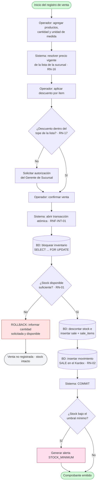
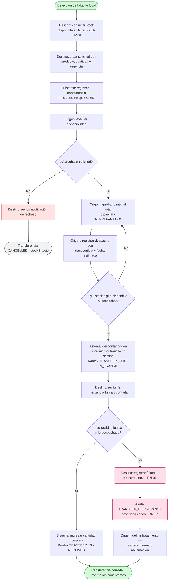
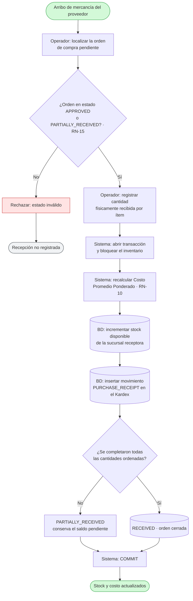
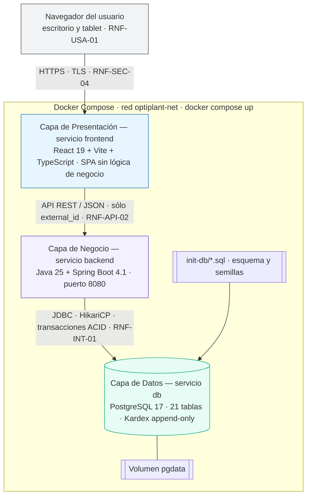
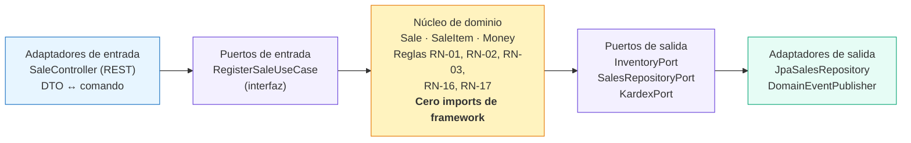

# Modelado del Sistema
## Sistema de Gestión de Inventario Multi-Sucursal — OptiPlant Consultores
### Cumplimiento: Sección 7.1 — Diagramas Obligatorios

---

## 1. Inventario de Diagramas

El enunciado exige cuatro diagramas de ingeniería. Cada uno se entrega en **Excalidraw** (editable y presentable) y, cuando la notación lo justifica, también en **PlantUML** (UML estricto) y **Mermaid** (renderizado directo en GitHub).

| # | Diagrama obligatorio | Estado | Archivos |
| :--- | :--- | :--- | :--- |
| 1 | **Casos de uso** | ✅ | 9 diagramas — ver [`casos_de_uso.md`](./casos_de_uso.md), sección 4.3 |
| 2 | **Actividades / flujo** | ✅ | 3 diagramas — venta, transferencia y recepción de compra (sección 2) |
| 3 | **Arquitectura** | ✅ | 3 vistas — capas, módulos y puertos/adaptadores (sección 3) |
| 4 | **Entidad-Relación** | ✅ | Mermaid, PlantUML y Excalidraw — sección 4 |

**Criterio de descomposición:** ningún diagrama intenta contarlo todo. Un lienzo saturado obliga al lector a hacer el trabajo que el diagrama debía hacer por él. Cada vista responde **una** pregunta, y este documento indica cuál.

---

## 2. Diagramas de Actividad

El enunciado exige como mínimo el flujo de transferencia y el flujo de venta. Se agrega un tercero —la recepción de compra— porque es la única operación que altera la **valorización** del inventario, y sin ella el modelo de costos queda sin representar.

Los tres usan **calles verticales por actor**: un diagrama de actividad que no muestra *quién* ejecuta cada paso deja de responder la mitad de la pregunta.

| Archivo | Flujo | Caso de uso | Responde |
| :--- | :--- | :--- | :--- |
| [`diagrams/actividad_01_venta.excalidraw`](./diagrams/actividad_01_venta.excalidraw) | Venta con validación de stock | CU-VEN-01 | ¿Cómo se impide la sobreventa bajo concurrencia? |
| [`diagrams/actividad_02_transferencia.excalidraw`](./diagrams/actividad_02_transferencia.excalidraw) | Transferencia entre sucursales | CU-TRA-01 … CU-TRA-06 | ¿Cómo se mueve stock entre dos sucursales sin perderlo ni duplicarlo? |
| [`diagrams/actividad_03_recepcion_compra.excalidraw`](./diagrams/actividad_03_recepcion_compra.excalidraw) | Recepción de compra y CPP | CU-COM-04 | ¿Cuándo y cómo se recalcula el costo del inventario? |

### 2.1. Flujo de Venta



**Lo que este flujo garantiza.** La validación de stock ocurre **después** del bloqueo pesimista, no antes. Ese orden es la diferencia entre prevenir la sobreventa y solo esperar que no ocurra: si dos operadores confirman a la vez la última unidad, el segundo espera el bloqueo, revalida y es rechazado.

### 2.2. Flujo de Transferencia entre Sucursales



**El detalle que suele omitirse.** La aprobación **no reserva** stock. Entre que el gerente aprueba y el operador despacha pueden pasar horas, y en ese lapso la sucursal origen sigue vendiendo. Por eso el despacho revalida disponibilidad y puede devolver la transferencia a `IN_PREPARATION` — esa es la rama roja del diagrama, y es la que distingue un modelo pensado de uno dibujado.

### 2.3. Flujo de Recepción de Compra y Costo Promedio



**Fórmula aplicada (RN-10):**

```
CPP nuevo = ((stock actual × CPP actual) + (cantidad recibida × costo unitario)) / (stock actual + cantidad recibida)
```

Caso verificable: 100 unidades a $10 más 100 unidades a $20 arroja un CPP de exactamente **$15**. Ese es el criterio de aceptación de la historia HU-INV-03.

---

## 3. Diagramas de Arquitectura

La vista técnica se descompone en tres niveles de acercamiento. Intentar mostrar capas, módulos y puertos en un solo lienzo produce un diagrama que nadie lee.

| Archivo | Nivel | Responde |
| :--- | :--- | :--- |
| [`diagrams/arquitectura_01_capas.excalidraw`](./diagrams/arquitectura_01_capas.excalidraw) | Sistema y despliegue | ¿Qué se despliega y cómo se comunica? |
| [`diagrams/arquitectura_02_modulos.excalidraw`](./diagrams/arquitectura_02_modulos.excalidraw) | Interior del backend | ¿Cómo se organiza el dominio y por qué monolito modular? |
| [`diagrams/arquitectura_03_hexagonal.excalidraw`](./diagrams/arquitectura_03_hexagonal.excalidraw) | Interior de un módulo | ¿Cómo se aísla la lógica de negocio del framework? |

### 3.1. Capas y Despliegue



**Las tres capas son tres servicios Docker aislados**, cada uno con su ciclo de vida y su *healthcheck*. El frontend no contiene ni una regla de negocio y jamás toca la base de datos: esa es la restricción técnica número 2 del enunciado, y la separación en servicios la hace estructuralmente imposible de violar.

### 3.2. Módulos del Backend

```mermaid
flowchart TB
    subgraph MONO["Backend — Monolito Modular · fronteras verificadas con ArchUnit · RNF-MAN-02"]
        direction TB
        subgraph FILA1[" "]
            direction LR
            IAM["iam<br/>usuarios, roles y sesiones"]
            CAT["catalog<br/>productos y unidades"]
            PRE["pricing<br/>listas de precios y vigencias"]
            INV["inventory<br/>existencias y Kardex"]
            COM["purchases<br/>órdenes, recepción y CPP"]
        end
        subgraph FILA2[" "]
            direction LR
            VEN["sales<br/>transacciones y comprobantes"]
            TRA["transfers<br/>máquina de estados"]
            LOG["logistics<br/>rutas y cumplimiento"]
            NOT["notifications<br/>alertas y eventos"]
            ANA["analytics<br/>dashboards y KPI · solo lectura"]
        end
        SYNC["Puertos de salida · llamada SÍNCRONA<br/>dentro de la misma transacción<br/>RN-01 · RN-02 · RNF-INT-01"]
        EVT["Eventos de dominio · AFTER_COMMIT<br/>reacciones que no abortan la operación<br/>alertas y proyecciones analíticas"]
        FILA1 --> SYNC
        FILA2 --> SYNC
        FILA2 --> EVT
    end

    style IAM fill:#ffe3e3,stroke:#c92a2a
    style CAT fill:#d0ebff,stroke:#1971c2
    style PRE fill:#fff0f6,stroke:#a61e4d
    style INV fill:#d0ebff,stroke:#1971c2
    style COM fill:#d3f9d8,stroke:#2f9e44
    style VEN fill:#fff3bf,stroke:#e67700
    style TRA fill:#e5dbff,stroke:#6741d9
    style LOG fill:#ffe8cc,stroke:#d9480f
    style NOT fill:#ffdeeb,stroke:#a61e4d
    style ANA fill:#c5f6fa,stroke:#0c8599
    style SYNC fill:#e7f5ff,stroke:#1971c2
    style EVT fill:#f1f3f5,stroke:#495057
```



**Por qué monolito modular y no microservicios.** El inventario exige transacciones ACID que abarcan varios módulos: descontar stock, escribir el Kardex y cerrar la venta ocurren juntos o no ocurren. Con microservicios esa atomicidad exigiría sagas y compensaciones —complejidad enorme para un dominio que cabe cómodamente en una sola base de datos—. El monolito modular entrega las fronteras del microservicio sin pagar su costo operativo: si mañana un módulo debe extraerse, la frontera ya está trazada y verificada por reglas de ArchUnit que corren en cada construcción.

**Y por qué hay dos mecanismos de comunicación y no uno.** La atomicidad **no viaja por eventos**. Si el descuento de stock se delegara a un escucha asíncrono quedaría fuera de la transacción de la venta, y bastaría un fallo de ese escucha para dejar una venta confirmada sin descuento de inventario. Por eso los efectos que deben ser atómicos se invocan por **puerto de salida síncrono** —el desacoplamiento lo da la interfaz, no el evento— y los **eventos de dominio** se reservan, en `AFTER_COMMIT`, para lo que puede fallar sin revertir la venta: una alerta de stock mínimo, una proyección analítica. El detalle está en la sección 3.6 de [`decisiones_arquitectura_tecnica.md`](./decisiones_arquitectura_tecnica.md).

### 3.3. Puertos y Adaptadores dentro de un Módulo



**La dependencia apunta siempre hacia adentro.** Los adaptadores conocen al dominio; el dominio no conoce a nadie. Eso compra tres cosas concretas: el núcleo se prueba sin levantar Spring ni base de datos (por eso el 80% de cobertura de RNF-MAN-01 es alcanzable), cambiar de motor de base de datos toca una sola columna del diagrama, y las reglas de negocio viven en un único lugar en vez de filtrarse a los controladores.

---

## 4. Modelo Entidad-Relación (E-R)

El cuarto diagrama obligatorio. El modelo relacional para **PostgreSQL 17** se entrega en tres notaciones —Mermaid para lectura directa en GitHub, PlantUML para UML estricto y Excalidraw para edición— más esta descripción del razonamiento de diseño. Los archivos editables son [`diagrams/diagrama_er.excalidraw`](./diagrams/diagrama_er.excalidraw) y [`diagrams/diagrama_er.puml`](./diagrams/diagrama_er.puml).

### 4.1. Descripción del Modelo de Datos

El modelo de datos relacional para **PostgreSQL 17** implementa una arquitectura modular con consistencia **ACID** estricta, diseñada bajo el patrón:
* **Surrogate Clustered PK:** `id BIGINT GENERATED ALWAYS AS IDENTITY` para optimizar el rendimiento de *JOINs* e índices B-Tree.
* **Public Natural Token:** `external_id UUID` para exponer identificadores seguros (anti-IDOR/BOLA) en la API REST pública.
* **Inmutabilidad en Auditoría:** Tablas *append-only* para `kardex_movements` y `audit_logs`.
* **Precios Versionados por Vigencia:** `price_list_items` conserva el histórico de precios mediante `valid_from` / `valid_to`; el precio vigente no se sobrescribe, se cierra y se sucede.
* **Sesiones revocables:** `refresh_tokens` guarda únicamente el digest del token; la rotación cierra el anterior y la reutilización de uno ya rotado revoca la familia completa.
* **Identificación Opcional y Congelamiento de Clientes:** `customers` registra terceros asociados opcionalmente a las ventas (`sales.customer_id` 0..1). La venta preserva `customer_name` y `customer_tax_id` como snapshot inmutable al momento de facturar.

### 4.2. Resolución del Precio de Venta

El precio aplicable a un producto en una sucursal se resuelve en tres pasos, y esa jerarquía es la razón de que `price_list_items.branch_id` sea opcional:

1. Se determina la lista de precios de la operación: la indicada en la venta o, en su defecto, `branches.default_price_list_id`.
2. Dentro de esa lista gana el ítem cuyo `branch_id` coincide con la sucursal; si no existe, se aplica el ítem corporativo (`branch_id IS NULL`).
3. Entre los candidatos se toma el vigente a la fecha de la operación (`valid_from <= hoy` y `valid_to` nulo o posterior).

Dos índices únicos parciales garantizan que no puedan coexistir dos precios vigentes para la misma combinación: `uq_price_current_branch` a nivel de sucursal y `uq_price_current_corporate` a nivel corporativo. El descuento aplicado queda acotado por `price_lists.max_discount_percent`, y `sale_items` congela el `list_unit_price` del momento para que el descuento sea auditable aunque el precio cambie después.

### 4.3. Diagrama Entidad-Relación en Mermaid

```mermaid
erDiagram
    BRANCHES ||--o{ USERS : "emplea"
    BRANCHES ||--o{ BRANCH_INVENTORIES : "almacena"
    BRANCHES ||--o{ KARDEX_MOVEMENTS : "registra"
    BRANCHES ||--o{ PURCHASE_ORDERS : "emite"
    BRANCHES ||--o{ SALES : "factura"
    BRANCHES ||--o{ LOGISTICS_ROUTES : "origen_de"
    BRANCHES ||--o{ LOGISTICS_ROUTES : "destino_de"
    BRANCHES ||--o{ TRANSFERS : "despacha"
    BRANCHES ||--o{ TRANSFERS : "recibe"
    BRANCHES ||--o{ SYSTEM_ALERTS : "reporta"

    CATEGORIES ||--|{ PRODUCTS : "clasifica"
    PRODUCTS ||--|{ PRODUCT_UNITS : "posee"
    PRODUCTS ||--o{ BRANCH_INVENTORIES : "distribuido_en"
    PRODUCTS ||--o{ KARDEX_MOVEMENTS : "traza"
    PRODUCTS ||--o{ PURCHASE_ORDER_ITEMS : "incluido_en"
    PRODUCTS ||--o{ SALE_ITEMS : "vendido_en"
    PRODUCTS ||--o{ TRANSFER_ITEMS : "trasladado_en"
    PRODUCTS ||--o{ PRICE_LIST_ITEMS : "tarifado_en"

    PRICE_LISTS ||--|{ PRICE_LIST_ITEMS : "contiene"
    PRICE_LISTS ||--o{ BRANCHES : "predeterminada_en"
    PRICE_LISTS ||--o{ SALES : "tarifa_aplicada_en"
    BRANCHES ||--o{ PRICE_LIST_ITEMS : "excepcion_local_de"

    SUPPLIERS ||--o{ PURCHASE_ORDERS : "abastece"
    PURCHASE_ORDERS ||--|{ PURCHASE_ORDER_ITEMS : "contiene"
    USERS ||--o{ PURCHASE_ORDERS : "crea"

    SALES ||--|{ SALE_ITEMS : "contiene"
    USERS ||--o{ SALES : "registra"
    CUSTOMERS |o--o{ SALES : "asociado_a"

    TRANSFERS ||--|{ TRANSFER_ITEMS : "contiene"
    USERS ||--o{ TRANSFERS : "solicita"
    USERS ||--o{ TRANSFERS : "despacha"
    USERS ||--o{ TRANSFERS : "recibe"

    USERS ||--o{ KARDEX_MOVEMENTS : "autoriza"
    USERS ||--o{ SYSTEM_ALERTS : "resuelve"
    USERS ||--o{ AUDIT_LOGS : "ejecuta"
    USERS ||--o{ REFRESH_TOKENS : "mantiene"

    BRANCHES {
        bigint id PK
        uuid external_id UK
        varchar code UK
        varchar name
        varchar city
        bigint default_price_list_id FK
        boolean is_active
    }

    USERS {
        bigint id PK
        uuid external_id UK
        bigint branch_id FK
        varchar username UK
        varchar email UK
        varchar role
        boolean is_active
    }

    REFRESH_TOKENS {
        bigint id PK
        uuid external_id UK
        bigint user_id FK
        uuid family_id
        varchar token_hash UK
        timestamptz last_used_at
        timestamptz expires_at
        timestamptz revoked_at
    }

    CATEGORIES {
        bigint id PK
        uuid external_id UK
        varchar name UK
        text description
        boolean is_active
    }

    PRODUCTS {
        bigint id PK
        uuid external_id UK
        bigint category_id FK
        varchar sku UK
        varchar name
        varchar base_unit
        boolean is_active
    }

    PRODUCT_UNITS {
        bigint id PK
        uuid external_id UK
        bigint product_id FK
        varchar unit_name
        numeric conversion_factor
        boolean is_default_sale_unit
    }

    PRICE_LISTS {
        bigint id PK
        uuid external_id UK
        varchar code UK
        varchar name
        numeric max_discount_percent
        boolean is_default
        boolean is_active
    }

    PRICE_LIST_ITEMS {
        bigint id PK
        uuid external_id UK
        bigint price_list_id FK
        bigint product_id FK
        bigint branch_id FK
        numeric unit_price
        date valid_from
        date valid_to
    }

    BRANCH_INVENTORIES {
        bigint id PK
        uuid external_id UK
        bigint branch_id FK
        bigint product_id FK
        numeric current_stock
        numeric in_transit_stock
        numeric min_stock_threshold
        numeric average_cost
    }

    KARDEX_MOVEMENTS {
        bigint id PK
        uuid external_id UK
        bigint branch_id FK
        bigint product_id FK
        varchar movement_type
        numeric quantity
        numeric unit_cost
        numeric resulting_stock
        varchar reference_id
        bigint user_id FK
    }

    SUPPLIERS {
        bigint id PK
        uuid external_id UK
        varchar tax_id UK
        varchar name
        varchar email
    }

    PURCHASE_ORDERS {
        bigint id PK
        uuid external_id UK
        varchar order_number UK
        bigint branch_id FK
        bigint supplier_id FK
        bigint user_id FK
        varchar status
        numeric total_amount
    }

    PURCHASE_ORDER_ITEMS {
        bigint id PK
        uuid external_id UK
        bigint purchase_order_id FK
        bigint product_id FK
        numeric ordered_quantity
        numeric received_quantity
        numeric unit_cost
        numeric subtotal
    }

    CUSTOMERS {
        bigint id PK
        uuid external_id UK
        varchar name
        varchar tax_id UK
        varchar email
        varchar phone
        varchar address
        boolean is_active
        timestamptz created_at
        timestamptz updated_at
    }

    SALES {
        bigint id PK
        uuid external_id UK
        varchar invoice_number UK
        bigint branch_id FK
        bigint user_id FK
        bigint price_list_id FK
        bigint customer_id FK
        varchar customer_name
        varchar status
        numeric total_amount
    }

    SALE_ITEMS {
        bigint id PK
        uuid external_id UK
        bigint sale_id FK
        bigint product_id FK
        numeric quantity
        numeric list_unit_price
        numeric unit_price
        numeric discount_percent
        numeric subtotal
    }

    LOGISTICS_ROUTES {
        bigint id PK
        uuid external_id UK
        bigint origin_branch_id FK
        bigint destination_branch_id FK
        numeric estimated_duration_hours
        numeric transport_cost
        varchar priority_level
    }

    TRANSFERS {
        bigint id PK
        uuid external_id UK
        varchar transfer_number UK
        bigint origin_branch_id FK
        bigint destination_branch_id FK
        bigint requested_by_user_id FK
        bigint dispatched_by_user_id FK
        bigint received_by_user_id FK
        varchar status
        varchar carrier_name
    }

    TRANSFER_ITEMS {
        bigint id PK
        uuid external_id UK
        bigint transfer_id FK
        bigint product_id FK
        numeric requested_quantity
        numeric dispatched_quantity
        numeric received_quantity
        numeric discrepancy_quantity
    }

    SYSTEM_ALERTS {
        bigint id PK
        uuid external_id UK
        bigint branch_id FK
        varchar alert_type
        varchar severity
        text message
        boolean is_resolved
    }

    AUDIT_LOGS {
        bigint id PK
        uuid external_id UK
        bigint user_id FK
        bigint branch_id FK
        varchar action
        varchar entity_name
        varchar entity_id
        jsonb payload_after
    }
```



### 4.4. Diagrama Entidad-Relación en PlantUML

```plantuml
@startuml
!theme plain
skinparam linetype ortho
skinparam roundcorner 5
skinparam class {
    BackgroundColor White
    ArrowColor #2C3E50
    BorderColor #2C3E50
}

package "IAM & Organización" {
    entity "branches" as branches {
        * id : BIGINT <<PK>>
        --
        * external_id : UUID <<UK>>
        * code : VARCHAR(20) <<UK>>
        * name : VARCHAR(100)
        * address : VARCHAR(255)
        * city : VARCHAR(100)
        default_price_list_id : BIGINT <<FK>>
        * is_active : BOOLEAN
        created_at : TIMESTAMPTZ
        updated_at : TIMESTAMPTZ
    }

    entity "users" as users {
        * id : BIGINT <<PK>>
        --
        * external_id : UUID <<UK>>
        branch_id : BIGINT <<FK>>
        * username : VARCHAR(50) <<UK>>
        * email : VARCHAR(100) <<UK>>
        * password_hash : VARCHAR(255)
        * full_name : VARCHAR(120)
        * role : VARCHAR(30)
        * is_active : BOOLEAN
        created_at : TIMESTAMPTZ
        updated_at : TIMESTAMPTZ
    }

    entity "refresh_tokens" as refresh_tokens {
        * id : BIGINT <<PK>>
        --
        * external_id : UUID <<UK>>
        * user_id : BIGINT <<FK>>
        * family_id : UUID
        * token_hash : VARCHAR(64) <<UK>>
        * issued_at : TIMESTAMPTZ
        * last_used_at : TIMESTAMPTZ
        * expires_at : TIMESTAMPTZ
        revoked_at : TIMESTAMPTZ
        revoked_reason : VARCHAR(20)
    }
}

package "Catálogo Maestro" {
    entity "categories" as categories {
        * id : BIGINT <<PK>>
        --
        * external_id : UUID <<UK>>
        * name : VARCHAR(100) <<UK>>
        description : TEXT
        * is_active : BOOLEAN
        created_at : TIMESTAMPTZ
        updated_at : TIMESTAMPTZ
    }

    entity "products" as products {
        * id : BIGINT <<PK>>
        --
        * external_id : UUID <<UK>>
        * category_id : BIGINT <<FK>>
        * sku : VARCHAR(50) <<UK>>
        * name : VARCHAR(150)
        description : TEXT
        * base_unit : VARCHAR(20)
        * is_active : BOOLEAN
        created_at : TIMESTAMPTZ
        updated_at : TIMESTAMPTZ
    }

    entity "product_units" as product_units {
        * id : BIGINT <<PK>>
        --
        * external_id : UUID <<UK>>
        * product_id : BIGINT <<FK>>
        * unit_name : VARCHAR(50)
        * conversion_factor : NUMERIC(12,4)
        * is_default_sale_unit : BOOLEAN
        created_at : TIMESTAMPTZ
    }
}

package "Precios Comerciales" {
    entity "price_lists" as price_lists {
        * id : BIGINT <<PK>>
        --
        * external_id : UUID <<UK>>
        * code : VARCHAR(30) <<UK>>
        * name : VARCHAR(100)
        description : TEXT
        * max_discount_percent : NUMERIC(5,2)
        * is_default : BOOLEAN
        * is_active : BOOLEAN
        created_at : TIMESTAMPTZ
        updated_at : TIMESTAMPTZ
    }

    entity "price_list_items" as price_list_items {
        * id : BIGINT <<PK>>
        --
        * external_id : UUID <<UK>>
        * price_list_id : BIGINT <<FK>>
        * product_id : BIGINT <<FK>>
        branch_id : BIGINT <<FK>>
        * unit_price : NUMERIC(14,4)
        * valid_from : DATE
        valid_to : DATE
        created_at : TIMESTAMPTZ
        updated_at : TIMESTAMPTZ
    }
}

package "Inventario & Kardex" {
    entity "branch_inventories" as branch_inventories {
        * id : BIGINT <<PK>>
        --
        * external_id : UUID <<UK>>
        * branch_id : BIGINT <<FK>>
        * product_id : BIGINT <<FK>>
        * current_stock : NUMERIC(14,4)
        * reserved_stock : NUMERIC(14,4)
        * in_transit_stock : NUMERIC(14,4)
        * min_stock_threshold : NUMERIC(14,4)
        * average_cost : NUMERIC(14,4)
        last_updated_at : TIMESTAMPTZ
    }

    entity "kardex_movements" as kardex_movements {
        * id : BIGINT <<PK>>
        --
        * external_id : UUID <<UK>>
        * branch_id : BIGINT <<FK>>
        * product_id : BIGINT <<FK>>
        * movement_type : VARCHAR(30)
        * quantity : NUMERIC(14,4)
        * unit_cost : NUMERIC(14,4)
        * total_cost : NUMERIC(14,4)
        * previous_stock : NUMERIC(14,4)
        * resulting_stock : NUMERIC(14,4)
        reference_id : VARCHAR(100)
        reference_type : VARCHAR(50)
        user_id : BIGINT <<FK>>
        created_at : TIMESTAMPTZ
    }
}

package "Compras & Proveedores" {
    entity "suppliers" as suppliers {
        * id : BIGINT <<PK>>
        --
        * external_id : UUID <<UK>>
        * tax_id : VARCHAR(30) <<UK>>
        * name : VARCHAR(150)
        contact_name : VARCHAR(100)
        email : VARCHAR(100)
        phone : VARCHAR(50)
        is_active : BOOLEAN
    }

    entity "purchase_orders" as purchase_orders {
        * id : BIGINT <<PK>>
        --
        * external_id : UUID <<UK>>
        * order_number : VARCHAR(50) <<UK>>
        * branch_id : BIGINT <<FK>>
        * supplier_id : BIGINT <<FK>>
        * user_id : BIGINT <<FK>>
        * status : VARCHAR(30)
        payment_terms : VARCHAR(100)
        * total_amount : NUMERIC(14,4)
        created_at : TIMESTAMPTZ
    }

    entity "purchase_order_items" as purchase_order_items {
        * id : BIGINT <<PK>>
        --
        * external_id : UUID <<UK>>
        * purchase_order_id : BIGINT <<FK>>
        * product_id : BIGINT <<FK>>
        * ordered_quantity : NUMERIC(14,4)
        * received_quantity : NUMERIC(14,4)
        * unit_cost : NUMERIC(14,4)
        * subtotal : NUMERIC(14,4)
    }
}

package "Ventas" {
    entity "customers" as customers {
        * id : BIGINT <<PK>>
        --
        * external_id : UUID <<UK>>
        * name : VARCHAR(150)
        tax_id : VARCHAR(30) <<UK>>
        email : VARCHAR(100)
        phone : VARCHAR(50)
        address : VARCHAR(255)
        * is_active : BOOLEAN
        created_at : TIMESTAMPTZ
        updated_at : TIMESTAMPTZ
    }

    entity "sales" as sales {
        * id : BIGINT <<PK>>
        --
        * external_id : UUID <<UK>>
        * invoice_number : VARCHAR(50) <<UK>>
        * branch_id : BIGINT <<FK>>
        * user_id : BIGINT <<FK>>
        * price_list_id : BIGINT <<FK>>
        customer_id : BIGINT <<FK>>
        * customer_name : VARCHAR(150)
        * status : VARCHAR(20)
        * subtotal : NUMERIC(14,4)
        * total_amount : NUMERIC(14,4)
        created_at : TIMESTAMPTZ
    }

    entity "sale_items" as sale_items {
        * id : BIGINT <<PK>>
        --
        * external_id : UUID <<UK>>
        * sale_id : BIGINT <<FK>>
        * product_id : BIGINT <<FK>>
        * quantity : NUMERIC(14,4)
        * list_unit_price : NUMERIC(14,4)
        * unit_price : NUMERIC(14,4)
        * discount_percent : NUMERIC(5,2)
        * subtotal : NUMERIC(14,4)
    }
}

package "Transferencias & Logística" {
    entity "logistics_routes" as logistics_routes {
        * id : BIGINT <<PK>>
        --
        * external_id : UUID <<UK>>
        * origin_branch_id : BIGINT <<FK>>
        * destination_branch_id : BIGINT <<FK>>
        * estimated_duration_hours : NUMERIC(6,2)
        * transport_cost : NUMERIC(12,2)
        * priority_level : VARCHAR(20)
    }

    entity "transfers" as transfers {
        * id : BIGINT <<PK>>
        --
        * external_id : UUID <<UK>>
        * transfer_number : VARCHAR(50) <<UK>>
        * origin_branch_id : BIGINT <<FK>>
        * destination_branch_id : BIGINT <<FK>>
        * requested_by_user_id : BIGINT <<FK>>
        dispatched_by_user_id : BIGINT <<FK>>
        received_by_user_id : BIGINT <<FK>>
        * status : VARCHAR(35)
        carrier_name : VARCHAR(100)
        tracking_number : VARCHAR(100)
        dispatched_at : TIMESTAMPTZ
        estimated_arrival_at : TIMESTAMPTZ
        actual_arrival_at : TIMESTAMPTZ
    }

    entity "transfer_items" as transfer_items {
        * id : BIGINT <<PK>>
        --
        * external_id : UUID <<UK>>
        * transfer_id : BIGINT <<FK>>
        * product_id : BIGINT <<FK>>
        * requested_quantity : NUMERIC(14,4)
        * dispatched_quantity : NUMERIC(14,4)
        * received_quantity : NUMERIC(14,4)
        * discrepancy_quantity : NUMERIC(14,4)
    }
}

package "Alertas & Auditoría" {
    entity "system_alerts" as system_alerts {
        * id : BIGINT <<PK>>
        --
        * external_id : UUID <<UK>>
        branch_id : BIGINT <<FK>>
        * alert_type : VARCHAR(40)
        * severity : VARCHAR(20)
        * message : TEXT
        * is_resolved : BOOLEAN
    }

    entity "audit_logs" as audit_logs {
        * id : BIGINT <<PK>>
        --
        * external_id : UUID <<UK>>
        user_id : BIGINT <<FK>>
        branch_id : BIGINT <<FK>>
        * action : VARCHAR(50)
        * entity_name : VARCHAR(50)
        * entity_id : VARCHAR(100)
        payload_after : JSONB
        created_at : TIMESTAMPTZ
    }
}

' Relaciones
branches ||--o{ users
branches ||--o{ branch_inventories
branches ||--o{ kardex_movements
branches ||--o{ purchase_orders
branches ||--o{ sales
branches ||--o{ logistics_routes : "origen"
branches ||--o{ logistics_routes : "destino"
branches ||--o{ transfers : "origen"
branches ||--o{ transfers : "destino"
branches ||--o{ system_alerts

categories ||--|{ products
products ||--|{ product_units
products ||--o{ branch_inventories
products ||--o{ kardex_movements
products ||--o{ purchase_order_items
products ||--o{ sale_items
products ||--o{ transfer_items
products ||--o{ price_list_items

price_lists ||--|{ price_list_items
price_lists ||--o{ branches : "predeterminada"
price_lists ||--o{ sales : "tarifa aplicada"
branches ||--o{ price_list_items : "excepción local"

suppliers ||--o{ purchase_orders
purchase_orders ||--|{ purchase_order_items
users ||--o{ purchase_orders

sales ||--|{ sale_items
users ||--o{ sales
customers |o--o{ sales : "asociado a"

transfers ||--|{ transfer_items
users ||--o{ transfers : "solicita"
users ||--o{ transfers : "despacha"
users ||--o{ transfers : "recibe"

users ||--o{ kardex_movements
users ||--o{ system_alerts
users ||--o{ audit_logs
users ||--o{ refresh_tokens : "mantiene"

@enduml
```



---

## 5. Trazabilidad de los Diagramas

| Diagrama | Requerimientos que representa | Reglas de negocio que hace visibles |
| :--- | :--- | :--- |
| Actividad — Venta | RF-VEN-01, RF-VEN-02, RF-VEN-03, RF-INV-06, RF-INV-08 | RN-01, RN-02, RN-03, RN-16, RN-17 |
| Actividad — Transferencia | RF-TRA-01 … RF-TRA-06, RF-LOG-01, RF-VAL-01 | RN-04, RN-05, RN-06, RN-07 |
| Actividad — Recepción de compra | RF-COM-02, RF-COM-04, RF-COM-05, RF-INV-05 | RN-02, RN-10, RN-15 |
| Arquitectura — Capas | RNF-CON-01, RNF-CON-02, RNF-API-02, RNF-INT-01, RNF-SEC-04 | — |
| Arquitectura — Módulos | RNF-ESC-01, RNF-ESC-02, RNF-MAN-02, RNF-DIS-01 | — |
| Arquitectura — Hexagonal | RNF-ESC-01, RNF-MAN-01, RNF-MAN-02 | RN-01 … RN-17 (residen en el núcleo) |
| Entidad-Relación | Estructura de datos de los diez módulos | RN-16, RN-17 · integridad de RNF-INT-01 … RNF-INT-03 |

---

## 6. Cómo Abrir y Editar los Diagramas

* **Excalidraw** (`.excalidraw`): arrastrar el archivo sobre [excalidraw.com](https://excalidraw.com) o usar la extensión de Excalidraw para VS Code.
* **PlantUML** (`.puml`): cualquier renderizador de PlantUML o la extensión correspondiente de VS Code.
* **Mermaid**: se renderiza automáticamente al visualizar estos documentos en GitHub.
