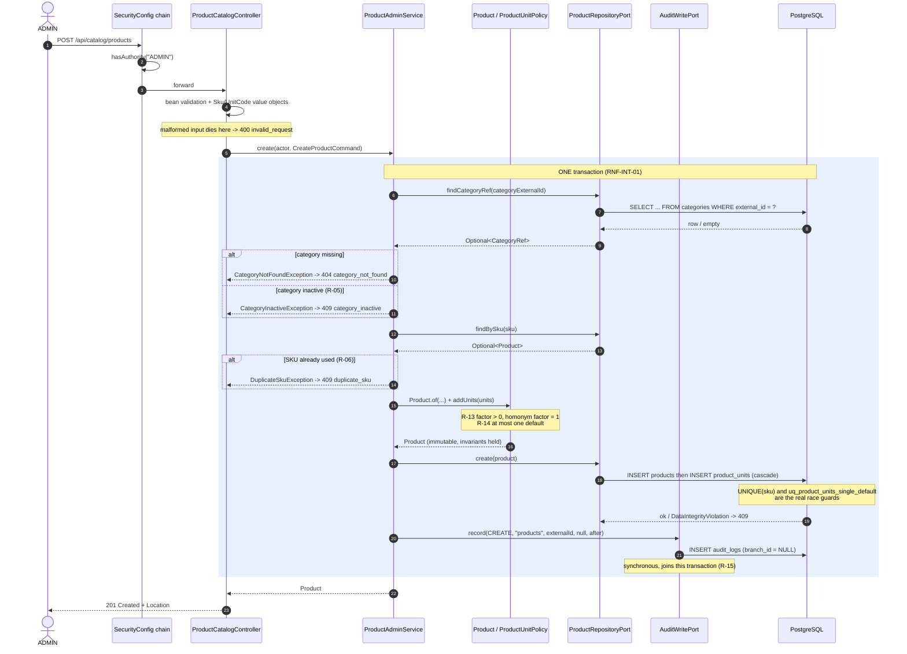
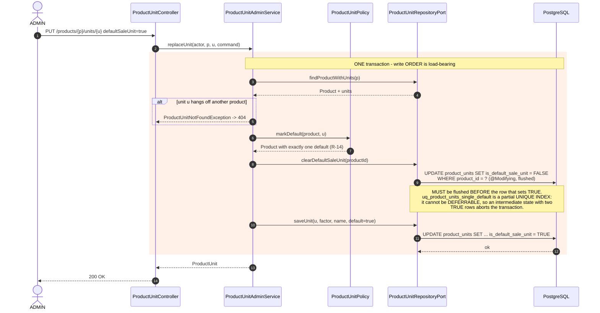
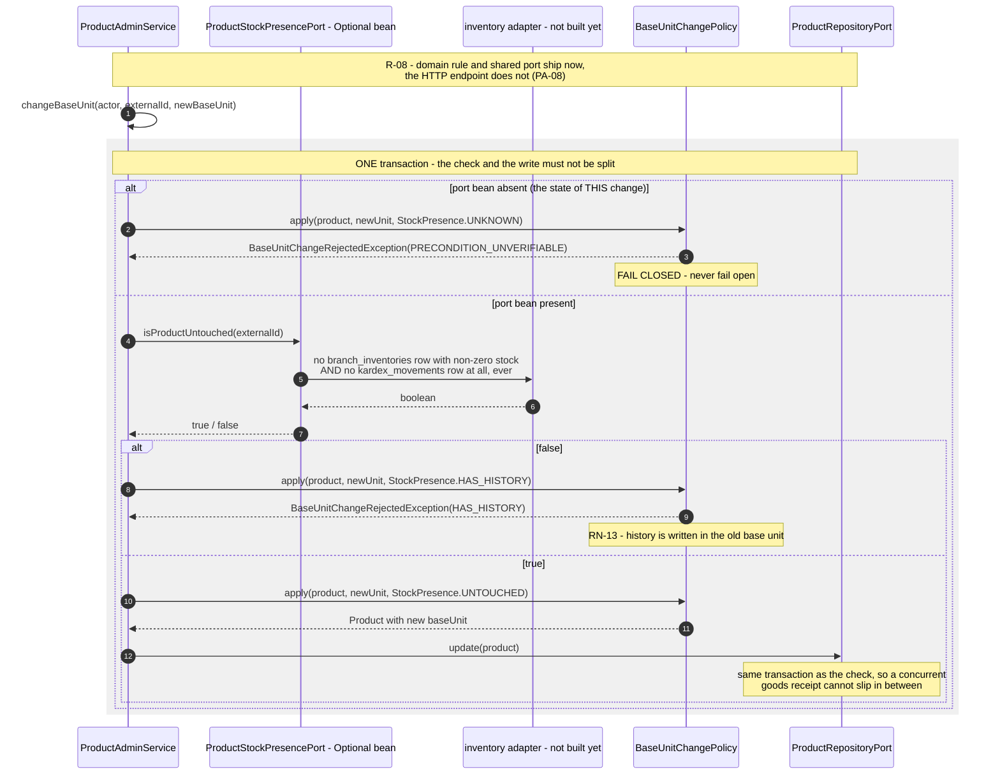

# Design: `add-catalog-module`

- **Input**: `openspec/changes/add-catalog-module/contract.md` (accepted, 850 lines).
- **Phase**: 2 of 3. Consumed by `backend-implementer` / `sdd-apply` together with `tasks.md`.
- **Reference module**: `iam` (`openspec/changes/archive/2026-08-28-add-iam-module/`). Structure,
  naming and test style are imitated; none of its logic is.
- **Language**: English (contract PA-01). `docs/` stays Spanish.

## 0. Verification status of every external fact in this document

Nothing below was written from memory. What was executed, and what it proved:

| Fact | How it was verified |
| :--- | :--- |
| `categories` / `products` / `product_units` columns, types, FKs, indexes | Read from `backend/init-db/01-init-schema.sql:78-117` |
| Seed shape: explicit column list for `categories`, one default unit per product | Read from `backend/init-db/02-seed-data.sql:45-65` |
| The four seeded category names have no case-insensitive collision | Read from `02-seed-data.sql:46-49` |
| `org.springframework.http.HttpMethod` | Present in `~/.m2/.../spring-web/7.0.9/spring-web-7.0.9.jar` |
| `org.springframework.web.bind.MethodArgumentNotValidException` | Present in `spring-web-7.0.9.jar` |
| `org.springframework.web.method.annotation.MethodArgumentTypeMismatchException` | Present in `spring-web-7.0.9.jar` |
| `org.springframework.data.jpa.repository.Modifying` | Present in `spring-data-jpa-4.1.1.jar` |
| `org.springframework.data.domain.Sort` | Present in `spring-data-commons-4.1.1.jar` |
| `org.springframework.dao.DataIntegrityViolationException` | Present in `spring-tx-7.0.9.jar` |
| The three Mermaid sequence diagrams in §9 | **Rendered** with `@mermaid-js/mermaid-cli@11` to SVG. Two failed to parse on the first attempt and were fixed (see §9 note) — which is the whole reason the project forbids shipping an unrendered diagram |
| `validar_esquema.sh` currently runs 25 checks | Counted per section against `scripts/validar_esquema.sh` (A=3, B=3, C=8, D=6, E=3, F=2) |
| `validar_trazabilidad.py` only reads `docs/` and only tracks `RF`/`RNF`/`RN`/`CU`/`DT` identifiers | Read from `scripts/validar_trazabilidad.py:20-99` |
| `AuditWriteAdapter` carries no `@Transactional` of its own | Read from `iam/infrastructure/adapter/out/persistence/AuditWriteAdapter.java:14-30` |
| `@EnableMethodSecurity` / `@PreAuthorize` absent from `backend/src/main` | `rg` over `backend/src/main` returned zero hits (re-confirming contract §2.4) |

**Not verified, and named as such:** the p95 latency target of §9 of the contract. No load test
exists and none is created by this change; §8.4 below states what the design actually guarantees
instead of repeating a number nobody measured.

---

## 1. Module placement and the dependency graph

`catalog` owns products, categories and units of measure — architecture §2.4
(`docs/decisiones_arquitectura_tecnica.md:79`). It is a new direct subpackage of
`com.optiplant.inventory`, which is legal precisely because it is one of the ten declared business
modules (CLAUDE.md's base-package rule). No `config/` or `util/` subpackage is created anywhere.

```
catalog ──────► shared ◄────── inventory   (later; ships the port implementation)
   │
   └──► shared/security  (AuthenticatedPrincipal, PrincipalAccessor)
   └──► shared/audit     (AuditWritePort, AuditEntryCommand, AuditAction)
   └──► shared/stock     (ProductStockPresencePort)   ← new in this change
```

**Cycle proof.** `catalog` imports exactly two package roots outside itself: the JDK, and
`com.optiplant.inventory.shared..`. It imports no class of `iam`, `inventory` or any other module.
The slice graph therefore gains **zero** module-to-module edges, so `noHayCiclosEntreModulos`
(`ModuleBoundariesTest.java:80-87`) and `ningunModuloEntraAlInteriorDeOtro` (`:67-77`) both stay
green — and green *non-vacuously*, since `catalog` classes now exist for the rules to evaluate.

`shared/stock/ProductStockPresencePort` imports only `java.util.UUID`, so `sharedEsUnaHoja`
(`:90-97`) and `SharedIsFrameworkFreeTest` keep holding.

**`iam` is touched at exactly one point**: two matcher lines in
`iam/infrastructure/config/SecurityConfig.java` (§7). Those are string literals, not imports — no
type dependency, no boundary crossed. `iam` is not otherwise edited by this change.

---

## 2. Package layout

```
com.optiplant.inventory
├── shared/
│   ├── audit/    AuditAction                       ← extended: + ENABLE, DELETE
│   └── stock/    ProductStockPresencePort          ← NEW package, JDK-only, leaf
└── catalog/
    ├── domain/
    │   ├── model/      CategoryName · Sku · UnitCode                  (value objects)
    │   │               Category · CategorySummary · CategoryRef
    │   │               Product · ProductSummary · ProductUnit
    │   │               ActiveFilter · ProductSort · StockPresence     (enums)
    │   ├── exception/  CategoryNotFoundException · ProductNotFoundException
    │   │               ProductUnitNotFoundException · DuplicateCategoryNameException
    │   │               DuplicateSkuException · DuplicateProductUnitException
    │   │               CategoryInUseException · CategoryInactiveException
    │   │               InvalidConversionFactorException
    │   │               BaseUnitChangeRejectedException
    │   └── service/    ProductUnitPolicy · BaseUnitChangePolicy
    ├── application/
    │   ├── port/in/    ManageCategoriesUseCase · ManageProductsUseCase
    │   │               ManageProductUnitsUseCase
    │   ├── port/out/   CategoryRepositoryPort · ProductRepositoryPort
    │   │               ProductUnitRepositoryPort
    │   └── service/    CategoryAdminService · ProductAdminService
    │                   ProductUnitAdminService
    └── infrastructure/
        └── adapter/
            ├── in/web/            CategoryController · ProductController
            │                      ProductUnitController · CatalogExceptionHandler
            │                      (request/response DTOs nested in their controller)
            └── out/persistence/   CategoryJpaEntity · ProductJpaEntity · ProductUnitJpaEntity
                                   CategorySpringDataRepository · ProductSpringDataRepository
                                   ProductUnitSpringDataRepository
                                   CategoryPersistenceAdapter · ProductPersistenceAdapter
                                   ProductUnitPersistenceAdapter
                                   CategoryMapper · ProductMapper
```

`catalog/infrastructure/config/` does **not** exist: this module configures nothing. Its
authorization lives in `iam`'s existing filter chain (§7) and it introduces no properties.

---

## 3. Domain model

Pure Java. No `org.springframework..`, no `jakarta.persistence..`, no `..application..`,
no `..infrastructure..` — `elDominioNoConoceInfraestructuraNiFramework`
(`ModuleBoundariesTest.java:35-46`).

Every model type is a **record**, hence immutable. Mutation is expressed as a `with*` copy, so no
use case can hand a half-mutated aggregate to the persistence adapter and no invariant can be
bypassed after construction.

### 3.1. Value objects — validation lives here, once

| Type | Fields | Invariant it protects | Anchor |
| :--- | :--- | :--- | :--- |
| `CategoryName` | `String value` | Trimmed; `1..100` chars; not blank. Exposes `comparisonKey()` = `value.toLowerCase(Locale.ROOT)` for the case-insensitive uniqueness of R-02. Case is **preserved** in `value` — these are human-facing display names. | R-02; `categories.name VARCHAR(100) NOT NULL` (`01-init-schema.sql:81`) |
| `Sku` | `String value` | Trimmed **and uppercased** at construction; `1..50`; not blank. Because every persisted SKU is uppercase, the existing `UNIQUE (sku)` is a *sufficient* guarantee of R-06 — `abc-1` and `ABC-1` cannot coexist. | R-06; `products.sku VARCHAR(50) NOT NULL UNIQUE` (`:92`) |
| `UnitCode` | `String value` | Trimmed, uppercased, must match `^[A-Z0-9_]+$` and be `1..50`. Static factory `UnitCode.baseUnit(String)` applies the same rules with the tighter bound `1..20`. One type, one character set, two explicit bounds — each anchored to its own column. | R-07, R-13; `products.base_unit VARCHAR(20)` (`:97`), `product_units.unit_name VARCHAR(50)` (`:109`) |

All three throw `IllegalArgumentException` on violation, which `CatalogExceptionHandler` maps to
`400 invalid_request` (§6.3) — the same shape `IamExceptionHandler.java:97-101` already uses.

**Why validation lives in the value object and not in the controller's bean-validation
annotations**: RNF-MAN-01 requires the domain to be testable without infrastructure. A `@Pattern`
on a DTO field is unreachable from a domain unit test, and it would leave the *use case* callable
with an unnormalized SKU. Bean validation still runs on the DTOs, but only for shape (`@NotBlank`,
`@Size`) so a malformed body is rejected before the domain is touched (RNF-SEC-05). Normalization
happens exactly once, in the VO.

### 3.2. Enums

| Type | Values | Purpose |
| :--- | :--- | :--- |
| `ActiveFilter` | `ACTIVE`, `INACTIVE`, `ALL` | R-12's tri-state listing filter. `static ActiveFilter parse(String raw)` accepts `"true"`, `"false"`, `"all"` and throws `IllegalArgumentException` on anything else — `active=maybe` therefore yields `400 invalid_request`, not a Spring type-mismatch page. Default is `ACTIVE`. |
| `ProductSort` | `SKU`, `NAME`, `CREATED_AT` | The closed allow-list of R-12. `static ProductSort parse(String raw)`. Nothing outside it can reach a query, so `sort=(select 1)` is a `400` and is never interpolated. |
| `StockPresence` | `UNTOUCHED`, `HAS_HISTORY`, `UNKNOWN` | The three answers R-08 must distinguish, including "the port could not answer". See §5.2. |

### 3.3. Entities and projections

```java
record CategoryRef(UUID externalId, String name, boolean active) {}

record Category(UUID externalId, CategoryName name, String description,
                boolean active, Instant createdAt, Instant updatedAt) {

    Category withName(CategoryName name, String description, Instant now);   // → updatedAt = now
    Category withActive(boolean active, Instant now);                        // → updatedAt = now
}

/** Read projection. activeProductCount is derived data the category does not own. */
record CategorySummary(Category category, long activeProductCount) {}

record ProductUnit(UUID externalId, UnitCode unitName, BigDecimal conversionFactor,
                   boolean defaultSaleUnit, Instant createdAt) {
    // compact constructor: conversionFactor != null && > 0
    //                      → InvalidConversionFactorException
}

record Product(UUID externalId, Sku sku, String name, String description,
               UnitCode baseUnit, boolean active, CategoryRef category,
               List<ProductUnit> units, Instant createdAt, Instant updatedAt) {

    // compact constructor: units → List.copyOf (defensive), then asserts
    //   R-13  no two units share a unitName          → DuplicateProductUnitException
    //   R-13  a unit named like baseUnit has factor 1 → InvalidConversionFactorException
    //   R-14  at most one unit has defaultSaleUnit    → IllegalStateException
    // No Product instance can exist that violates these.

    Product withDetails(Sku sku, String name, String description, CategoryRef category, Instant now);
    Product withActive(boolean active, Instant now);
    Product withBaseUnit(UnitCode baseUnit, Instant now);   // reachable only via BaseUnitChangePolicy
    Product withUnits(List<ProductUnit> units);
}

/** List projection — deliberately without units and description (contract §6.2), so a
 *  100-row page cannot trigger a per-row unit query. */
record ProductSummary(UUID externalId, Sku sku, String name, UnitCode baseUnit,
                      boolean active, CategoryRef category,
                      Instant createdAt, Instant updatedAt) {}
```

**Why `Category` does not carry `activeProductCount`.** The count belongs to `products`, not to the
category. If it were a field, every mutation path would have to invent a value for it, and
`Category` could no longer be serialized as an audit payload without embedding a number that has
nothing to do with the mutation. `CategorySummary` pairs the two only where the API needs them
together (contract §6.1), and the audit payload serializes the bare `Category`.

**Why `ProductSummary` is a separate type rather than a `Product` with an empty `units` list.**
An empty list would be ambiguous — "this product has no units" and "we did not load them" would be
indistinguishable, and the first caller to iterate it in the list path would silently get the wrong
answer. Two types make the difference a compile-time fact.

### 3.4. Domain exceptions

`catalog/domain/exception/`, all extending `RuntimeException`, mirroring `iam`'s style:

| Exception | Raised by | Rule |
| :--- | :--- | :--- |
| `CategoryNotFoundException` | category lookup by `external_id`, and product create/edit referencing a category | R-04, R-06, R-09 |
| `ProductNotFoundException` | product lookup by `external_id` | R-09, R-10, R-11 |
| `ProductUnitNotFoundException` | unit lookup — **including a unit that exists but hangs off another product** | contract §6.3 |
| `DuplicateCategoryNameException` | case-insensitive name collision | R-02 |
| `DuplicateSkuException` | SKU collision on create and on edit | R-06, R-09 |
| `DuplicateProductUnitException` | `unit_name` repeated inside one product | R-13 |
| `CategoryInUseException` | disabling a category with ≥ 1 **active** product | R-04 |
| `CategoryInactiveException` | creating/moving a product into, or re-enabling one under, an inactive category | R-05, R-11 |
| `InvalidConversionFactorException` | factor ≤ 0, or a base-unit homonym with factor ≠ 1 | R-13 |
| `BaseUnitChangeRejectedException` | R-08's refusal. Carries `Reason { HAS_HISTORY, PRECONDITION_UNVERIFIABLE }` | R-08 |

**`BaseUnitChangeRejectedException` gets no entry in `CatalogExceptionHandler`, deliberately.**
Contract §7 withdraws both base-unit error codes because PA-08 defers the endpoint, and a code with
no reachable path is dead contract. The exception is reachable only from `BaseUnitChangePolicyTest`
and `ProductAdminServiceTest` until `inventory` ships the endpoint. The implementer **must not**
"complete" the handler by adding a mapping for it.

The `Reason` enum exists now so that the future slice can emit its two distinct codes — one for
*"the product has history"*, one for *"the port cannot answer"* (contract §7's closing note) —
without reopening the domain. Collapsing them later would make an infrastructure gap look like a
business rejection in the logs, which is exactly what that note warns against.

---

## 4. Domain services

### 4.1. `ProductUnitPolicy`

Pure functions over `Product`; the record's compact constructor is what *asserts* the invariants,
this service is what *transforms* while keeping them. Every method returns a new `Product`.

```java
Product addUnit(Product product, ProductUnit unit);
Product replaceUnit(Product product, UUID unitExternalId, UnitCode name,
                    BigDecimal factor, boolean defaultSaleUnit);
Product removeUnit(Product product, UUID unitExternalId);
```

Each one, when the incoming unit carries `defaultSaleUnit = true`, first clears the flag on every
sibling and only then applies it — so the returned `Product` always satisfies R-14. When
`defaultSaleUnit = false` is applied to the current default, the product legitimately ends with no
default at all (R-14's fourth scenario: the mark is optional, `DEFAULT FALSE` at `:111`).

Homonym rule (R-13): a unit whose `unitName` equals `product.baseUnit()` is accepted **only** with
`conversionFactor == 1`. The base unit is worth exactly one base unit; accepting anything else
would let two contradictory conversions of the same name coexist.

`removeUnit` on the current default is allowed and leaves the product with none — R-13's last
scenario, and no other table references `product_units`.

### 4.2. `BaseUnitChangePolicy`

```java
Product apply(Product product, UnitCode newBaseUnit, StockPresence presence, Instant now);
```

| `presence` | Outcome |
| :--- | :--- |
| `UNTOUCHED` | returns `product.withBaseUnit(newBaseUnit, now)` |
| `HAS_HISTORY` | throws `BaseUnitChangeRejectedException(HAS_HISTORY)` |
| `UNKNOWN` | throws `BaseUnitChangeRejectedException(PRECONDITION_UNVERIFIABLE)` |

**Why the domain takes an enum instead of the port.** The port lives in `shared` and the domain may
legally import it, but taking `Optional<ProductStockPresencePort>` would make fail-closed an
accident of whichever `orElse(...)` the implementer typed. With three explicit values the refusal is
a *case in a switch*, all four R-08 scenarios are unit-testable with no stub at all, and there is no
`Optional` whose default could silently become `true`. Contract §2.2 is emphatic that this must
**not** fail open; this shape is what makes failing open unwriteable rather than merely discouraged.

The mapping from port to enum lives in `ProductAdminService` (§5.2) — one line, covered by its own
unit test with a stubbed port, which is what the contract's DoD asks for.

**No `WeightedAverageCost`-style domain service exists here.** `catalog` computes nothing; RN-10 and
RN-02 belong to `inventory`.

---

## 5. Application layer

### 5.1. Primary ports (`application/port/in`)

Following `ManageBranchesUseCase`, reads and mutations live on the same per-resource port.
**Mutation methods take an `AuthenticatedPrincipal actor`; read methods do not.** That is not
cosmetic: it makes R-16 (*the catalog has no branch dimension and must not vary by caller*)
structurally true — the read path has no way to see who is asking, so it cannot vary. RN-14 is
satisfied for the same reason there is nothing to satisfy: no method anywhere accepts a branch id.

```java
public interface ManageCategoriesUseCase {                            // CU-INV-01
    CategoryPage list(CategoryQuery query);                           // R-12
    CategorySummary get(UUID externalId);                             // → CategoryNotFoundException
    CategorySummary create(AuthenticatedPrincipal actor, CreateCategoryCommand c);   // R-02
    CategorySummary edit(AuthenticatedPrincipal actor, UUID externalId,
                         EditCategoryCommand c);                      // R-02, R-03
    CategorySummary disable(AuthenticatedPrincipal actor, UUID externalId);  // R-03, R-04
    CategorySummary enable(AuthenticatedPrincipal actor, UUID externalId);   // R-03, R-11

    record CreateCategoryCommand(String name, String description) {}
    record EditCategoryCommand(String name, String description) {}
    record CategoryQuery(String name, ActiveFilter active, int page, int size) {}
}

public interface ManageProductsUseCase {                              // CU-INV-01
    ProductPage list(ProductQuery query);                             // R-12
    Product get(UUID externalId);                                     // R-10 — inactive still 200
    Product create(AuthenticatedPrincipal actor, CreateProductCommand c);   // R-05, R-06, R-07, R-13
    Product edit(AuthenticatedPrincipal actor, UUID externalId, EditProductCommand c); // R-05, R-09
    Product disable(AuthenticatedPrincipal actor, UUID externalId);   // R-10
    Product enable(AuthenticatedPrincipal actor, UUID externalId);    // R-11

    /** R-08. No controller calls this in this change (PA-08); it exists so the rule,
     *  the port and the transaction boundary are settled before `inventory` implements them. */
    Product changeBaseUnit(AuthenticatedPrincipal actor, UUID externalId, String newBaseUnit);

    record CreateProductCommand(String sku, String name, String description,
                                UUID categoryExternalId, String baseUnit,
                                List<NewUnit> units) {}
    record NewUnit(String unitName, BigDecimal conversionFactor, boolean defaultSaleUnit) {}
    /** baseUnit is deliberately absent — it is fixed at creation in this change (§6.2). */
    record EditProductCommand(String sku, String name, String description,
                              UUID categoryExternalId) {}
    record ProductQuery(String q, UUID categoryExternalId, ActiveFilter active,
                        ProductSort sort, boolean ascending, int page, int size) {}
}

public interface ManageProductUnitsUseCase {                          // CU-INV-02
    List<ProductUnit> list(UUID productExternalId);                   // not paginated — §6.3
    ProductUnit add(AuthenticatedPrincipal actor, UUID productExternalId, UnitCommand c);
    ProductUnit replace(AuthenticatedPrincipal actor, UUID productExternalId,
                        UUID unitExternalId, UnitCommand c);
    void delete(AuthenticatedPrincipal actor, UUID productExternalId, UUID unitExternalId);

    record UnitCommand(String unitName, BigDecimal conversionFactor, boolean defaultSaleUnit) {}
}
```

`CategoryPage` / `ProductPage` are `record(List<T> content, long totalElements, int page, int size)`
declared on the corresponding **out** port, exactly as `BranchRepositoryPort.BranchPage` is.

`changeBaseUnit` takes a raw `String` and builds `UnitCode.baseUnit(...)` internally so the
validation of R-07 applies identically whether the caller is a future controller or a test.

### 5.2. Application services

| Service | Implements | Notes |
| :--- | :--- | :--- |
| `CategoryAdminService` | `ManageCategoriesUseCase` | `@Transactional` on mutations, `@Transactional(readOnly = true)` on reads |
| `ProductAdminService` | `ManageProductsUseCase` | idem |
| `ProductUnitAdminService` | `ManageProductUnitsUseCase` | idem |

Each mutation is: load → apply domain rule → persist → `auditWritePort.record(...)`, all inside one
`@Transactional` (§8). The audit call is last so the payload-after is the persisted state, matching
`BranchAdminService.java:45-85`.

**`ProductAdminService` and the stock-presence port — the one piece of Spring subtlety in this
module.** It is constructor-injected as `Optional<ProductStockPresencePort>`. Spring supplies
`Optional.empty()` when no bean implements the interface, which is exactly the state of this change:

```java
private StockPresence presenceOf(UUID productExternalId) {
    return stockPresencePort
            .map(port -> port.isProductUntouched(productExternalId)
                    ? StockPresence.UNTOUCHED : StockPresence.HAS_HISTORY)
            .orElse(StockPresence.UNKNOWN);          // fail closed — contract §2.2
}
```

Three lines, three cases, one unit test each. `orElse(StockPresence.UNKNOWN)` is the fail-closed
default and `BaseUnitChangePolicy` refuses on `UNKNOWN`, so there is no arrangement of these two
lines that lets the change through unproven.

### 5.3. Secondary ports (`application/port/out`)

Named for the need, never the technology. No port mentions JPA, SQL or a table.

```java
public interface CategoryRepositoryPort {
    Optional<CategorySummary> findByExternalId(UUID externalId);
    Optional<CategoryRef> findRefByExternalId(UUID externalId);   // cheap ref for the product path
    boolean existsByNameIgnoringCase(String comparisonKey, UUID excludingExternalId);  // R-02
    boolean hasActiveProducts(UUID externalId);                   // R-04
    CategorySummary create(NewCategory newCategory);
    CategorySummary update(UUID externalId, CategoryUpdate update);
    CategorySummary setActive(UUID externalId, boolean active, Instant updatedAt);
    CategoryPage list(CategoryFilter filter);

    record NewCategory(String name, String description) {}
    record CategoryUpdate(String name, String description, Instant updatedAt) {}
    record CategoryFilter(String name, ActiveFilter active, int page, int size) {}
    record CategoryPage(List<CategorySummary> content, long totalElements, int page, int size) {}
}

public interface ProductRepositoryPort {
    Optional<Product> findByExternalId(UUID externalId);          // with units
    boolean existsBySku(String normalizedSku, UUID excludingExternalId);   // R-06, R-09
    Product create(NewProduct newProduct);                        // product + inline units, one tx
    Product update(UUID externalId, ProductUpdate update);
    Product setActive(UUID externalId, boolean active, Instant updatedAt);
    Product setBaseUnit(UUID externalId, String baseUnit, Instant updatedAt);   // R-08, deferred
    ProductPage list(ProductFilter filter);

    record NewProduct(String sku, String name, String description, UUID categoryExternalId,
                      String baseUnit, List<NewUnitRow> units) {}
    record NewUnitRow(String unitName, BigDecimal conversionFactor, boolean defaultSaleUnit) {}
    record ProductUpdate(String sku, String name, String description,
                         UUID categoryExternalId, Instant updatedAt) {}
    record ProductFilter(String q, UUID categoryExternalId, ActiveFilter active,
                         ProductSort sort, boolean ascending, int page, int size) {}
    record ProductPage(List<ProductSummary> content, long totalElements, int page, int size) {}
}

public interface ProductUnitRepositoryPort {
    List<ProductUnit> findByProduct(UUID productExternalId);
    Optional<ProductUnit> find(UUID productExternalId, UUID unitExternalId);  // scoped by product
    /** Clears is_default_sale_unit on every unit of the product and FLUSHES.
     *  Called before any write that sets it — see §8.2, this ordering is load-bearing. */
    void clearDefaultSaleUnit(UUID productExternalId);
    ProductUnit add(UUID productExternalId, NewUnitRow unit);
    ProductUnit replace(UUID productExternalId, UUID unitExternalId, NewUnitRow unit);
    void delete(UUID productExternalId, UUID unitExternalId);
}
```

**`excludingExternalId` on the two uniqueness checks** is what makes editing an entity to its own
current SKU/name a no-op rather than a spurious `409` (R-09's first scenario: an ordinary rename
must not trip the duplicate guard on the row being renamed). `null` on the create path.

**The port `catalog` consumes but does not implement** — the contract's §2.2 inbound port, in
`shared` so no module-to-module edge exists:

```java
package com.optiplant.inventory.shared.stock;

public interface ProductStockPresencePort {
    /**
     * A product is untouched when (a) it has no branch_inventories row with a non-zero
     * current_stock, reserved_stock or in_transit_stock, AND (b) it has no
     * kardex_movements row at all, in any branch, ever.
     *
     * Clause (b) is not redundant: a product whose stock returned to zero still has
     * history recorded in the OLD base unit, and RN-13 exists to stop that history
     * being silently reinterpreted.
     *
     * One consumer (catalog), one future implementer (inventory), one question. This
     * interface MUST NOT grow a stock-shaped return type or a second method.
     */
    boolean isProductUntouched(UUID productExternalId);
}
```

Package `shared/stock`, not `shared/inventory`: the port names the *question* it answers, and a
package called `inventory` inside `shared` would read as a second home for a module that already has
one.

### 5.4. Domain events

**None.** Contract §8 fixes this and the design agrees: no alerting or analytics consumer is
interested in master data yet, and an `AFTER_COMMIT` event with no recipient is coupling with no
purpose. The audit write is emphatically **not** an event — it is the synchronous
`AuditWritePort` inside the same transaction (CLAUDE.md's atomic-effects invariant, R-15).

---

## 6. Adapters

### 6.1. Driving adapter — web

Three controllers, one per resource, each with its request/response DTOs nested as records. Every
identifier crossing the boundary is an `external_id` UUID; no `Long` appears in any DTO.

| Controller | Base path |
| :--- | :--- |
| `CategoryController` | `/api/catalog/categories` |
| `ProductController` | `/api/catalog/products` |
| `ProductUnitController` | `/api/catalog/products/{productExternalId}/units` |

Endpoints, status codes and payloads are exactly contract §6.1–§6.3. Two implementation points that
are easy to get wrong:

**`201 Created` with a `Location` header.** `iam`'s `BranchAdminController.create` returns a plain
body (HTTP 200). The catalog contract requires `201 + Location`, so catalog deviates deliberately:
`ResponseEntity.created(URI.create("/api/catalog/products/" + p.externalId())).body(...)`. The
`Location` carries the `external_id` only — never a numeric id (§7.1 point 1).

**`PUT /products/{externalId}` must *reject* a `baseUnit` field, not ignore it.** Spring Boot
disables `FAIL_ON_UNKNOWN_PROPERTIES` by default, so an unknown JSON property is silently dropped —
and `@JsonIgnoreProperties(ignoreUnknown = false)` does **not** re-enable failing (`false` is that
annotation's own default; it defers to the mapper config, which is off). Turning the mapper flag on
globally would change `iam`'s behaviour too. So `EditProductRequest` declares the field explicitly
and refuses it:

```java
public record EditProductRequest(@NotBlank @Size(max = 50) String sku,
                                 @NotBlank @Size(max = 150) String name,
                                 String description,
                                 @NotNull UUID categoryExternalId,
                                 String baseUnit) {          // present only to be rejected
}
// in the controller, before calling the use case:
if (request.baseUnit() != null) {
    throw new IllegalArgumentException(
        "baseUnit cannot be changed through this endpoint");   // → 400 invalid_request
}
```

Contract §12.3 point 3 is explicit that a client sending the field must *learn* the change did not
happen. `"baseUnit": null` is indistinguishable from absent and is treated as absent — sending null
is not an attempt to change anything. This is exactly the kind of thing that reads as correct and
fails when executed, so `tasks.md` requires an integration test that actually sends the field.

**Query-parameter parsing.** `active` and `sort` are bound as `String` and parsed by
`ActiveFilter.parse` / `ProductSort.parse`, never bound straight to `Boolean`/an enum: direct
binding would produce Spring's own type-mismatch response instead of the `{code, message}` envelope
§7 requires, and would have no way to express `all`. `size` is **clamped** to the cap, not rejected
(contract §9: "a larger `size` is clamped, not rejected"), matching
`BranchAdminController.java:74`. `page` and `size` constants: `DEFAULT_PAGE_SIZE = 20`,
`MAX_PAGE_SIZE = 100`.

### 6.2. Driven adapter — persistence

Three JPA entities mapping the real columns of `01-init-schema.sql:78-117` plus S-1/S-2.

```java
@Entity @Table(name = "categories")
class CategoryJpaEntity {
    Long id; UUID externalId; String name; String description;
    boolean active;              // is_active   ← S-1
    Instant createdAt; Instant updatedAt;      // updated_at ← S-2
}

@Entity @Table(name = "products")
class ProductJpaEntity {
    Long id; UUID externalId;
    @ManyToOne(fetch = LAZY, optional = false) @JoinColumn(name = "category_id")
    CategoryJpaEntity category;
    String sku; String name; String description; String baseUnit;
    boolean active; Instant createdAt; Instant updatedAt;
    @OneToMany(mappedBy = "product", cascade = ALL, orphanRemoval = true)
    List<ProductUnitJpaEntity> units = new ArrayList<>();
}

@Entity @Table(name = "product_units")
class ProductUnitJpaEntity {
    Long id; UUID externalId;
    @ManyToOne(fetch = LAZY, optional = false) @JoinColumn(name = "product_id")
    ProductJpaEntity product;
    String unitName; BigDecimal conversionFactor; boolean defaultSaleUnit; Instant createdAt;
    // no updated_at — the table has none and none is added (contract §6.3)
}
```

**Deviation from `iam`, with its reason.** `UserJpaEntity` keeps `branch_id` as a plain `Long`, and
its own Javadoc gives the reason: *"no `BranchJpaEntity` exists yet"*. Here both sides of every
association live in the same module and are created in the same change, and two things need the
association: the product detail response embeds the category's name and active flag (contract §6.2),
and `POST /products` must persist inline units in the same transaction (R-06). A `@ManyToOne` +
cascade expresses both directly; keeping plain `Long` columns would mean hand-resolving
`category_id` on every write and issuing a second query on every read. The N+1 risk that usually
argues against associations is closed explicitly in the list query below.

`conversion_factor` is `NUMERIC(12,4)`, so the Java type is `BigDecimal` — never `double`, which
cannot represent a decimal factor exactly and would drift the moment `inventory` multiplies by it.

**Spring Data repositories.** Three, one per entity. The load-bearing queries:

```java
// ProductSpringDataRepository — JPQL, NOT native. Spring Data JPA rejects a dynamic Sort on a
// native query (a fact this repo learned by executing — see AuditWriteAdapter.java:56-58), and
// R-12 needs three sort fields, so JPQL is the only shape that works.
@Query("""
        SELECT p FROM ProductJpaEntity p JOIN FETCH p.category c
        WHERE (:q IS NULL OR LOWER(p.sku) LIKE LOWER(CONCAT('%', :q, '%'))
                          OR LOWER(p.name) LIKE LOWER(CONCAT('%', :q, '%')))
          AND (:categoryId IS NULL OR c.id = :categoryId)
          AND (:active IS NULL OR p.active = :active)
        """)
Page<ProductJpaEntity> search(@Param("q") String q, @Param("categoryId") Long categoryId,
                              @Param("active") Boolean active, Pageable pageable);
```

`JOIN FETCH p.category` is what keeps a 100-row page at **one** query instead of 101 — the N+1 the
contract warns about in §6.2. The `Pageable` carries the `Sort` built from the `ProductSort` enum,
so the sort field is chosen from a closed set in Java and never interpolated.

```java
// CategorySpringDataRepository — the active-product count for a whole page in ONE query,
// not one query per row.
@Query("""
        SELECT p.category.id AS categoryId, COUNT(p) AS total FROM ProductJpaEntity p
        WHERE p.category.id IN :categoryIds AND p.active = TRUE GROUP BY p.category.id
        """)
List<CategoryProductCount> countActiveProductsByCategoryIds(@Param("categoryIds") List<Long> ids);

boolean existsByCategoryIdAndActiveIsTrue(Long categoryId);        // R-04, cheap existence check

@Query("SELECT COUNT(c) > 0 FROM CategoryJpaEntity c WHERE LOWER(c.name) = :key AND c.externalId <> :excluding")
boolean existsByNameIgnoringCase(@Param("key") String comparisonKey,
                                 @Param("excluding") UUID excludingExternalId);
```

So a category listing costs two queries regardless of page size: the page, then one grouped count.

```java
// ProductUnitSpringDataRepository — §8.2. flushAutomatically is what makes the ordering real.
@Modifying(flushAutomatically = true, clearAutomatically = true)
@Query("UPDATE ProductUnitJpaEntity u SET u.defaultSaleUnit = FALSE WHERE u.product.externalId = :p")
void clearDefaultSaleUnit(@Param("p") UUID productExternalId);
```

**Persistence adapters** implement the out-ports, map entity ↔ domain through MapStruct mappers
(`@Mapper(componentModel = "spring")`, as `BranchMapper`), and are the only classes that ever see a
numeric `id`. No numeric id is returned from any adapter method — every port signature above traffics
in UUIDs and domain records.

**Prohibited, and ArchUnit cannot catch it (contract §2.2, rejected alternative 2):** no `catalog`
adapter may issue SQL — JPQL or native — against `branch_inventories` or `kardex_movements`. SQL
strings import no types, so every boundary rule would pass while `catalog` became a silent
co-owner of `inventory`'s tables. This is a manual-review item in the DoD and a `rg` check in
`tasks.md`.

### 6.3. `CatalogExceptionHandler`

`@RestControllerAdvice(basePackages = "com.optiplant.inventory.catalog.infrastructure.adapter.in.web")`
— scoped exactly as `IamExceptionHandler` is (`IamExceptionHandler.java:25`), so neither module's
advice can swallow the other's exceptions.

| Exception | HTTP | `code` |
| :--- | :---: | :--- |
| `IllegalArgumentException` (value objects, `active`/`sort` parsing, rejected `baseUnit`) | 400 | `invalid_request` |
| `MethodArgumentNotValidException` (bean validation on a DTO) | 400 | `invalid_request` |
| `MethodArgumentTypeMismatchException` (malformed UUID in the path) | 400 | `invalid_request` |
| `InvalidConversionFactorException` | 400 | `invalid_conversion_factor` |
| `CategoryNotFoundException` | 404 | `category_not_found` |
| `ProductNotFoundException` | 404 | `product_not_found` |
| `ProductUnitNotFoundException` | 404 | `product_unit_not_found` |
| `DuplicateCategoryNameException` | 409 | `duplicate_category_name` |
| `DuplicateSkuException` | 409 | `duplicate_sku` |
| `DuplicateProductUnitException` | 409 | `duplicate_product_unit` |
| `CategoryInUseException` | 409 | `category_in_use` |
| `CategoryInactiveException` | 409 | `category_inactive` |
| `DataIntegrityViolationException` | 409 | see below |

Ten codes, matching contract §7 exactly. `BaseUnitChangeRejectedException` is **absent** on purpose
(§3.4).

`DataIntegrityViolationException` is the last line of defence, reached when the database rejects
what the in-memory pre-check let through — a concurrent duplicate SKU, a concurrent category name,
or `uq_product_units_single_default`. It maps to the matching `409` code by inspecting the
constraint name **out of the exception's own message**, and its `message` field is hand-written:
no stack trace, no SQL, no constraint name reaches the client (§7.1 point 2), exactly as
`IamExceptionHandler.java:82-86` already does. When the constraint cannot be identified, the code is
the generic `duplicate_sku`… no — it falls back to `invalid_request`? Neither is honest. **Decision:
the fallback is a `409` with code `duplicate_sku` only when the message names `products_sku_key`,
`duplicate_category_name` for `uq_categories_name_ci`, `duplicate_product_unit` for `uq_product_unit`
or `uq_product_units_single_default`; anything else rethrows and becomes a 500.** A wrong-but-tidy
409 would tell the caller to fix a duplicate that does not exist; an unmapped integrity violation is
a genuine defect and should be loud.

`ErrorResponse` is a local `record(String code, String message)`, duplicated from `iam`'s
package-private one. It cannot be imported (`ningunModuloEntraAlInteriorDeOtro`), and promoting it
to `shared/web` would touch `iam`, which contract §2.1 limits to a single point. Two two-field
records with a shape pinned by contract §7 and asserted by integration tests in both modules is the
cheaper cost. Flagged for a future `shared/web` extraction when a third module needs it; **not**
filed as technical debt (§11).

---

## 7. Where `/api/catalog/**` is authorized — the decision the contract delegated

Contract §2.4 left this open. **Decision: extend the existing filter chain in
`iam/infrastructure/config/SecurityConfig.java` with two HTTP-method-scoped matchers.** Method
security (`@EnableMethodSecurity` + `@PreAuthorize`) is rejected.

```java
// inside authorizeHttpRequests, before .anyRequest().authenticated():
// Catalog: the READ surface is open to every authenticated role, the MUTATION surface is
// ADMIN-only (contract §5). The split is by HTTP method, not by path — splitting the same
// resource into two path trees by audience would duplicate every route.
.requestMatchers(HttpMethod.GET, "/api/catalog/**").authenticated()
.requestMatchers("/api/catalog/**").hasAuthority("ADMIN")
```

Order matters: the `GET` matcher must come first, because matchers are evaluated top-down and the
second one would otherwise capture reads too. `org.springframework.http.HttpMethod` is a new import
in `SecurityConfig` — verified present in `spring-web-7.0.9.jar` (§0).

`hasAuthority`, never `hasRole`: the authorities are the bare strings `ADMIN` / `BRANCH_MANAGER` /
`OPERATOR` and `hasRole` would prepend `ROLE_`, which the `CHECK` on `users.role` rejects
(CLAUDE.md; `SecurityConfig.java:69-71` already does it this way).

**Why not method security.** Four reasons, in order of weight:

1. **Contract §5 note 3 and §7.1 point 3 require the `403` to resolve *before* the use case runs**,
   so an `OPERATOR` cannot distinguish `403` from `404` and probe which `external_id`s exist. A
   filter-chain matcher rejects before any controller code runs. `@PreAuthorize` runs after argument
   binding, which changes the contracted order of failures for no gain.
2. `@EnableMethodSecurity` is an **application-wide** switch. Placing it in `catalog` would mean a
   business module silently enabling a global security feature — and silently disabling it for
   everyone if `catalog` were ever removed. Placing it in `iam` means `iam` still owns catalog's
   authorization, which is the situation method security was supposed to avoid.
3. It is not currently enabled anywhere (verified: zero occurrences under `backend/src/main`), so
   choosing it means turning on a new mechanism for one module while `iam` keeps using another.
   Two authorization mechanisms in one application is a maintenance trap.
4. `SecurityConfig`'s own Javadoc already anticipates exactly this: *"Las rutas de otros módulos
   … llegan como cadenas literales en slices futuras, no como imports, así que ninguna frontera se
   cruza por eso."*

**Consequence accepted**: `SecurityConfig` keeps growing a route table for modules it does not own.
The `iam` design already recorded the escape hatch — each module can later contribute its own
ordered `SecurityFilterChain` bean. Two modules do not justify it yet; at five, it should be
revisited.

**Corporate `ADMIN` with `branch_id = NULL` is unaffected.** No matcher and no use case in this
module inspects the principal's branch (contract §5 note 2, §5.1 above).

---

## 8. Transaction boundaries and consistency

### 8.1. The table

Every mutating use case is one `@Transactional` at the application-service method. No
`REQUIRES_NEW` anywhere. Isolation is the PostgreSQL default, **READ COMMITTED**, everywhere:
`catalog` performs no read-modify-write over a contended row, so nothing needs a stronger level.

| Operation | Atomic unit | `AFTER_COMMIT` | Locking | Race guard |
| :--- | :--- | :---: | :---: | :--- |
| `POST /categories` | `INSERT categories` + `INSERT audit_logs` | none | none | `uq_categories_name_ci` (S-4) |
| `PUT /categories/{id}` | `UPDATE categories` (name, description, `updated_at`) + audit | none | none | `uq_categories_name_ci` |
| `PATCH /categories/{id}/disable` | active-product existence check + `UPDATE` + audit | none | none | — |
| `PATCH /categories/{id}/enable` | `UPDATE` + audit | none | none | — |
| `POST /products` | `INSERT products` + `INSERT product_units` × n (cascade) + audit | none | none | `products.sku UNIQUE`, `uq_product_unit`, `uq_product_units_single_default` |
| `PUT /products/{id}` | `UPDATE products` + audit | none | none | `products.sku UNIQUE` |
| `PATCH /products/{id}/disable\|enable` | `UPDATE products` (`is_active`, `updated_at`) + audit. **Balances, Kardex and sales rows are not read and not written** (R-10) | none | none | — |
| `POST` / `PUT` unit | `clearDefaultSaleUnit` (flushed) → `INSERT`/`UPDATE product_units` + audit | none | none | `uq_product_unit`, `uq_product_units_single_default` — see §8.2 |
| `DELETE` unit | `DELETE product_units` + audit | none | none | — |
| `changeBaseUnit` *(no endpoint in this change)* | port call + `UPDATE products` + audit, **in one transaction** | none | none | the transaction itself: a concurrent goods receipt cannot create the first movement between the check and the commit (contract §2.2) |
| every `GET` | `@Transactional(readOnly = true)` | — | — | — |

`readOnly = true` on reads is a small addition over `iam` (whose `list` carries no annotation): it is
a free correctness and optimizer hint, and it makes "this path writes nothing" a declaration rather
than a convention.

**The audit write joins the caller's transaction.** `AuditWriteAdapter` deliberately carries no
`@Transactional` of its own (verified, §0), so `auditWritePort.record(...)` runs inside whatever
transaction the catalog service opened. If the audit insert fails, the catalog mutation rolls back
with it — R-15's second scenario, and CLAUDE.md's atomic-effects invariant.

### 8.2. The default-sale-unit swap — the trap in this change

R-14 requires clearing the previous default and setting the new one in one transaction. S-3 makes
the database enforce it. Together they create a failure mode that reads as correct:

> Hibernate does not guarantee that the `UPDATE` clearing the old flag is written before the
> `UPDATE` setting the new one. If the setting statement flushes first, the table transiently holds
> **two** rows with `is_default_sale_unit = TRUE` for the same `product_id`, and
> `uq_product_units_single_default` aborts the transaction.

`uq_product_units_single_default` is a **partial unique index**, and PostgreSQL cannot defer an
index — only constraints are `DEFERRABLE`, and a partial unique index cannot be expressed as a
`UNIQUE` constraint at all. So the fix cannot be deferral; it has to be write order:

1. `ProductUnitRepositoryPort.clearDefaultSaleUnit(productExternalId)` issues the bulk
   `UPDATE … SET is_default_sale_unit = FALSE` as a `@Modifying(flushAutomatically = true,
   clearAutomatically = true)` query. `flushAutomatically` pushes any pending changes out first;
   `clearAutomatically` drops the now-stale persistence context so the subsequent read sees the
   cleared rows.
2. Only then does the adapter write the row that sets `TRUE`.

This ordering is required on **three** paths: `POST` a unit with `defaultSaleUnit = true`, `PUT` a
unit to `defaultSaleUnit = true`, and — not needed but worth stating — `POST /products` with inline
units, where the product is new so no sibling can already hold the flag and the domain's compact
constructor has already rejected two inline defaults.

`tasks.md` requires an integration test that actually performs the swap against real PostgreSQL. A
unit test cannot catch this: it is a flush-ordering fact of the real database.

### 8.3. What the schema guarantees that the application cannot

Both real races in this module are resolved by constraints, not locks (contract §8):

- **Concurrent creation of the same SKU / the same category name.** Both pre-checks can pass in two
  transactions simultaneously. `products.sku UNIQUE` and the new `uq_categories_name_ci` are what
  make exactly one commit; the loser surfaces as `DataIntegrityViolationException` → `409` (§6.3).
- **Concurrent marking of two default sale units.** `uq_product_units_single_default`.

### 8.4. What is honestly claimed about performance

Contract §9 asserts *"SKU search uses `idx_products_sku`"*. That is not true of the search the
contract itself specifies: R-12 requires a **contains** match (`%npk%`), and a leading wildcard makes
a plain btree index unusable. What the design actually guarantees:

- The **category filter** uses `idx_products_category`, and **lookup by `external_id`** uses
  `idx_products_external_id` — both index scans.
- Free-text `q` is a sequential scan with an `ILIKE`-equivalent predicate. At the contracted
  volumetry (10 000 products, `especificacion_requerimientos.md:217`) that is a scan of a small
  table and comfortably inside p95 < 200 ms; it has not been measured, and this document does not
  claim it has.
- If the catalog ever outgrows that, the fix is a `pg_trgm` GIN index on `sku` and `name`. It is
  **not** added now: an index for a load nobody has measured is speculation, and `pg_trgm` is an
  extension the schema does not currently enable.
- The listing is paginated with a hard cap of 100 (RNF-PER-04), so no query is unbounded.
- The two N+1 risks — units per product row, active-product count per category row — are closed
  structurally (§6.2: `ProductSummary` carries no units; one grouped count query per page).

---

## 9. Sequence diagrams

All three were rendered to SVG with `@mermaid-js/mermaid-cli@11` before being written here. Two
failed to parse on the first attempt — a `;` inside a message text (Mermaid reads it as a statement
separator) and `&lt;…&gt;` inside a participant alias — and are reproduced below in their corrected,
rendered form. This is the project's rule working as intended: an unrendered diagram is not
verified.

### 9.1. Create a product with inline units



### 9.2. Marking a new default sale unit — the write-ordering constraint



### 9.3. The base-unit rule, failing closed with no port implementation



---

## 10. Persistence changes

### 10.1. DDL — exact edits to `backend/init-db/01-init-schema.sql`

Four edits, no new table, nothing dropped or renamed. The `igual "20 tablas creadas"` check
(`validar_esquema.sh:78`) is unaffected: indexes are not tables.

**Edit 1 — `categories` (S-1, S-2), replacing `:78-85`:**

```sql
CREATE TABLE categories (
    id BIGINT GENERATED ALWAYS AS IDENTITY PRIMARY KEY,
    external_id UUID NOT NULL UNIQUE DEFAULT gen_random_uuid(),
    name VARCHAR(100) NOT NULL UNIQUE,
    description TEXT,
    is_active BOOLEAN NOT NULL DEFAULT TRUE,
    created_at TIMESTAMPTZ NOT NULL DEFAULT CURRENT_TIMESTAMP,
    updated_at TIMESTAMPTZ NOT NULL DEFAULT CURRENT_TIMESTAMP
);
```

**Edit 2 — `uq_categories_name_ci` (S-4, added by this design; see §12/D-2), after `:87`:**

```sql
CREATE INDEX idx_categories_external_id ON categories(external_id);
-- La unicidad del nombre debe ser insensible a mayúsculas: el UNIQUE de la columna
-- distingue mayúsculas y dejaría convivir 'Fertilizantes' con 'fertilizantes'
-- (RNF-INT-03; el mismo papel que products.sku UNIQUE cumple para el SKU, que sí
-- llega normalizado en mayúsculas desde el dominio).
CREATE UNIQUE INDEX uq_categories_name_ci ON categories (LOWER(name));
```

The pre-existing `UNIQUE` on the column is **kept**: dropping it would make the change
non-additive, and §10 of the contract (rollback) depends on additivity. The case-insensitive index
strictly subsumes it, so it is redundant but harmless.

**Edit 3 — `uq_product_units_single_default` (S-3), after `:117`:**

```sql
CREATE INDEX idx_product_units_product ON product_units(product_id);
-- Un producto tiene a lo sumo una unidad de venta predeterminada (RN-13 / RNF-INT-03).
-- Mismo patrón que uq_price_lists_single_default (:145), que resuelve el problema
-- idéntico un módulo más allá.
CREATE UNIQUE INDEX uq_product_units_single_default
    ON product_units(product_id) WHERE is_default_sale_unit;
```

### 10.2. Seed — no edit required, verified rather than assumed

- `02-seed-data.sql:45` inserts categories with an explicit column list
  `(external_id, name, description)`, so `is_active` and `updated_at` take their defaults.
- `02-seed-data.sql:58-65` contains exactly one `is_default_sale_unit = TRUE` per product (products
  1–5, one each), so S-3 loads cleanly.
- The four seeded category names — *Fertilizantes y Nutrición Vegetal*, *Semillas y Material
  Genético*, *Protección de Cultivos*, *Sistemas de Riego e Insumos* — have **no case-insensitive
  collision**, so S-4 also loads cleanly. This is the check the contract did not run, because S-4
  did not exist when it was written.

### 10.3. `scripts/validar_esquema.sh` — a new section G

Appended after section F, before the summary. Appending rather than inserting keeps the existing
section letters stable and the diff small; section order in the output is cosmetic.

```bash
echo
echo "G. Catálogo maestro"
igual  "toda categoría tiene estado de actividad" \
  "SELECT count(*) FROM categories WHERE is_active IS NULL" "0"
igual  "las categorías sembradas nacen activas" \
  "SELECT count(*) FROM categories WHERE is_active" "4"
rechaza "RN-13 · un producto no puede tener dos unidades de venta predeterminadas" \
  "UPDATE product_units SET is_default_sale_unit = TRUE WHERE product_id = 1 AND unit_name = 'BULTITO_10KG'"
acepta "dos productos distintos tienen cada uno su unidad predeterminada" \
  "INSERT INTO products (category_id, sku, name, base_unit) VALUES (1,'SKU-TEST-G','Producto G','KG');
   INSERT INTO product_units (product_id, unit_name, conversion_factor, is_default_sale_unit)
   VALUES ((SELECT id FROM products WHERE sku='SKU-TEST-G'),'CAJA_G',12.0,TRUE)"
rechaza "el nombre de una categoría es único sin distinguir mayúsculas" \
  "INSERT INTO categories (name) VALUES ('sistemas de riego e insumos')"
```

Five checks. Notes for the implementer:

- The `acepta` check is the guard the contract asked for against an index written **without**
  `product_id` — such an index would let one product's default block every other product's.
- The last `rechaza` uses *Sistemas de Riego e Insumos* rather than the accented first category on
  purpose: an accented literal inside a `docker exec psql -c` argument adds an encoding variable to
  a check that is about uniqueness, not about UTF-8.
- Check count goes **25 → 30**. Two counters must follow, both outside `docs/`:
  `CLAUDE.md:15` ("25 invariantes" → "30 invariantes") and `openspec/config.yaml:46`
  ("Checks 25 invariants" → "Checks 30 invariants").

### 10.4. `docs/diagrama_er.md` — kept in sync, contradicting one DoD item

Two blocks change, both purely additive:

- Mermaid `CATEGORIES` block (`:105-110`): add `boolean is_active`.
- PlantUML `categories` entity (`:347-355`): add `* is_active : BOOLEAN` and
  `updated_at : TIMESTAMPTZ`.

**This contradicts contract §11's `git diff --stat docs/` **empty** item, and the item is what is
wrong.** Its justification (§3.3) is entirely about traceability: no `RF`/`RNF`/`RN` identifier is
created, so `validar_trazabilidad.py` stays green. That reasoning is sound and unchanged — the
validator only tracks identifiers and relative links (`validar_trazabilidad.py:44-99`), and adding
two column names to a diagram introduces neither. But the item generalises from "no new identifier"
to "no `docs/` edit at all", and `docs/diagrama_er.md` is a named source of truth for the data model
that CLAUDE.md requires to stay in sync with any schema change. A schema change that leaves the ER
diagram stale is a documentation defect regardless of what the traceability validator thinks.

**Corrected DoD item, to be used instead:** *no `RF`/`RNF`/`RN` identifier is created and
`docs/casos_de_uso.md`'s traceability matrix is untouched; `python3 scripts/validar_trazabilidad.py`
is green.* `tasks.md` verifies exactly that.

---

## 11. New technical debt

### 11.1. Filed: `DT-07`

The deferred base-unit endpoint (PA-08) is a deliberate deferral with a named repayment slice —
precisely what `docs/deuda_tecnica.md` records. Without a ficha, the only trace of it lives inside an
openspec change that gets archived. Added to `docs/deuda_tecnica.md` in Spanish, following the
existing DT format (a `**DT-07**` row in the summary table plus a `### DT-07` ficha, which is what
`validar_trazabilidad.py:83-86` checks):

> **DT-07 — Exposición HTTP del cambio de unidad base, diferida**
> *Severidad*: baja. *Origen*: `add-catalog-module`, decisión PA-08.
> `catalog` entrega la regla de dominio R-08, el puerto `shared/stock/ProductStockPresencePort`,
> la política `BaseUnitChangePolicy` y sus pruebas, pero **ningún endpoint** los alcanza: sin
> implementación del puerto toda llamada respondería `409` para siempre, y una operación que jamás
> ha tenido éxito es peor en el documento OpenAPI que una operación ausente.
> *Consecuencia*: dentro de este alcance `base_unit` es de hecho inmutable — se fija al crear el
> producto y `PUT /products/{externalId}` rechaza el campo.
> *Plan de pago*: el cambio que construya `inventory` implementa el puerto, publica
> `PATCH /api/catalog/products/{externalId}/base-unit` y define **dos** códigos de error distintos
> —uno para «el producto tiene historial» y otro para «no puedo verificarlo»—, porque unificarlos
> haría que una carencia de infraestructura pareciera un rechazo de negocio.

This adds `DT-07` to `docs/`, which the same corrected DoD item of §10.4 covers: it introduces no
`RF`/`RNF`/`RN` identifier, and it satisfies the DT-has-a-ficha rule.

### 11.2. Not filed, with reasons

- **`ErrorResponse` duplicated in `catalog` and `iam`.** A two-field record whose shape is pinned by
  contract §7 and asserted by integration tests in both modules. The drift risk is real but tiny,
  and the alternative (promoting it to `shared/web`) widens this change into `iam`, which contract
  §2.1 limits to one point. Revisit when a third module needs it.
- **Free-text product search is a sequential scan.** Not debt at 10 000 rows; §8.4 states the
  honest position and names `pg_trgm` as the fix if the volumetry ever changes.
- **A disabled category may still hold inactive products.** Contract §12.2 point 1 already records
  this as an accepted behaviour, not debt: no cascade exists by decision (PA-11), and R-11's guard
  prevents re-entering the inconsistent state.

---

## 12. Decisions this design made, and what each is anchored to

Ordered by the criterion that settled them: (1) requirements and their traceability, (2) CLAUDE.md
and architecture invariants, (3) professional judgment about the larger future problem.

| # | Decision | Anchor | Criterion |
| :--- | :--- | :--- | :---: |
| **D-1** | `/api/catalog/**` is authorized by two method-scoped matchers in `iam`'s existing `SecurityConfig`; method security rejected | Contract §2.4 (delegated), §5 note 3 and §7.1 point 3 (403 before the use case); `SecurityConfig.java:59-72` precedent | 1 |
| **D-2** | Add **S-4** `uq_categories_name_ci`, a fourth schema edit the contract did not list | R-02 requires case-insensitive uniqueness; `categories.name UNIQUE` is case-**sensitive** and therefore does not enforce it, unlike `products.sku UNIQUE`, which does because the domain uppercases the SKU. RNF-INT-03 requires critical invariants in the schema. Without it, R-06's concurrency guarantee has no counterpart for categories | 1 |
| **D-3** | `BaseUnitChangePolicy` takes a `StockPresence` enum, not the port or an `Optional` | Contract §2.2 "MUST NOT fail open". An enum makes failing open unwriteable; an `Optional` makes it one `orElse(true)` away | 2 |
| **D-4** | The `shared` port lives in `shared/stock/` and is named `ProductStockPresencePort.isProductUntouched` | Contract §2.2 / PA-09 (one boolean method, one question); `shared/audit` naming precedent; `sharedEsUnaHoja` | 1 |
| **D-5** | `ProductJpaEntity` uses `@ManyToOne` + `@OneToMany(cascade, orphanRemoval)`, deviating from `UserJpaEntity`'s plain `Long` FK | `UserJpaEntity`'s own Javadoc gives "no `BranchJpaEntity` exists yet" as its reason, which does not apply here; R-06 needs cascade for inline units; contract §6.2 needs the category embedded in the response. N+1 closed by `JOIN FETCH` | 3 |
| **D-6** | `CategorySummary` and `ProductSummary` are separate read projections; `Category` and `Product` stay pure | Contract §6.1 (`activeProductCount`) and §6.2 (list item without `units`); an empty `units` list would be ambiguous | 3 |
| **D-7** | Reads and mutations share one port per resource; **read methods take no `actor`** | `ManageBranchesUseCase` precedent; makes R-16 structurally true rather than merely tested | 2 |
| **D-8** | `EditProductRequest` declares `baseUnit` explicitly in order to reject it | Contract §12.3 point 3; `@JsonIgnoreProperties(ignoreUnknown = false)` does not re-enable failing and the global mapper flag would change `iam` | 2 |
| **D-9** | Extend `shared/audit/AuditAction` with `ENABLE` and `DELETE` rather than creating a `catalog`-local enum | The type's own Javadoc scopes it to generic CRUD verbs while keeping `AuditEntryCommand.action` a `String` for module-specific names; `ENABLE`/`DELETE` are generic. Contract §2.1 lists `shared` as "Extended". No switch over the enum exists, so adding constants breaks nothing | 2 |
| **D-10** | Product search is **JPQL**, never a native query | Spring Data JPA rejects a dynamic `Sort` on a native query — a fact this repo learned by executing (`AuditWriteAdapter.java:56-58`); R-12 needs three sort fields | 1 |
| **D-11** | The default-unit swap clears the old flag through a flushed `@Modifying` bulk update **before** setting the new one | S-3 is a partial unique index and PostgreSQL cannot defer an index; Hibernate does not guarantee flush order (§8.2) | 2 |
| **D-12** | `docs/diagrama_er.md` **is** edited, and contract §11's `git diff --stat docs/` empty item is restated | CLAUDE.md's documentation map makes the ER diagram a source of truth that must follow the schema; §3.3's actual argument is about identifiers, which still holds (§10.4) | 2 |
| **D-13** | File `DT-07` for the deferred base-unit endpoint | Project convention: deferred work with a repayment plan belongs in `docs/deuda_tecnica.md`, not only inside a change folder that gets archived | 3 |
| **D-14** | An unmapped `DataIntegrityViolationException` becomes a `500`, not a fallback `409` | §7.1 point 2 forbids leaking constraint names, but a tidy wrong `409` would tell the caller to fix a duplicate that does not exist. An unmapped integrity violation is a defect and should be loud | 3 |
| **D-15** | `catalog/infrastructure/config/` is not created | Nothing to configure: authorization lives in `iam` (D-1) and the module introduces no properties. An empty package would only invite a future misplacement | 2 |

**Open questions: none.** Every point the contract delegated (§2.4) or left implicit is settled
above with its anchor. The four places a reviewer should look first, because they are where this
design chose rather than transcribed: **D-2** (a schema edit the contract did not list), **D-12**
(a DoD item declared wrong), **D-13** (a `docs/` file the contract said not to touch), and **D-5**
(a deliberate divergence from the reference module).

---

## 13. Rejected alternatives

| Rejected | Why |
| :--- | :--- |
| A `catalog` persistence adapter querying `branch_inventories` / `kardex_movements` directly | Contract §2.2 rejected alternative 2, restated here because **ArchUnit cannot catch it**: SQL strings import no types, so every boundary rule would pass while `catalog` became a silent co-owner of `inventory`'s tables. Enforced by manual review and an `rg` check in `tasks.md` |
| A coordinating application service outside both modules | Contract §2.2 rejected alternative 1: no legal home. CLAUDE.md forbids a new class in a direct subpackage of the base package that is not a business module — the rule that forced `SecurityConfig` into `iam` |
| A broader "stock summary" port in `shared` | PA-09. It would become a cross-module read API nobody owns and would hand `catalog` inventory data it has no business holding (§7.1 point 4) |
| `@EnableMethodSecurity` + `@PreAuthorize` on catalog controllers | §7, four reasons — chiefly that `403` must resolve before the use case runs, and that a business module must not toggle an application-wide security mechanism |
| Making S-3 a `DEFERRABLE` constraint so flush order stops mattering | PostgreSQL cannot defer an index, and a *partial* unique index cannot be expressed as a `UNIQUE` constraint at all. An `EXCLUDE … WHERE … DEFERRABLE` could technically work but would abandon the contract's chosen mirror of `uq_price_lists_single_default` in exchange for a construct nobody else in this schema uses. Solved by write order instead (§8.2) |
| Normalizing category names to uppercase, as SKUs are | R-02 says persist the *trimmed* name, and category names are human-facing display strings — `SISTEMAS DE RIEGO E INSUMOS` is a worse product than the constraint it would buy. S-4 buys the same guarantee without touching the displayed value |
| `spring.jackson.deserialization.fail-on-unknown-properties: true` globally, to reject `baseUnit` | Changes `iam`'s deserialization behaviour as a side effect of a `catalog` requirement. D-8 instead |
| A native `@Query` for the product search | Spring Data JPA rejects a dynamic `Sort` on native queries; R-12 requires three sort fields (D-10) |
| Publishing a `CategoryDisabled` / `ProductCreated` domain event | Contract §8 "zero domain events". No consumer exists. An `AFTER_COMMIT` event with no recipient is coupling with no purpose — and the audit write, the one effect that does exist, must be synchronous anyway (R-15) |
| A per-row `activeProductCount` subquery on the category listing | N+1 at page size 100. One grouped count query per page instead (§6.2) |
| Adding `pg_trgm` + a GIN index now, for the free-text search | An index for a load nobody has measured. §8.4 names it as the fix if the volumetry changes |
| Promoting `ErrorResponse` to `shared/web` | Widens this change into `iam`, which contract §2.1 limits to a single point (§11.2) |
| Splitting the catalog into `/api/catalog/**` for reads and `/api/admin/catalog/**` for mutations, mirroring `iam`'s path convention | Contract §6: it would duplicate every path. The correct split for this module is by HTTP method, which is what D-1 implements |
