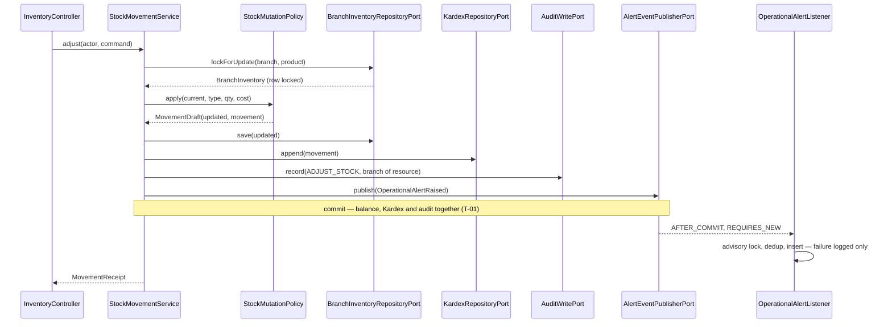

# Design — `add-inventory-module`

Step 2 of 3. Consumes `contract.md`, whose decisions (P-01 … P-10, R-00 … R-24, T-01 … T-07,
F-1 … F-4, PA-01 … PA-04) are closed and **not** restated here. This document records only what the
architecture does not already dictate: the domain model, the port signatures, the transaction
boundaries and the traps specific to these two modules. Layering, package structure and naming
suffixes follow `iam`/`catalog` verbatim — the implementation replicates that pattern, it does not
invent one.

---

## 1. Module placement and graph

`inventory` (module package `com.optiplant.inventory.inventory` — the module name repeats the base
package name; this is correct and `ModuleBoundariesTest` already resolves it as `BASE + ".inventory.."`)
and `notifications`, two packages, two boundaries.

New edges: `inventory → shared`, `notifications → shared`. Nothing else. Both are leaves toward
each other: `inventory` never names `notifications` — it publishes a `shared` event type — and
`notifications` never names `inventory`. `catalog → shared ← inventory` closes the
`ProductStockPresencePort` gap without a cycle. `SecurityConfig` lives in `iam/infrastructure/config`
and gains two matcher **string literals**; no import, so no `iam → inventory` edge appears.

## 2. `shared` additions

Framework-free, `external_id` UUIDs only (`SharedIsFrameworkFreeTest`, `sharedEsUnaHoja`).

### 2.1. `shared/stock`

```java
public enum StockMovementType {
    PURCHASE_RECEIPT, SALE, TRANSFER_OUT, TRANSFER_IN,
    ADJUSTMENT_POS, ADJUSTMENT_NEG, DAMAGE_WASTE, INITIAL_LOAD;
    public boolean isInbound();            // the four that add to current_stock
    public boolean requiresSuppliedCost(); // == isInbound() — P-03, expressed as intent, not as an alias
}

public interface StockMutationPort {
    UUID applyMovement(StockMutationCommand command);        // P-01, P-04 — returns the movement external_id
    void shiftInTransit(InTransitShiftCommand command);      // P-05, P-06 — writes no Kardex row
}

public record StockMutationCommand(UUID branchExternalId, UUID productExternalId,
        StockMovementType movementType, BigDecimal quantity, BigDecimal unitCost,
        String referenceType, String referenceId, String notes, UUID actorUserExternalId) {}

public record InTransitShiftCommand(UUID branchExternalId, UUID productExternalId,
        BigDecimal quantity, InTransitDirection direction, UUID actorUserExternalId) {}

public enum InTransitDirection { INCREMENT, DECREMENT }
```

The enum lives in `shared`, not in `inventory.domain`, because P-03's cost rule must be checkable
by the caller (`purchases`, `transfers`) before the port is even invoked. One source of truth for
the eight `movement_type` literals of `01-init-schema.sql:215-226`.

### 2.2. `shared/alert` — reconciling P-08 with P-09

P-08 names the event `StockThresholdBreached`; P-09 requires one event type that `transfers` and
`logistics` can reuse for `TRANSFER_DISCREPANCY` / `LOGISTIC_DELAY` with no new agreement. A
producer-specific name cannot be reused, so the **transport** generalizes and the **domain concept**
keeps P-08's name inside `inventory`:

```java
public record OperationalAlertRaised(UUID branchExternalId, AlertType alertType, AlertSeverity severity,
        String subjectToken, String message, Instant occurredAt) {}

public enum AlertType { STOCK_MINIMUM, LOGISTIC_DELAY, TRANSFER_DISCREPANCY, PRICE_CHANGE }
public enum AlertSeverity { INFO, WARNING, CRITICAL }
```

`inventory.domain.model.StockThresholdBreach` (branch, product, resultingStock, threshold,
movementExternalId) is the P-08 record; `AlertRaisingPolicy` renders it into an
`OperationalAlertRaised` whose `subjectToken` is the product `external_id` and whose `message`
carries stock, threshold and movement id in human-readable form. Every P-08 field survives; the
listener stays producer-agnostic.

`title` is **not** on the event: it is derived by `notifications` from `alertType + subjectToken`
(F-1), so the dedup token has exactly one author.

---

## 3. `inventory` domain

Records, no Spring, no Jakarta. All quantities `BigDecimal` normalized to scale 4 `HALF_UP` —
matching `NUMERIC(14,4)`, so no rounding surprise is deferred to the database.

### 3.1. Value objects

| Type | Invariant | Enforces |
| :--- | :--- | :--- |
| `Quantity(BigDecimal value)` | non-null, **strictly** positive, scale 4 | `CHECK (quantity > 0)`; the sign is a property of `StockMovementType`, never of the number (P-02) |
| `StockLevel(BigDecimal value)` | non-null, `>= 0`, scale 4 | `CHECK (current_stock >= 0)` and `min_stock_threshold >= 0` (R-14) |
| `UnitCost(BigDecimal value)` | non-null, `>= 0`, scale 4 | `CHECK (unit_cost >= 0)` |
| `MovementReason(String value)` | trimmed, non-blank, `<= 500` | RN-11, R-07 |
| `DateRange(Instant from, Instant to)` | both nullable; if both present `from <= to` | R-16, `invalid_request` on a malformed range |

Each rejects in its compact constructor with `IllegalArgumentException` (mapped to `invalid_request`),
except `MovementReason`, which throws `AdjustmentReasonRequiredException` so R-07 gets its own code.

### 3.2. Entities

```java
record BranchInventory(UUID externalId, UUID branchExternalId, UUID productExternalId,
        StockLevel currentStock, StockLevel reservedStock, StockLevel inTransitStock,
        StockLevel minStockThreshold, UnitCost averageCost, Instant lastUpdatedAt) {

    BigDecimal availableStock();                    // current − reserved; in_transit excluded (P-07)
    boolean breachesThreshold();                    // currentStock <= minStockThreshold (R-20)
    BranchInventory withStock(StockLevel s, Instant at);
    BranchInventory withThreshold(StockLevel t, Instant at);
}

record KardexMovement(UUID externalId, UUID branchExternalId, UUID productExternalId,
        StockMovementType movementType, Quantity quantity, UnitCost unitCost, BigDecimal totalCost,
        BigDecimal previousStock, BigDecimal resultingStock, String referenceType, String referenceId,
        String notes, UUID userExternalId, Instant createdAt) {}
```

`KardexMovement` has **no** `with*` method and no setter, and `KardexRepositoryPort` (§5.2) exposes
no update or delete. R-17 is therefore a property of the type system, not of a convention.

`averageCost` is read and stamped here but never recalculated — RN-10's inbound revaluation is
CU-COM-04's, out of scope.

Read-side records: `StockLine`, `StockPage`, `BranchAvailability`, `NetworkAvailability`,
`KardexLine`, `KardexPage`, `ThresholdView`, `MovementReceipt`, `ProductDescriptor`.

### 3.3. Domain services

**`StockMutationPolicy`** — the single place a balance changes. Pure function:

```
apply(BranchInventory current, StockMovementType type, Quantity qty, UnitCost suppliedCost, ...)
    -> MovementDraft(BranchInventory updated, KardexMovement.Draft movement)
```

1. P-03: `type.requiresSuppliedCost()` and `suppliedCost == null` → `UnitCostContractViolationException`;
   outbound and `suppliedCost != null` → same exception. Outbound uses `current.averageCost()` (RN-03, R-12).
2. Inbound → `previous + qty`; outbound → `previous − qty`, and `previous < qty` →
   `InsufficientStockException` **before** any SQL (T-07, RN-01).
3. `totalCost = quantity × effectiveUnitCost`, scale 4.
4. Returns both halves as one value. A caller cannot obtain the new balance without also obtaining
   the movement — the shape is what makes RN-02 hard to violate, not the reviewer's attention.

**`AdjustmentPolicy`** — counted quantity → movement (R-06, R-08). Negative count →
`IllegalArgumentException`; count equal to balance → `AdjustmentWithoutDifferenceException`;
otherwise `ADJUSTMENT_POS`/`ADJUSTMENT_NEG` with `Quantity(|counted − current|)`.

**`AlertRaisingPolicy`** — post-mutation `BranchInventory` → `Optional<StockThresholdBreach>`;
severity `CRITICAL` when resulting stock is exactly zero, `WARNING` otherwise (R-20).

**`BranchScopePolicy`** — `AuthenticatedPrincipal` → the branch a mutation resolves to.
Corporate (`branchId == null`) → `BranchContextRequiredException` (PA-02); a resolved branch other
than the session's → `CrossBranchAccessDeniedException` (defence in depth behind RN-14).

### 3.4. Exceptions

`InsufficientStockException`, `AdjustmentReasonRequiredException`, `AdjustmentWithoutDifferenceException`,
`UnitCostContractViolationException`, `InventoryRecordNotFoundException`, `ProductNotFoundException`
(inventory's own — `catalog`'s cannot be imported), `BranchContextRequiredException`,
`CrossBranchAccessDeniedException`.

---

## 4. `notifications` domain

```java
record Alert(UUID externalId, UUID branchExternalId, AlertType alertType, AlertSeverity severity,
        String title, String message, boolean resolved, Instant resolvedAt,
        UUID resolvedByUserExternalId, Instant createdAt) {
    Alert resolve(UUID actorUserExternalId, Instant at);   // throws AlertAlreadyResolvedException (R-23)
}

record AlertDedupKey(UUID branchExternalId, AlertType alertType, String subjectToken) {
    String title();   // "STOCK_MINIMUM:<product external_id>" — F-1, asserted <= 150 chars
}
```

`title()` is the only writer of the F-1 token, and the only reader is the dedup query. Exceptions:
`AlertNotFoundException`, `AlertAlreadyResolvedException`. No auto-resolution path exists (R-22, PA-03).

---

## 5. Ports

### 5.1. Primary (`application/port/in`)

| Port | Method | CU | Actor / authorization |
| :--- | :--- | :--- | :--- |
| `QueryStockUseCase` | `listOwnBranchStock(actor, StockQuery)` | CU-INV-03 | all roles; branch from session |
| | `networkAvailability(actor, productExternalId)` | CU-INV-04 | all roles; read-only, all active branches |
| `RegisterStockMovementUseCase` | `adjust(actor, AdjustStockCommand)` | CU-INV-05 | `ADMIN`\*/`BRANCH_MANAGER` |
| | `writeOff(actor, WriteOffCommand)` | CU-INV-06 | + `OPERATOR` (R-13) |
| `ManageStockThresholdUseCase` | `setThreshold(actor, productExternalId, BigDecimal)` | CU-INV-07 | `ADMIN`\*/`BRANCH_MANAGER` |
| `QueryKardexUseCase` | `list(actor, KardexQuery)` | CU-INV-08 | `ADMIN`/`BRANCH_MANAGER` |
| `ManageAlertsUseCase` | `list(actor, AlertQuery)` / `resolve(actor, externalId)` | CU-ALE-02 | `ADMIN`/`BRANCH_MANAGER` |
| | `raise(RaiseAlertCommand)` | CU-ALE-01 | no actor — invoked by the listener, not by a request |

\* a corporate `ADMIN` gets `branch_context_required` (PA-02).

**Every method takes `AuthenticatedPrincipal`, reads included** — the opposite of `catalog`, whose
reads deliberately take no actor. Here the branch dimension exists and RN-14 forbids it arriving
from the client, so a read that cannot see its caller cannot be scoped. `raise` is the one exception.

### 5.2. Secondary (`application/port/out`)

```java
interface BranchInventoryRepositoryPort {
    Optional<BranchInventory> lockForUpdate(UUID branchExternalId, UUID productExternalId); // T-02
    BranchInventory createZeroed(UUID branchExternalId, UUID productExternalId);            // F-3
    BranchInventory save(BranchInventory inventory);
    StockPage list(StockFilter filter);                                                     // no lock (T-05)
    List<BranchAvailability> findAcrossActiveBranches(UUID productExternalId);              // CU-INV-04
    boolean hasAnyBalance(UUID productExternalId);                                          // ProductStockPresencePort
}

interface KardexRepositoryPort {
    KardexMovement append(NewMovement movement);   // insert only — no update, no delete (R-17)
    KardexPage list(KardexFilter filter);
    boolean hasAnyMovement(UUID productExternalId);
}

interface ProductLookupPort {                      // named for the need, not for catalog
    Optional<ProductDescriptor> findByExternalId(UUID productExternalId);
    Map<UUID, ProductDescriptor> findAllByExternalIds(Collection<UUID> ids);   // batch — no N+1 (RNF-PER-01)
}

interface AlertEventPublisherPort { void publish(OperationalAlertRaised event); }
```

`AlertEventPublisherPort` exists so the application layer never names `ApplicationEventPublisher`;
the `AFTER_COMMIT` dispatch is entirely the adapter's concern.

`notifications`: `AlertRepositoryPort` with `findUnresolvedByDedupKey`, `create`, `markResolved`,
`findByExternalIdVisibleTo(externalId, branchExternalId)` (returns empty for another branch, so
R-24 yields `404` and never `403`), `list(AlertFilter)`, and `lockAlertScope(AlertDedupKey)` (§6.3).

---

## 6. Adapters

### 6.1. Persistence — `inventory` owns two tables and maps nothing else

`BranchInventoryJpaEntity` (`branch_inventories`) and `KardexMovementJpaEntity` (`kardex_movements`).
Their `branch_id` / `product_id` / `user_id` foreign keys are mapped as **plain `Long` columns**, not
as `@ManyToOne` associations. Consequently `inventory` declares **no `@Entity` for another module's
table**: `products`, `branches` and `users` are reached through native `@Query` with interface
projections on a small `ForeignKeyResolverSpringDataRepository`. This is deliberate — a second
`@Entity` mapped onto `products` would give `catalog`'s row two owners in one persistence unit and
duplicate the mapping every `catalog` change would have to keep in sync.

`lockForUpdate` is `@Lock(LockModeType.PESSIMISTIC_WRITE)` on a derived query
(`findByBranchIdAndProductId`) → `SELECT … FOR UPDATE`.

`InventoryStockPresenceAdapter implements ProductStockPresencePort` returns
`!hasAnyBalance(id) && !hasAnyMovement(id)`, satisfying the port's two-clause predicate and turning
`catalog`'s fail-closed `StockPresence.UNKNOWN` into a real answer.

### 6.2. Web

`InventoryController` (`/api/inventory/**`), `AlertController` (`/api/notifications/**`), one
`@RestControllerAdvice` per module package (`InventoryExceptionHandler`, `NotificationsExceptionHandler`),
scoped by `basePackages` exactly as `CatalogExceptionHandler` is, so neither swallows the other's
exceptions. `ErrorResponse` is duplicated per module — it is package-private in each and cannot
cross a boundary; promoting it to `shared/web` is out of scope here.

`SecurityConfig` gains, before `anyRequest()`:
`/api/inventory/write-offs` → `hasAnyAuthority("ADMIN","BRANCH_MANAGER","OPERATOR")`;
`GET /api/inventory/stock/**` → `authenticated()`; `/api/inventory/kardex` and
`/api/notifications/**` → `hasAnyAuthority("ADMIN","BRANCH_MANAGER")`; the remaining
`/api/inventory/**` → `hasAnyAuthority("ADMIN","BRANCH_MANAGER")`. `hasAuthority`, never `hasRole`.

### 6.3. The alert listener

`notifications/infrastructure/adapter/in/event/OperationalAlertListener`:
`@TransactionalEventListener(phase = TransactionPhase.AFTER_COMMIT)` +
`@Transactional(propagation = Propagation.REQUIRES_NEW)`, whole body wrapped in a `try/catch
(RuntimeException)` that logs with correlation id, branch and alert type (P-10, RNF-OBS-01) and
returns. Nothing it can throw reaches the mutation's caller.

**Dedup under concurrency (F-1, R-21).** `system_alerts` has no unique constraint and this change
adds none, so check-then-insert races. `lockAlertScope` takes a PostgreSQL transaction advisory lock
— `SELECT pg_advisory_xact_lock(hashtext(:key))` with `key = branch:type:subject` — as the first
statement of the listener's transaction. It serializes only concurrent alerts for the *same* subject,
needs no schema change, and releases at commit. Recorded as DT-09 (§9).

---

## 7. Transaction boundaries

| Operation | One transaction | `AFTER_COMMIT` | Lock | Isolation |
| :--- | :--- | :--- | :--- | :--- |
| `adjust` (CU-INV-05) | `branch_inventories` update + `kardex_movements` insert + `audit_logs` insert (T-01) | `OperationalAlertRaised` if `breachesThreshold()` | `FOR UPDATE` on the `branch_inventories` row (T-02) | READ COMMITTED |
| `writeOff` (CU-INV-06) | same three writes | same | same | READ COMMITTED |
| `setThreshold` (CU-INV-07) | `branch_inventories` update + audit; **no Kardex row** (R-14) | same, evaluated on the committed threshold (R-15) | `FOR UPDATE` | READ COMMITTED |
| `StockMutationPort.applyMovement` | joins the **caller's** transaction (`Propagation.REQUIRED`) — never `REQUIRES_NEW`, never `@Async` (P-01) | publishes; the caller's commit decides | `FOR UPDATE` | inherited |
| `shiftInTransit` | `in_transit_stock` only, joins caller's transaction (P-06) | none | `FOR UPDATE` | inherited |
| all reads (CU-INV-03/04/08, alert list) | `@Transactional(readOnly = true)` | — | none (T-05, RN-09) | READ COMMITTED |
| listener `raise` | advisory lock + dedup read + `system_alerts` insert, `REQUIRES_NEW` | — | advisory (§6.3) | READ COMMITTED |
| `resolve` (CU-ALE-02) | `is_resolved`, `resolved_at`, `resolved_by_user_id` in one update (R-23) | — | none | READ COMMITTED |

`audit_logs.branch_id` is the branch of the **mutated resource** (T-03), unlike `catalog`, which
passes `null`. Actions: `ADJUST_STOCK`, `WRITE_OFF_STOCK`, `SET_STOCK_THRESHOLD`, `RESOLVE_ALERT`
— plain strings; `audit_logs.action` has no `CHECK`.

**No lock timeout hint is configured.** Verified against `hibernate-core-7.4.5.Final`:
`PostgreSQLDialect` renders only `for update`, `for update nowait` and `for update skip locked` — a
numeric `jakarta.persistence.lock.timeout` has no PostgreSQL rendering and would be silently
dropped, which is worse than not asking for it. The wait is bounded by the statement timeout, and
`PessimisticLockingFailureException` (superclass of `CannotAcquireLockException`) maps to
`concurrent_stock_update` `409`.

---

## 8. Persistence — no schema change

`backend/init-db/01-init-schema.sql` is **not** edited (contract §2.5). `./scripts/validar_esquema.sh`
must stay green and unchanged; if it must change, §2.5 was wrong — stop and report.

Column facts that shape the code, verified against the file:

- `kardex_movements.unit_cost` and `total_cost` are `NOT NULL` (`:228-229`). P-02's "optional unit
  cost" is optional **at the port only**; `StockMutationPolicy` always resolves a value before insert.
- `kardex_movements` has no unit column (F-4) — everything is the base unit (RN-13).
- `branch_inventories.min_stock_threshold` defaults to `10.0000`, not `0`. A row created on demand
  (F-3) must set the threshold **explicitly** to `0` rather than inherit the default, or a brand-new
  product would fire `STOCK_MINIMUM` on its first movement.
- `idx_branch_inventory_critical (branch_id, current_stock, min_stock_threshold)` cannot serve
  `current_stock <= min_stock_threshold` as a range scan — a column-to-column comparison is a filter.
  The `branch_id` prefix still bounds the scan, which is what RNF-PER-01 needs at this data volume.
- `idx_kardex_branch_product` and `idx_kardex_created_at` are the Kardex access paths; the query
  filters `branch_id, product_id` and orders by `created_at` ascending (R-16).

## 9. Rejected alternatives and new debt

| Rejected | Why |
| :--- | :--- |
| Trigger keeping `current_stock` in sync with `kardex_movements` | RNF-INT-03: the schema is the last line of defence, never the first. The rule belongs to `StockMutationPolicy`. |
| Optimistic locking with `@Version` | Needs a column (F-2). Pessimistic lock is what CU-INV-05 step 5 already prescribes. |
| A second `@Entity` on `products` inside `inventory` | Two owners for one table in one persistence unit; native projections cost less and drift less (§6.1). |
| Fusing alerts into `inventory` | P-10 and the separate ArchUnit boundary; a failed alert must not roll back a movement. |
| Partial unique index for alert dedup | A schema change three days before delivery (PA-04). Advisory lock instead. |
| `in_transit_stock` held on the origin branch | P-05/RN-04: it is the destination's incoming quantity. |

**DT-09 (new, medium)** — `system_alerts` has no uniqueness constraint behind the F-1 dedup token;
correctness rests on the advisory lock in `OperationalAlertListener`. Any future producer bypassing
that listener can duplicate an unresolved alert. Repayment: add `product_id` plus
`CREATE UNIQUE INDEX … ON system_alerts(branch_id, alert_type, product_id) WHERE NOT is_resolved`
when the next schema change lands, then drop the advisory lock. File in `docs/deuda_tecnica.md` in S3.

## 10. Adjustment flow (CU-INV-05)



## 11. Traps specific to this change

1. **`BranchIsolationIT` already exists** (`src/test/java/com/optiplant/inventory/BranchIsolationIT.java`,
   from `iam`). The contract's PR-3 name collides — use `InventoryBranchIsolationIT`.
2. The module package is `com.optiplant.inventory.inventory` — it reads oddly and is correct.
3. `SecurityConfig` is an `iam` file. Add matchers only; an import of an `inventory` type there
   would create an `iam → inventory` edge and fail `ModuleBoundariesTest`.
4. `@TransactionalEventListener` fires only if the publish happened inside an active transaction —
   the publish must be the last statement of the `@Transactional` service method, not after it.
5. `system_alerts.branch_id` is nullable; every alert raised here has one. `shared` gains only
   `Instant` and `BigDecimal` — both `java.*`, so `SharedIsFrameworkFreeTest` holds.

## 12. Open questions

None. The two design-level resolutions taken here rather than escalated:

- **D-1 — the shared event is `OperationalAlertRaised`, not `StockThresholdBreached`.** P-08's name
  survives as `inventory`'s domain record; the transport generalizes so P-09 holds. Reversal cost:
  renaming one `shared` record before another module publishes — near zero today, rising afterwards.
- **D-2 — alert dedup is guarded by a PostgreSQL advisory lock.** The only no-migration option that
  is actually correct under concurrency (DT-09). Reversal cost: deleting one native query when the
  unique index lands.
