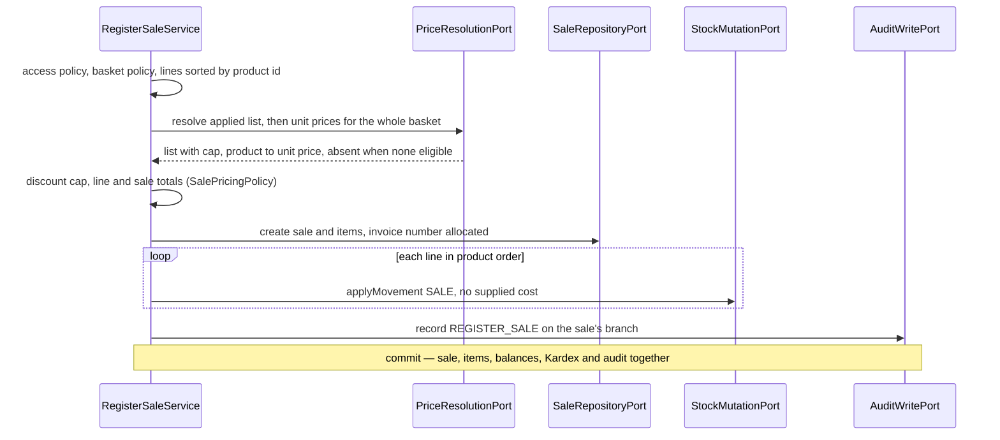

# Design — `add-sales-module`

Step 2 of 3. Consumes `contract.md`, whose decisions (P-01 … P-08, R-00 … R-29, T-01 … T-07, F-1 … F-8, PA-01 … PA-06)
are closed and **not** restated — cited by identifier only. Layering, packages and naming suffixes replicate `iam` /
`catalog` / `inventory` / `transfers` verbatim; this records only what that pattern and the contract do not dictate.
Every column and Spring fact was read from the file or the resolved JAR, never recalled.

## 1. Module placement and graph

Two module packages, two independently verified boundaries: `com.optiplant.inventory.sales` and
`com.optiplant.inventory.pricing`. Both already sit in `ModuleBoundariesTest.MODULOS`
(`ModuleBoundariesTest.java:36-37`) — **no ArchUnit change**. New edges, all through `shared`, all one-way, no cycle:
`sales → shared ← pricing` (P-05); `sales → shared ← inventory` (P-01 stock mutation, F-2 valuation, D-4 rejection
exception); both modules → `shared` for `AuthenticatedPrincipal` / `PrincipalAccessor` / `AuditWritePort`. `sales`
never names `pricing` in an import and `pricing` never names `sales` (P-06). `SecurityConfig` (an `iam` file) gains
matcher **string literals only** (§6.4).

`sales` has **no event-publisher port and no `notifications` edge at all**: P-08 moves the `STOCK_MINIMUM` evaluation
inside `inventory`, behind `StockMutationPort` (§8), so contract §2.1's `sales → notifications` row is satisfied
without a line of `sales` code.

## 2. `shared` addition — the price-resolution port (P-05)

One new package, `shared/price`, framework-free (`java.*` and UUID only, so `SharedIsFrameworkFreeTest` and
`sharedEsUnaHoja` keep holding). It is **`price`, not `pricing`**: a `shared` subpackage carrying a module's name
invites the reader to think a module leaked into `shared` — the reasoning that named `shared/route`.

```java
public interface PriceResolutionPort {
    Optional<AppliedPriceList> findActiveListByExternalId(UUID priceListExternalId);   // R-10 named list
    Optional<AppliedPriceList> findActiveDefaultListForBranch(UUID branchExternalId);  // R-10 fallback
    Map<UUID, AppliedPriceList> describeLists(Collection<UUID> priceListExternalIds);  // any state, receipts
    Map<UUID, BigDecimal> resolveUnitPrices(UUID priceListExternalId, UUID branchExternalId,
            Collection<UUID> productExternalIds, LocalDate operationDate);             // R-11 / RN-16
}
public record AppliedPriceList(UUID externalId, String code, BigDecimal maxDiscountPercent) {}
```

The **two lookups are separate** because §7 demands two failures: a *named* list absent or inactive is
`price_list_not_found` 404; *no* list named and no active branch default is `price_list_not_resolvable` 409 — one
`Optional` could not tell them apart and one error code would be dead. `describeLists` returns lists **in any state**,
batched: a receipt made under a since-deactivated list must still render its `code` and cap (R-23) without a query per
row (RNF-PER-01). `resolveUnitPrices` is **one batch call for the whole basket** (RNF-PER-02) and a product with no
eligible row is **absent from the map** — the port never invents a price and never falls back to another list (P-05);
`sales` turns the absence into `price_not_available` 409. The cap travels **with the list**: a caller holding prices
without it could apply a discount it cannot validate (RN-17).

## 3. `pricing` domain

Records, no Spring, no Jakarta. Money is `BigDecimal` scale 4 (`NUMERIC(14,4)`), percentages scale 2 (`NUMERIC(5,2)`),
both `HALF_UP`, so no rounding surprise is deferred to the database.

| Value object | Invariant | Enforces |
| :--- | :--- | :--- |
| `PriceListCode(String)` | trimmed, non-blank, `<= 30`, upper-case | `code VARCHAR(30) UNIQUE` |
| `PriceListName(String)` | trimmed, non-blank, `<= 100` | `name VARCHAR(100)` |
| `DiscountCap(BigDecimal)` | `0 … 100`, scale 2 | `CHECK (max_discount_percent BETWEEN 0 AND 100)`; RN-17 |
| `UnitPrice(BigDecimal)` | `>= 0`, scale 4 | `CHECK (unit_price >= 0)` |
| `ValidityRange(LocalDate from, LocalDate to)` | `to` null or `>= from`; `coversAt(date)` | `check_price_period`; RN-16 |

`PriceList(externalId, code, name, description, maxDiscountPercent, isDefault, active, createdAt, updatedAt)` with
`update(name, description, cap)` and `deactivate()`, both returning new instances. `is_default` is **never mutated**:
the seed sets it, `uq_price_lists_single_default` guards it, and RF-VEN-03 asks for no default-switching endpoint.
`Price(externalId, priceListExternalId, productExternalId, branchExternalId, unitPrice, validity, createdAt)` with
`close(validTo)` and `scope()` → `CORPORATE` when `branchExternalId == null`, `BRANCH` otherwise.

**`PriceResolutionPolicy` (RN-16, R-11)** — over the candidate rows for one product in one list: keep those whose
`validity.coversAt(date)`, return the branch-scoped one if present, else the corporate one, else empty. A **pure fold
over rows the adapter fetched**, not a query: the ordering rule is business, so it is unit-testable and the SQL only
has to be a superset filter (§6.2). **`QuoteCalculator`** — per line `unitPrice = listUnitPrice × (1 − discount/100)`,
`subtotal = quantity × unitPrice`, scale 4 `HALF_UP`, after `DiscountCap` validation; it duplicates three lines of
arithmetic with `sales`' `SalePricingPolicy` **on purpose** (D-6).

**`PriceSupersessionPolicy` (R-16)** — the rule the schema cannot express. A new price for (list, product, scope)
closes the open row and inserts the new one in one transaction. Two refusals, both `price_period_conflict` 409: (1)
more than one row already open for the tuple — the state the partial uniques prevent, checked first because the domain
refuses before the write (T-07); (2) **the open row's `valid_from` is not strictly before the new `validFrom`**, since
closing sets `valid_to = newValidFrom.minusDays(1)` and `check_price_period` would reject that whenever the current
row started on or after the new date. Refusing in the domain turns a `DataIntegrityViolationException` carrying a
constraint name into a typed 409 (§7 "must not leak"). Historical overlap stays unrestricted — `DT-03`, accepted, not
closed here.

**Exceptions** — `PriceListNotFoundException`, `PriceNotFoundException`, `PriceListCodeAlreadyExistsException`,
`PricePeriodConflictException`, `DiscountCapExceededException` (quotes only), `ProductNotFoundException`,
`BranchNotFoundException` — the last two repeat names other modules declare, and each module declares its own rather
than importing another's (boundary rule 3).

## 4. `sales` domain

| Value object | Invariant | Enforces |
| :--- | :--- | :--- |
| `SaleQuantity(BigDecimal)` | **strictly** positive, scale 4 | `CHECK (quantity > 0)`; R-01 |
| `Money(BigDecimal)` | `>= 0`, scale 4 | every `NUMERIC(14,4) CHECK (>= 0)` |
| `DiscountPercent(BigDecimal)` | `0 … 100`, scale 2 | `CHECK (discount_percent BETWEEN 0 AND 100)`; R-13 |
| `TaxPercent(BigDecimal)` | `0 … 100`, scale 2 | F-4 / PA-06 |
| `CustomerName(String)` | trimmed, non-blank, `<= 150` | `customer_name NOT NULL`; R-01 |
| `CustomerTaxId(String)` | null or trimmed non-blank `<= 30` | `customer_tax_id VARCHAR(30)` |
| `InvoiceNumber(String)` | non-blank, `<= 50`; `isReservedInternal()` matches `VEN-\d{4}-\d+` | `invoice_number UNIQUE`; §6.3 |
| `CancellationReason(String)` | trimmed, non-blank, `<= 480` | R-18, `sale_reason_required` |
| `SaleNotes(CancellationReason, String)` | sole reader and writer of the F-3 token | below |

```java
record Sale(UUID externalId, InvoiceNumber invoiceNumber, SaleStatus status, UUID branchExternalId,
        UUID soldByUserExternalId, UUID priceListExternalId, CustomerName customerName,
        CustomerTaxId customerTaxId, SaleTotals totals, SaleNotes notes, Instant createdAt,
        List<SaleItem> items) {
    Sale cancel(CancellationReason reason);      // R-18 → CANCELLED, via SaleStateMachine
    boolean belongsTo(UUID branchExternalId);    // R-25
}
record SaleItem(UUID externalId, UUID productExternalId, SaleQuantity quantity, Money listUnitPrice,
        Money unitPrice, DiscountPercent discountPercent, Money subtotal) {}
record SaleTotals(Money subtotal, Money discountAmount, Money taxAmount, Money totalAmount) {}
```

`SaleStatus` is the two `01-init-schema.sql:314` literals plus `isCancellable()`. `Sale` has no setters; `cancel` is
the only mutator and consults `SaleStateMachine` first, so R-18 cannot be bypassed. `items` is copied defensively and
exposed unmodifiable.

**`SaleItem`'s compact constructor is `DT-05`'s mitigation (R-12).** It rejects `unitPrice > listUnitPrice` (mirroring
`check_applied_price_not_above_list`) **and** any `unitPrice` that is not `listUnitPrice × (1 − discountPercent/100)`
at scale 4. A frozen price inconsistent with its own discount is unconstructible — the database cannot check the
second half, so the record does. The client supplies neither price: both come from the resolved list price (R-14,
RNF-SEC-05), and a later change to the list cannot reach a persisted row.

**`SaleNotes` — the F-3 token, one author.** `render()` writes `VOID_REASON:<text>` as the **first line** and joins
the human note after it; `parse(raw)` reads it back, and notes with no `VOID_REASON:` first line parse to *no reason*
with the whole text as the human note — a POS or an operator can write free prose and the parser must not throw.
`humanNote()` is exposed as `notes`, `cancellationReason()` as `cancellationReason`; the raw token never leaves the
mapper (§7 "must not leak"). The void's actor and timestamp live in `audit_logs` (entity `SALE`), already exposed by
`CU-SEG-04`.

### 4.1. Domain services

| Service | Rule | Notes |
| :--- | :--- | :--- |
| `SaleBasketPolicy` | R-01, R-06 — one item minimum, no product twice, quantity `> 0` | returns the lines **already sorted ascending by product `external_id`**, the T-02 lock order, so the service cannot get it wrong; runs before any resolution, so a malformed basket costs no query |
| `UnitConversionPolicy` | R-07, RN-13 — `toBaseUnit(quantity, factor)` = `quantity × factor`, scale 4 | no unit named ⇒ already base-unit; a unit with no conversion ⇒ `UnitConversionUnavailableException` 400. The factor is data the adapter fetches (§6.2); the multiplication is domain, because RN-13 puts conversion on entry |
| `DiscountCapPolicy` | R-13, RN-17 — above the applied list's cap ⇒ `DiscountExceedsCapException` naming the cap | **for every role** (F-5, PA-02); above 100 is already unconstructible |
| `SaleStateMachine` | R-18 — `requireCancellable(status)`; anything but `COMPLETED` ⇒ `InvalidSaleStateException` 409 | a `Map` constant, not a chain of `if`s, so a test enumerates it exhaustively — two states today, and the table is what makes a third cheap |

**`SalePricingPolicy` (R-12, R-14)** — the only place a sale's money is computed. Per line `unitPrice = listUnitPrice
× (1 − discount/100)`, `subtotal = quantity × unitPrice`. Per sale `subtotal = Σ (quantity × listUnitPrice)`,
`discountAmount = Σ (quantity × (listUnitPrice − unitPrice))`, `taxAmount = (subtotal − discountAmount) ×
taxPercent/100`, `totalAmount = subtotal − discountAmount + taxAmount`; all scale 4 `HALF_UP`. `sales.subtotal` is
therefore the **pre-discount** figure, which is what keeps `total = subtotal − discount + tax` consistent with the
four independent `CHECK (>= 0)` columns.

**`SaleAccessPolicy` (§5, R-02, R-22, R-25, RNF-SEC-03)** — three ordered questions, and the order is the security
property. (1) **Branch context**: registering with `branchId == null` ⇒ `BranchContextRequiredException` 403. (2)
**Visibility**: `ADMIN`, or the actor's branch equals the sale's; otherwise `SaleNotFoundException` **404, never
403**, so existence does not leak (R-25). (3) **Mutation**: the void additionally requires `ADMIN`/`BRANCH_MANAGER`,
else `CrossBranchAccessDeniedException`. An authorized role acting on another branch's sale must fail (2) with 404
before (3) can answer 403 and thereby confirm the receipt exists.

**Exceptions** — `SaleNotFoundException`, `InvalidSaleStateException`, `InvalidSaleQuantityException`,
`DuplicateSaleItemException`, `DiscountExceedsCapException`, `UnitConversionUnavailableException`,
`SaleReasonRequiredException`, `BranchContextRequiredException`, `CrossBranchAccessDeniedException`,
`ProductNotFoundException`, `PriceListNotFoundException`, `PriceListNotResolvableException`,
`PriceNotAvailableException`, `DuplicateInvoiceNumberException`.

## 5. Ports

Every primary-port method takes `AuthenticatedPrincipal`, reads included — the branch dimension exists and RN-14
forbids it arriving from the client, so a read that cannot see its caller cannot be scoped.

| Primary port (`port/in`) | Methods | CU | Authorization (§5) |
| :--- | :--- | :--- | :--- |
| `RegisterSaleUseCase` | `register` | CU-VEN-01, CU-EXT-02 | all roles + external; session branch; corporate `ADMIN` → R-02 |
| `VoidSaleUseCase` | `voidSale` | CU-VEN-03 | `ADMIN`/`BRANCH_MANAGER`, the sale's branch |
| `QuerySalesUseCase` | `list`, `detail`, `byInvoiceNumber` | CU-VEN-04 | all roles; own branch, `ADMIN` network-wide |
| `ManagePriceListsUseCase` | `create`, `update`, `deactivate`, `list` | RF-VEN-03 | writes `ADMIN`, reads authenticated (PA-03) |
| `ManagePricesUseCase` | `setPrice`, `closePrice`, `listPrices` | R-15, R-16 | writes `ADMIN`, reads authenticated |
| `QuotePricesUseCase` | `quote` | CU-VEN-02 preload | any authenticated role |

`RegisterSaleCommand` carries an **optional `invoiceNumber`**: `null` from the internal controller (server-allocated,
§6.3), supplied by the POS (R-29). That one optional field is what makes P-07 real — the external adapter invokes the
*same* use case with zero new domain logic.

**Secondary (`port/out`).** `sales` — **`SaleRepositoryPort`**: `create(NewSale)` (allocates or accepts the invoice
number, §6.3), `lockForUpdate(externalId)` (T-02), `findByExternalIdVisibleTo`, `findByInvoiceNumberVisibleTo` (both
readOnly, no lock, T-05), `save`, `list(SaleFilter)` returning summaries **plus** the aggregate row (R-24).
**`SaleReferencePort`**, named for the need not the technology: `requireActiveProduct`, `findProducts(Collection)`
(batched, any state, so a receipt still names a later-disabled product), `findBranches`, `findUsers`,
`findConversionFactor(product, unit)`, `findExternalCredentialSubject(userExternalId)` (§6.5). `pricing` —
`PriceListRepositoryPort`; `PriceRepositoryPort` (`findOpen(list, product, scope)`, `close`, `insert`, `list`,
`findEligible(list, branch, products, date)`); `PricingReferencePort`. Both consume `shared`'s `AuditWritePort`;
`sales` also consumes `PriceResolutionPort`, `StockMutationPort` and `OutboundValuationPort`, **implementing none of
them**, and neither module declares an event publisher (P-08).

## 6. Adapters

### 6.1. Persistence

`SaleJpaEntity` (`sales`) with `SaleItemJpaEntity` as a `@OneToMany(cascade = ALL, orphanRemoval = true)` collection —
items have no life outside their sale, matching `ON DELETE CASCADE` — plus `PriceListJpaEntity` and
`PriceListItemJpaEntity`. All `branch_id` / `product_id` / `user_id` / `price_list_id` foreign keys are **plain `Long`
columns, never `@ManyToOne`**, so neither module declares an `@Entity` over another module's table. Verified column
facts: **`sales` has no `updated_at`** (the mapper sets nothing on a void beyond `status` and `notes`), **`sale_items`
has no timestamp and no unit-of-measure column** (F-8), and `sales` has **no `version`** (F-7).

`lockForUpdate` is `@Lock(LockModeType.PESSIMISTIC_WRITE)` on a derived `findByExternalId`. **No `@QueryHints` lock
timeout**: verified for `transfers` against `hibernate-core`'s `PostgreSQLDialect`, which renders only `for update`,
`for update nowait` and `for update skip locked`, so a numeric `jakarta.persistence.lock.timeout` is silently dropped;
`PessimisticLockingFailureException` maps to `concurrent_sale_update` 409. `external_id → id` resolution goes through
`SaleReferenceSpringDataRepository` and `PricingReferenceSpringDataRepository`, both `extends Repository<…JpaEntity,
Long>` with native `@Query` and interface projections — exactly `inventory`'s `ForeignKeyResolverSpringDataRepository`.
The R-24 listing adds a native `COUNT(*), COALESCE(SUM(total_amount), 0)` over the same filter
(`idx_sales_branch_date`); pages carry summaries only and the detail batches its product descriptors, so no N+1 (RNF-PER-01).

### 6.2. The two queries that carry business meaning

**Eligible prices (R-11, RN-16)** — one native query per basket: `SELECT product_id, branch_id, unit_price,
valid_from, valid_to FROM price_list_items WHERE price_list_id = :listId AND product_id IN (:productIds) AND
(branch_id = :branchId OR branch_id IS NULL) AND valid_from <= :date AND (valid_to IS NULL OR valid_to >= :date)`,
served by `idx_price_list_items_lookup (product_id, price_list_id, branch_id)`. Deliberately a **superset**:
branch-over-corporate is decided by `PriceResolutionPolicy` in the domain, not by an `ORDER BY … LIMIT 1` per product,
so RN-16 is unit-testable and the query stays one round trip.

**Unit conversion (R-07)** — `SELECT conversion_factor FROM product_units pu JOIN products p ON p.id = pu.product_id
WHERE p.external_id = :product AND pu.external_id = :unit`, served by `idx_product_units_product`. `product_units` is
`catalog`'s table, read natively by `sales`' own reference adapter — the technique contract §2.1 blesses for
`products`/`branches`/`users` and `logistics` already uses against `transfers` rows. No port, no new edge (D-2).

### 6.3. `invoice_number` allocation (D-5)

Format `VEN-<yyyy>-<nnnn>`, matching the `TRF-<yyyy>-<nnnn>` precedent. The schema has no sequence and §2.5 forbids
adding one, so `SalePersistenceAdapter.create` — **only when the command carries no POS-supplied number** — takes
`SELECT pg_advisory_xact_lock(hashtext('sale_invoice_number:' || :year))` as its first statement, then `SELECT
COALESCE(MAX(CAST(SUBSTRING(invoice_number FROM 10) AS INTEGER)), 0) + 1 FROM sales WHERE invoice_number LIKE
'VEN-<yyyy>-%'`, then inserts. Offset 10 is `VEN-` + `yyyy` + `-`. It serializes only concurrent creations within one
year and releases at commit. Registered as **DT-12** (§10).

That `MAX` is why `InvoiceNumber.isReservedInternal()` exists: a POS supplying `VEN-2026-9999` would jump the internal
counter and a later collision would surface as a `DataIntegrityViolationException` mid-transaction, so the external
adapter refuses a POS number matching the reserved pattern with `invalid_request` 400. A POS number merely duplicating
a stored one is refused with `duplicate_invoice_number` 409 by a pre-check in the same transaction, the `UNIQUE`
constraint remaining the last line of defence (T-06, T-07).

### 6.4. Web and security

`SaleController` (`/api/sales/**`), `ExternalSaleController` (`/api/external/sales`), `PriceListController`
(`/api/pricing/price-lists/**`, including the nested `prices` collection), `PriceController`
(`/api/pricing/prices/*/closure`) and `PricingQuoteController` (`/api/pricing/quotes`). One `@RestControllerAdvice`
per module — `SalesExceptionHandler`, `PricingExceptionHandler` — scoped by `basePackages` as
`CatalogExceptionHandler` is, so neither swallows the other's exceptions. `ErrorResponse` is package-private and
duplicated per module; it cannot cross a boundary. **Trap:** `SalesExceptionHandler`'s `basePackages` must be
`com.optiplant.inventory.sales.infrastructure.adapter.in` — the whole `in` package, not `in.web` — or the external
controller's exceptions reach no handler and leak a stack trace (§7).

`SecurityConfig` gains, in this exact order, before `anyRequest()`, **string literals only**:

```
POST "/api/pricing/quotes"        -> authenticated()
GET  "/api/pricing/**"            -> authenticated()
     "/api/pricing/**"            -> hasAuthority("ADMIN")
     "/api/sales/*/cancellation"  -> hasAnyAuthority("ADMIN", "BRANCH_MANAGER")
     "/api/sales/**"              -> authenticated()
```

Matchers evaluate top to bottom, so the quote and the `GET` reads **must** precede the `ADMIN`-only pricing rule
(PA-03: every seller needs the resolved price) and the cancellation literal **must** precede the general sales rule,
or `OPERATOR` reaches the void (R-22). `hasAuthority`, never `hasRole`, which prepends `ROLE_` and the `users` `CHECK`
rejects. Per-branch rules stay domain checks (`SaleAccessPolicy`): a URL cannot know which branch owns a sale.

### 6.5. The external POS chain (F-6, P-07, D-3)

`/api/external/sales` is authenticated by an API key, not a JWT, so it needs its own `SecurityFilterChain`, declared
**in `sales`** at `sales/infrastructure/config/ExternalSalesSecurityConfig` as an `@Order(1)` bean with
`securityMatcher("/api/external/sales/**")`. `iam`'s chain has no `securityMatcher` and no `@Order`, so it stays the
catch-all and is consulted last: nothing is imported into `iam` and no `iam → sales` edge appears. Scoping the matcher
to `/sales/**` rather than `/api/external/**` lets `add-analytics-module` declare its own chain for `CU-EXT-01`
without inheriting this one.

`ExternalApiKeyAuthenticationFilter` (a `org.springframework.web.filter.OncePerRequestFilter`, verified present in the
resolved `spring-web` JAR) reads `X-Api-Key`, compares it in **constant time** (`MessageDigest.isEqual` over UTF-8
bytes) against `ExternalApiKeyProperties` (`sales/infrastructure/config`, the home `JwtProperties` established for a
module's own configuration), and puts an `AuthenticatedPrincipal` into a `sales`-local `AbstractAuthenticationToken`.
`iam`'s `SecurityContextPrincipalAccessor` only tests `getPrincipal() instanceof AuthenticatedPrincipal`, so
`PrincipalAccessor` works unchanged for the POS path and `sales` imports nothing from `iam`. The service user's
`username` and `Role` come from `users` by `external_id` (active only), not from configuration: the branch is the
credential's (R-27, RN-14) but the role must be the one the database grants, or a configuration typo would mint an
authority nobody assigned (D-4). **Trap:** a servlet filter runs before `DispatcherServlet`, so
`@RestControllerAdvice` never sees its failures — the filter writes the `401 {"code":"invalid_api_credential", …}`
body itself, one message for absent, malformed and unknown keys alike (R-28), and never logs key material
(RNF-OBS-01).

## 7. Transaction boundaries

| Operation | One transaction (T-01) | `AFTER_COMMIT` | Locks (T-02) |
| :--- | :--- | :--- | :--- |
| `register` | advisory lock (§6.3) + `sales` insert + `sale_items` inserts + per item `applyMovement(SALE)` + audit `REGISTER_SALE` | `STOCK_MINIMUM` per breaching product (R-08, raised inside `inventory`, §8) | advisory on `sale_invoice_number:<year>`, then `branch_inventories` rows ascending by product `external_id` |
| `voidSale` | `sales` update (status + F-3 token) + per item `applyMovement(ADJUSTMENT_POS)` + audit `VOID_SALE` | — | `FOR UPDATE` on the `sales` row **first** (F-7), then inventory rows ascending by product |
| price list / price writes | one or two `price_list_items` rows + audit (R-17) | — | none |
| every read (list, detail, receipt, quote, prices) | `@Transactional(readOnly = true)` | — | none (T-05, RN-09) |

All isolation is READ COMMITTED. `StockMutationPort` calls join the caller's transaction (`Propagation.REQUIRED`,
P-01) — never `REQUIRES_NEW`, never `@Async`.

**Lock order.** A sale touches exactly one branch, so ordering the per-item `applyMovement` calls **ascending by
product `external_id`** is enough to keep two concurrent sales over an overlapping basket from deadlocking;
`SaleBasketPolicy` returns its lines already sorted. For a void the `sales` row is locked before any inventory row,
which is also the order `register` implies, so the two agree.

**Valuation of the reversal (F-1, F-2, R-19, R-21).** The void reads the original `SALE` movements' unit costs in one
batch `OutboundValuationPort.outboundUnitCosts(branch, "SALE_INVOICE", saleExternalId)` and passes each as the
required cost of its `ADJUSTMENT_POS` (P-03). R-21 then holds **by construction, not by promise**:
`StockMutationPolicy.apply` was read for this design and never touches `average_cost` — inbound movements stamp the
supplied cost on the Kardex row and `BranchInventory.withStock` changes `current_stock` alone.

`audit_logs.branch_id` is the branch of the **mutated resource** (T-03): the sale's branch for registration and
voiding; `null` for price lists and corporate prices; the priced branch for a branch-scoped price. Actions are plain
strings — `audit_logs.action` has no `CHECK`: `REGISTER_SALE`, `VOID_SALE`, `CREATE_PRICE_LIST`, `UPDATE_PRICE_LIST`,
`DEACTIVATE_PRICE_LIST`, `SET_PRICE`, `CLOSE_PRICE`.

## 8. P-08 — the low-stock alert, behind the port

Verified in the code: `AlertRaisingPolicy` is invoked only from `inventory`'s `StockMovementService` and
`StockThresholdService`. `StockMutationAdapter` — the sole `StockMutationPort` implementation — raises nothing, so no
port consumer produces `STOCK_MINIMUM` today, and `sales` must not close that by reading `branch_inventories` (§2.1
forbids the edge). The fix is **one file, no new class, no new port, no schema change**, in
`inventory/infrastructure/adapter/out/stock/StockMutationAdapter.java`: add `AlertEventPublisherPort` — already an
`inventory` out-port implemented by `SpringAlertEventPublisher` — as a fourth constructor argument (infrastructure
depending on application is allowed by boundary rule 2); capture the return of
`branchInventoryRepository.save(draft.updated())`, today discarded, into `BranchInventory saved`; and, as the **last
statement of `applyMovement`** before returning the movement id, call `AlertRaisingPolicy.evaluate(saved,
movement.externalId()).ifPresent(b -> alertEventPublisherPort.publish(AlertRaisingPolicy.render(b)))`.

`shiftInTransit` stays untouched: it moves `in_transit_stock`, not `current_stock`, so no threshold is engaged. The
publish happens inside the caller's transaction, exactly what `notifications`'
`@TransactionalEventListener(AFTER_COMMIT)` requires in order to fire (T-04); its failure cannot roll back the sale.
`StockMovementService` does **not** route through this adapter — it calls the repository ports directly — so no manual
adjustment is double-published. **Trap:** `transfers` dispatch now raises `STOCK_MINIMUM` where it raised nothing, so
`TransferDispatchAtomicityIT` and `TransferReceiptDiscrepancyIT` must be re-read in S2 for any assertion that no alert
exists after a dispatch — the fixtures, not the fix, are what change.

## 9. Persistence — no schema change

`backend/init-db/01-init-schema.sql` is **not** edited (§2.5), so `docs/diagrama_er.md` needs no edit and
`./scripts/validar_esquema.sh` must stay green **and unaffected**; if a task appears to need a migration, §2.5 was
wrong — stop and report. The five tables written here already carry every constraint the domain duplicates (T-07):
`check_applied_price_not_above_list`, `uq_price_current_branch`, `uq_price_current_corporate`, `check_price_period`,
`sales.invoice_number UNIQUE`, `price_lists.code UNIQUE`, `CHECK (quantity > 0)` and four monetary `CHECK (>= 0)`s.
The seed loads three lists with caps 10/20/25, corporate prices, one expired historical row (`50000000-…-0010`,
`valid_to 2026-06-30` — the `PriceResolutionIT` fixture for "an expired price is ignored") and `UPDATE branches SET
default_price_list_id = 1`, so R-10's fallback is exercisable with no new data.

## 10. Rejected alternatives, decisions and new debt

| Rejected | Why not |
| :--- | :--- |
| `sales` reading `branch_inventories` for the R-08 alert | Creates the `sales → inventory` edge §2.1 forbids and leaves `transfers` still silent (P-08, §8). |
| A `SALE_RETURN` Kardex constant, or a `cancelled_at` column | An `ALTER` on a frozen schema (PA-01, F-3). |
| An idempotency-key table for `POST /api/sales` | T-06: two identical requests are two sales; the POS path is idempotent-by-refusal (PA-05). |
| `ORDER BY branch_id NULLS LAST LIMIT 1` per product for RN-16, or a `shared` money type shared by quotes and sales | One query per item (RNF-PER-02) with a business rule buried in SQL (§6.2); business arithmetic in the package every module imports (D-6). |
| Declaring the external chain's matchers inside `iam`'s `SecurityConfig` | The API-key filter is a `sales` type; importing it there creates `iam → sales` (D-3). |

| # | Decision taken here rather than escalated | Reversal cost |
| :--- | :--- | :--- |
| **D-1** | `shared/price/PriceResolutionPort`, four methods (§2): two lookups so both list error codes stay reachable, `describeLists` for historical receipts, one batch resolution | merge two methods, one error code goes dead; near zero |
| **D-2** | `sales` reads `product_units.conversion_factor` natively in its own reference adapter, no port (§6.2) | add `shared/catalog/UnitConversionPort` plus one `catalog` adapter |
| **D-3** | the external chain is an `@Order(1)` `SecurityFilterChain` owned by `sales`, matching `/api/external/sales/**` only (§6.5) | move the chain and a filter bean into `iam` as literals |
| **D-4** | the POS service user's role comes from `users`, not configuration; only the key→branch/user mapping is configured (§6.5) | one extra property per key, one deleted query |
| **D-5** | `invoice_number` under a year-scoped advisory lock, and a POS number matching `VEN-\d{4}-\d+` refused as reserved (§6.3) | one sequence, two deleted queries, one deleted guard |
| **D-6** | the quote's line arithmetic is duplicated in `pricing` rather than shared with `sales` (§3) | one `shared` value type — which would put domain logic in `shared` |
| **D-7** | `PriceSupersessionPolicy` refuses a new price whose `validFrom` is not strictly after the open row's, rather than letting `check_price_period` fail (§3) | delete one guard, map the constraint violation instead |

**DT-12 (new, low)** — `sales.invoice_number` has no database sequence; uniqueness rests on §6.3's advisory lock with
the `UNIQUE` constraint as backstop, so a writer inserting into `sales` without that lock can collide. Same shape and
repayment as `DT-11`: `CREATE SEQUENCE sale_invoice_number_seq` when the next schema change lands, then delete the
advisory lock, the `MAX` query and the reserved-prefix guard. File in S3.

## 11. Register a sale (CU-VEN-01 / CU-EXT-02)



## 12. Traps specific to this change

1. `SALE` is outbound: `applyMovement` takes `unitCost = null` or the port refuses (P-03); the reversal is inbound
   and **requires** the F-2 cost. `StockMutationRejectedException(INSUFFICIENT_STOCK)` is the only overdraw signal
   `sales` can catch (D-4, boundary rule 3) → `insufficient_stock` 409 naming product, requested and available.
2. Ship the application services **unannotated** in S1 while their out-ports have no adapter; S2 restores
   `@Service`, or `ApplicationContextIT`'s context boot fails, as in `add-inventory-module`.
3. `BranchIsolationIT` / `InventoryBranchIsolationIT` / `TransferBranchIsolationIT` exist — name this one exactly `SaleBranchIsolationIT`.
