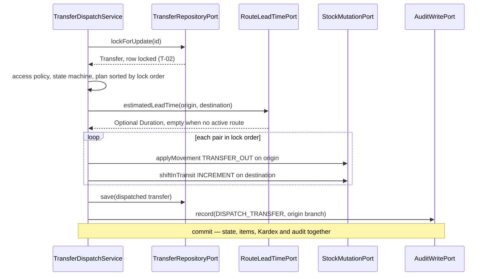

# Design — `add-transfers-module`

Step 2 of 3. Consumes `contract.md`, whose decisions (P-01 … P-12, R-00 … R-28, T-01 … T-07,
F-1 … F-6, PA-01 … PA-06) are closed and **not** restated here — they are cited by identifier only.
Layering, package structure and naming suffixes replicate `iam` / `catalog` / `inventory` verbatim;
this document records only what that pattern and the contract do not already dictate.

## 1. Module placement and graph

Two module packages, two independently verified boundaries:
`com.optiplant.inventory.transfers` and `com.optiplant.inventory.logistics`. Both names already sit
in `ModuleBoundariesTest.MODULOS` (`ModuleBoundariesTest.java:36-37`) — no ArchUnit rule changes.
New edges, all through `shared`, all one-way, no cycle: `transfers → shared ← inventory` (P-01 stock
port, D-2 valuation, D-4 exception); `transfers → shared ← logistics` (P-11 lead time);
`transfers → shared → event bus → notifications`, and the same for `logistics`. `transfers` never
names `logistics` in an import and `logistics` never names `transfers` — P-12's reads are native SQL
against tables (§6.3). `SecurityConfig` (an `iam` file) gains matcher **string literals only**; an
import of a `transfers` type there would create an `iam → transfers` edge.

## 2. `shared` additions

Framework-free, `external_id` UUIDs and `java.*` types only (`SharedIsFrameworkFreeTest`,
`sharedEsUnaHoja`). Three additions, each justified below.

**2.1 `shared/route/RouteLeadTimePort` (P-11)** —
`Optional<Duration> estimatedLeadTime(UUID originBranchExternalId, UUID destinationBranchExternalId)`
— empty when no route exists for the ordered pair or the route is inactive (R-24). The package is
`shared.route`, **not** `shared.logistics`: a `shared` subpackage sharing a module's name invites the
reader to think a module leaked into `shared`. `Optional<Duration>` rather than an hours `BigDecimal`
puts "no route ⇒ no ETA" in the type instead of in a convention.

**2.2 `shared/stock/OutboundValuationPort` (D-2).** R-20 needs the unit cost stamped on the
`TRANSFER_OUT`. That cost lives in `kardex_movements.unit_cost`, which `inventory` owns, and
`transfer_items` has no column to cache it in (§2.5 forbids adding one). One method:
`Map<UUID, BigDecimal> outboundUnitCosts(UUID branchExternalId, String referenceType, String
referenceId)` — product `external_id` → the unit cost of the outbound movement carrying that
reference. One batch call per receipt, no N+1 (RNF-PER-01). The key already exists: dispatch
writes `referenceType = "TRANSFER"`, `referenceId = <transfer external_id>` on every `TRANSFER_OUT`,
and `idx_kardex_reference` is the access path. Implemented by `inventory`'s
`InventoryOutboundValuationAdapter`; a read method has no business on a write port.

**2.3 `shared/stock/StockMutationRejectedException` (D-4).** `applyMovement` refuses an overdraw by
throwing `inventory.domain.exception.InsufficientStockException`, a type `transfers` **cannot
catch** — boundary rule 3 forbids importing another module's package, so its `@RestControllerAdvice`
could never map R-12 to `insufficient_stock` 409, and a port whose failure mode is inexpressible to
its callers is an incomplete port. The new unchecked exception carries
`Reason { INSUFFICIENT_STOCK, UNKNOWN_BRANCH, UNKNOWN_PRODUCT, UNIT_COST_CONTRACT }`;
`inventory`'s `StockMutationAdapter` — the port implementation, not the domain — translates on the
way out, leaving `inventory`'s own use cases and exception handler untouched.

## 3. `transfers` domain

Records, no Spring, no Jakarta. Every quantity is `BigDecimal` at scale 4 `HALF_UP`, matching
`NUMERIC(14,4)`, so no rounding surprise is deferred to the database.

### 3.1. Value objects

| Type | Invariant | Enforces |
| :--- | :--- | :--- |
| `TransferQuantity(BigDecimal)` | non-null, **strictly** positive, scale 4 | `CHECK (requested_quantity > 0)`; R-02, R-07, R-13 |
| `SettledQuantity(BigDecimal)` | non-null, `>= 0`, scale 4 | dispatched / received / discrepancy `>= 0`; R-19's "zero received is valid" |
| `TransferNumber(String)` | non-blank, `<= 50`, `TRF-\d{4}-\d{4,}` | `transfer_number VARCHAR(50) UNIQUE` |
| `CarrierName(String)` | trimmed, non-blank, `<= 100` | `carrier_name VARCHAR(100)`; R-10 |
| `TransferReason(String)` | trimmed, non-blank, `<= 500` | R-09, R-18, R-21 |
| `TransferNotes(TransferPriority, List<String>)` | sole reader and writer of the F-1 token | §3.5 |

All reject in their compact constructor with `IllegalArgumentException` (→ `invalid_request`),
except `TransferReason` → `TransferReasonRequiredException` and the quantity types →
`InvalidTransferQuantityException`, so R-09 and R-19 keep their own error codes.

### 3.2. Entities

```java
record Transfer(UUID externalId, TransferNumber number, TransferStatus status,
        UUID originBranchExternalId, UUID destinationBranchExternalId,
        UUID requestedByUserExternalId, UUID dispatchedByUserExternalId, UUID receivedByUserExternalId,
        CarrierName carrierName, String trackingNumber,
        Instant dispatchedAt, Instant estimatedArrivalAt, Instant actualArrivalAt,
        TransferNotes notes, Instant createdAt, Instant updatedAt, List<TransferItem> items) {
    Transfer approve(List<ApprovedLine> lines, Instant at);               // R-07 → IN_PREPARATION
    Transfer reject(TransferReason reason, Instant at);                   // R-09 → CANCELLED
    Transfer dispatch(DispatchDetails d, List<DispatchLine> lines, Instant at);  // R-10/13 → IN_TRANSIT
    Transfer receive(ReceiptOutcome outcome, UUID receiver, Instant at);  // R-17/R-18 → RECEIVED*
    Transfer cancel(TransferReason reason, Instant at);                   // R-21 → CANCELLED
    boolean involves(UUID branchExternalId);
    Optional<BigDecimal> deviationHours();                                // R-27, null-ETA safe
}
record TransferItem(UUID externalId, UUID productExternalId, TransferQuantity requestedQuantity,
        SettledQuantity dispatchedQuantity, SettledQuantity receivedQuantity,
        SettledQuantity discrepancyQuantity, String discrepancyReason) {}
```

Every mutator returns a new `Transfer` and calls `TransferStateMachine.require(...)` first, so R-01
cannot be bypassed by reaching for a setter — there are none. `items` is copied defensively and
exposed unmodifiable. `TransferStatus` is the six `01-init-schema.sql:371-380` literals plus
`isTerminal()` and `isActive()` (`REQUESTED`, `IN_PREPARATION`, `IN_TRANSIT` — R-25's filter).

### 3.3. Domain services

**`TransferStateMachine`** — the only authority on R-01. `require(current, transition)` throws
`InvalidTransferStateException`; `TransferTransition` is `APPROVE|REJECT|DISPATCH|RECEIVE|CANCEL`
and the legal source states are a `Map` constant, so the table is data a test can enumerate
exhaustively rather than a chain of `if`s.

**`TransferApprovalPolicy`** (R-07, F-2) — per line: approved `> 0` and `<= requested`; every item
appears exactly once. Returns the adjusted items **and** the observation lines describing each
reduction, appended to `TransferNotes` by the service; approval overwrites `requestedQuantity` (PA-02).

**`TransferDispatchPolicy`** (R-13) — per line: dispatched `> 0` and `<= requested` (the
post-approval agreed quantity); an item not named is refused, since sending less is a quantity
reduction, not an item omission. Returns a `DispatchPlan` whose lines are **already in the T-02 lock
order** (§7.1), so the service cannot get that order wrong.

**`TransferReceiptPolicy`** (R-16 … R-19) — per dispatched item: `0 <= received <= dispatched`
(above ⇒ refused, F-4/PA-03); `discrepancy = dispatched − received`, so RN-06 holds by construction
and never by a second client-supplied input; a non-blank reason is mandatory whenever
`discrepancy > 0`. Returns `ReceiptOutcome(lines, status, hasDiscrepancy)` with `RECEIVED` when
every discrepancy is zero and `RECEIVED_WITH_DISCREPANCY` otherwise.

**`TransferAccessPolicy`** (§5, RNF-SEC-03) — two ordered questions, and the order is the security
property. **(1) Visibility**: `ADMIN`, or the actor's branch is origin or destination; otherwise
`TransferNotFoundException` (`404`, never `403`, so existence does not leak). **(2) Side**: the
actor's branch equals the side the transition requires — origin, destination, or either for R-21;
otherwise `CrossBranchAccessDeniedException`. A corporate `ADMIN` requesting a transfer gets
`BranchContextRequiredException` (R-05); on transitions the side is read from the stored transfer,
so `AuthenticatedPrincipal.mayMutateBranch` already grants `ADMIN`.

**Exceptions** — `InvalidTransferStateException`, `SameBranchTransferException`, `DuplicateTransferItemException`,
`TransferReasonRequiredException`, `InvalidTransferQuantityException`, `TransferNotFoundException`,
`TransferItemNotFoundException`, `CrossBranchAccessDeniedException`, `BranchContextRequiredException`,
`ProductNotFoundException`, `BranchNotFoundException` — the last four repeat names `inventory` also
has, and each module declares its own, exactly as `inventory` declared its own
`ProductNotFoundException` rather than importing `catalog`'s.

### 3.5. `TransferNotes` — the F-1 token, one author

`render()` writes `PRIORITY:<LOW|STANDARD|URGENT>` as the first line and joins the observations
after it; `parse(String raw)` reads it back. **Notes with no `PRIORITY:` first line parse to
`STANDARD` with the whole text as observations** — not defensiveness but a requirement:
`02-seed-data.sql:192` seeds a transfer whose notes are free prose, and the parser must not throw on
it. `observations()` is what the API exposes; the token never leaves the mapper (§7 "must not leak").

## 4. `logistics` domain

```java
record LogisticsRoute(UUID externalId, UUID originBranchExternalId, UUID destinationBranchExternalId,
        RouteDuration estimatedDurationHours, TransportCost transportCost, RoutePriority priorityLevel,
        boolean active, Instant createdAt) {
    LogisticsRoute update(RouteDuration d, TransportCost c, RoutePriority p);
    LogisticsRoute deactivate();      // R-24 — logical only, never a delete (F-6)
    Duration leadTime();              // hours → Duration, for P-11
}
```

`RouteDuration` (`> 0`, scale 2), `TransportCost` (`>= 0`, scale 2) and `RoutePriority`
(`LOW|STANDARD|URGENT`) mirror the `CHECK`s at `01-init-schema.sql:351-353`; equal branches →
`SameBranchRouteException` (R-23), mirroring `check_different_branches`. Read records:
`ActiveTransferView`, `ActiveTransferPage`, `DeliveryOutcome`, `ComplianceRow`, `CompliancePage`,
`ComplianceGrouping`, `DelayedTransfer`, `RouteSummary`, `RoutePage`, `DateRange`.

**`DelayDetectionPolicy`** (R-25, R-28) — `isDelayed(status, eta, now)` is
`status == IN_TRANSIT && eta != null && now.isAfter(eta)`. One predicate feeds both the monitor flag
and the scheduled detector, so the two can never disagree.

**`DeliveryComplianceCalculator`** (R-26, R-27) — folds `DeliveryOutcome` rows into a
`ComplianceRow`: `deliveredCount` (all deliveries in range), `measuredCount` (non-null ETA),
`unmeasuredCount = delivered − measured` reported separately and **never scored**, `onTimeCount`
(measured with `actual <= estimated`), `onTimePercentage` = `onTime / measured × 100` at scale 2 and
**`null` when `measured == 0`** (a zero would score unmeasured deliveries as 100 % late, exactly what
R-26 forbids), and `averageDeviationHours`, the signed mean of `actual − estimated` in hours at scale
2 (negative = early). `Transfer.deviationHours()` computes the same subtraction inside `transfers`
for R-27: two lines of duplicated arithmetic cost less than a `shared` type existing to carry it.

## 5. Ports — primary (`application/port/in`)

Every method takes `AuthenticatedPrincipal`, reads included — the branch dimension exists and RN-14
forbids it arriving from the client, so a read that cannot see its caller cannot be scoped. The one
exception is `DetectTransferDelaysUseCase.detect()`, invoked by the scheduler, not by a request.

| Port | Methods | CU | Authorization (§5) |
| :--- | :--- | :--- | :--- |
| `RequestTransferUseCase` | `request` | CU-TRA-01 | all roles; session branch is the **destination**; corporate `ADMIN` → R-05 |
| `ReviewTransferUseCase` | `approve`, `reject` | CU-TRA-02 | `ADMIN`/`BRANCH_MANAGER` of **origin** |
| `DispatchTransferUseCase` | `dispatch` | CU-TRA-03 | all roles, **origin** |
| `ReceiveTransferUseCase` | `receive` | CU-TRA-04/05 | all roles, **destination** |
| `CancelTransferUseCase` | `cancel` | CU-TRA-06 | `ADMIN`/`BRANCH_MANAGER` of **either** side (R-21) |
| `QueryTransfersUseCase` | `list`, `detail` | listing, R-27 | all roles; own branch either side, `ADMIN` network-wide |
| `ManageRoutesUseCase` | `create`, `update`, `deactivate`, `list` | CU-LOG-01 | `ADMIN` only |
| `MonitorTransfersUseCase` | `listActive` | CU-LOG-02 | `ADMIN`/`BRANCH_MANAGER` |
| `ReportComplianceUseCase` | `report` | CU-LOG-03 | `ADMIN`/`BRANCH_MANAGER` |
| `DetectTransferDelaysUseCase` | `detect` | CU-ALE-01 | no actor — scheduler-invoked (R-28) |

### 5.2. Secondary (`application/port/out`)

`transfers` — **`TransferRepositoryPort`**: `create(NewTransfer)` (allocates the number, §6.2),
`lockForUpdate(externalId)` (T-02, `SELECT … FOR UPDATE`), `findByExternalId` (readOnly, no lock,
T-05), `save`, `list(TransferFilter)`. **`TransferReferencePort`** — named for the need, not the
technology: `requireActiveBranch(uuid)`, `findProduct(uuid)` (active only),
`findProducts(Collection)` and `findBranches(Collection)`, both batched so no detail or page issues
one query per row (RNF-PER-01). **`TransferAlertPublisherPort`**: `publish(OperationalAlertRaised)`
(R-18). `logistics` — `LogisticsRouteRepositoryPort` (`create`, `update`, `findByExternalId`,
`findActiveByPair`, `existsForPair`, `list`), `TransferMonitorReadPort` (`listActive`,
`listDeliveries`, `listDelayed`) and `LogisticsAlertPublisherPort`. Both publisher ports exist so no
application class ever names `ApplicationEventPublisher`; `AFTER_COMMIT` is the adapter's concern.

## 6. Adapters — persistence

`TransferJpaEntity` (`transfers`) with `TransferItemJpaEntity` as a
`@OneToMany(cascade = ALL, orphanRemoval = true)` collection — items have no life outside their
transfer — plus `LogisticsRouteJpaEntity` (`logistics_routes`). All `branch_id` / `product_id` /
`user_id` foreign keys are **plain `Long` columns**, never `@ManyToOne`, so neither module declares
an `@Entity` over another module's table (`inventory` §6.1, unchanged). `updated_at` is set
explicitly by the mapper: the schema has no trigger (verified). `external_id → id` resolution goes
through `TransferReferenceSpringDataRepository` / `LogisticsReferenceSpringDataRepository` — native
`@Query` with interface projections, bound to the module's own entity purely because Spring Data's
factory needs a registered entity type: exactly `inventory`'s `ForeignKeyResolverSpringDataRepository`.

`lockForUpdate` is `@Lock(LockModeType.PESSIMISTIC_WRITE)` on a derived `findByExternalId`.
**No `@QueryHints` lock timeout**: verified against `hibernate-core-7.4.5.Final`, `PostgreSQLDialect`
renders only `for update`, `for update nowait` and `for update skip locked`, so a numeric
`jakarta.persistence.lock.timeout` is silently dropped. `PessimisticLockingFailureException` maps to
`concurrent_transfer_update` 409.

### 6.2. `transfer_number` allocation (D-3)

Format `TRF-<yyyy>-<nnnn>`, matching the seeded `TRF-2026-0001`. The schema has no sequence and §2.5
forbids adding one, so `TransferPersistenceAdapter.create` takes a PostgreSQL transaction advisory
lock as its first statement — `SELECT pg_advisory_xact_lock(hashtext('transfer_number:' || :year))`
— then `SELECT COALESCE(MAX(CAST(SUBSTRING(transfer_number FROM 10) AS INTEGER)), 0) + 1 FROM
transfers WHERE transfer_number LIKE 'TRF-<yyyy>-%'`, and inserts. It serializes only concurrent
creations within one year, needs no migration and releases at commit — the technique `notifications`
already uses for alert dedup (DT-09). The suffix widens past `9999` rather than truncating.
Registered as **DT-11** (§9).

### 6.3. How `logistics` reads `transfers` rows (P-12)

`TransferProjectionSpringDataRepository extends Repository<LogisticsRouteJpaEntity, Long>` — the
bare `Repository` marker interface, which declares **no** `save`, `delete` or `flush`. It holds only
`@Query(nativeQuery = true)` `SELECT`s over `transfers` / `transfer_items` returning interface
projections; no `@Modifying` method and no JPA entity for `transfers` exists inside `logistics`, so
the module has no mechanism through which to write those rows even by mistake. Read-only enforcement
is structural, not a review promise — which matters, because ArchUnit cannot see SQL. Three queries:
the **monitor** list (R-25 — `status IN (…)` plus the caller's branch on either side, `LEFT JOIN` for
item count and quantity sum, served by `idx_transfers_status` / `idx_transfers_origin` /
`idx_transfers_destination`); the **delivery outcomes** for compliance (R-26 — `actual_arrival_at` in
range, aggregated with `GROUP BY`, paginated with `LIMIT/OFFSET`); and the **delayed scan** (R-28 —
`status = 'IN_TRANSIT' AND estimated_arrival_at < :now`).

### 6.4. Web

`TransferController` (`/api/transfers/**`) and `LogisticsController` (`/api/logistics/**`), with one
`@RestControllerAdvice` per module scoped by `basePackages` (`TransfersExceptionHandler`,
`LogisticsExceptionHandler`) exactly as `CatalogExceptionHandler` is, so neither swallows the
other's exceptions. `ErrorResponse` is package-private and duplicated per module — it cannot cross a
boundary. Contract §7 mappings beyond the obvious:
`StockMutationRejectedException(INSUFFICIENT_STOCK)` → `insufficient_stock` 409 (D-4);
`DataIntegrityViolationException` on `uq_route_pair` → `route_already_exists` 409;
`PessimisticLockingFailureException` → `concurrent_transfer_update` 409; bean-validation failures,
`IllegalArgumentException` and a page size above the cap → `invalid_request` 400 (R-00: **reject**,
never clamp — `inventory`'s pattern, not `catalog`'s DT-10).

`SecurityConfig` gains, in this order, before `anyRequest()`: the three literals
`/api/transfers/*/approval`, `/api/transfers/*/rejection` and `/api/transfers/*/cancellation` →
`hasAnyAuthority("ADMIN", "BRANCH_MANAGER")`; then `/api/transfers/**` → `authenticated()`; then
`/api/logistics/routes/**` → `hasAuthority("ADMIN")`; then `/api/logistics/**` →
`hasAnyAuthority("ADMIN", "BRANCH_MANAGER")`. `hasAuthority`, never `hasRole`. The three specific
transfer paths **must** precede the general one or `OPERATOR` reaches approval. Per-side branch
rules stay domain checks (`TransferAccessPolicy`), not matchers — a URL cannot know which branch
owns a transfer.

### 6.5. The scheduled delay detector (R-28)

`logistics/infrastructure/adapter/in/scheduler/TransferDelayScheduler` —
`@Scheduled(cron = "${optiplant.logistics.delay-detection.cron:0 */15 * * * *}")` calling
`DetectTransferDelaysUseCase.detect()` inside a `try/catch (RuntimeException)` that logs
(RNF-OBS-01) and returns. `@EnableScheduling` goes on
`logistics/infrastructure/config/LogisticsSchedulingConfig`, never on `InventoryApplication`.

**Trap (D-5).** `@TransactionalEventListener(AFTER_COMMIT)`, which is how `notifications` receives
every alert and which P-09 says must not change, fires **only** when the publish happened inside an
active transaction — a detector running with no transaction at all would publish into the void.
`TransferDelayDetectionService.detect()` is therefore `@Transactional(readOnly = true)`: it reads
the delayed transfers and publishes as its last statements, and that read-only transaction's commit
fires the listener. R-28 still holds — no lock, no transfer state mutated, not a business
transaction — and `notifications` stays untouched. One event per involved branch, with
`subjectToken = transfer external_id` so `notifications` deduplicates while the condition persists
(T-06).

## 7. Transaction boundaries

| Operation | One transaction (T-01) | `AFTER_COMMIT` | Locks (T-02) |
| :--- | :--- | :--- | :--- |
| `request` (CU-TRA-01) | advisory lock + `transfers` insert + `transfer_items` insert + audit; **no balance** (R-04) | — | advisory on `transfer_number:<year>` (§6.2) |
| `approve` / `reject` (CU-TRA-02) | transfer update + item updates + audit; **no balance** (R-08) | — | `FOR UPDATE` on the transfer row |
| `dispatch` (CU-TRA-03) | transfer + `dispatched_quantity` + per item `applyMovement(TRANSFER_OUT, origin)` + `shiftInTransit(INCREMENT, destination)` + audit | — | transfer row, then `branch_inventories` rows in the §7.1 order |
| `receive` (CU-TRA-04/05) | transfer + received/discrepancy + per item `applyMovement(TRANSFER_IN, destination)` + `shiftInTransit(DECREMENT, destination)` + audit | `TRANSFER_DISCREPANCY` ×2 on a shortfall (R-18) | transfer row, then destination rows by product |
| `cancel` (CU-TRA-06) | transfer update + audit; no balance anywhere (R-22) | — | `FOR UPDATE` on the transfer row |
| routes CRUD (CU-LOG-01) | one row + audit | — | none |
| every read (list, detail, monitor, compliance) | `@Transactional(readOnly = true)` | — | none (T-05, RN-09) |
| `detect()` (R-28) | `readOnly` read + publish (§6.5) | `LOGISTIC_DELAY`, one per branch | none |

All isolation is READ COMMITTED. `StockMutationPort` calls join the caller's transaction
(`Propagation.REQUIRED`, P-01) — never `REQUIRES_NEW`, never `@Async`. The publish must be the
**last statement inside** the `@Transactional` service method, or `AFTER_COMMIT` never fires.

`audit_logs.branch_id` is the branch of the **mutated resource** (T-03): destination for `request`
and `receive`; origin for `approve`, `reject`, `dispatch` and `cancel`; `null` for routes
(corporate). Actions are plain strings — `audit_logs.action` has no `CHECK`: `REQUEST_TRANSFER`,
`APPROVE_TRANSFER`, `REJECT_TRANSFER`, `DISPATCH_TRANSFER`, `RECEIVE_TRANSFER`, `CANCEL_TRANSFER`,
`CREATE_ROUTE`, `UPDATE_ROUTE`, `DEACTIVATE_ROUTE`.

**§7.1 Deterministic lock order — the deadlock this design must not have.** Two transfers dispatched simultaneously, A→B and B→A over the same products, would deadlock if each
locked its own origin first. The rule is therefore **global, not role-relative**: build the full set
of `(branchExternalId, productExternalId)` pairs the operation will touch, sort ascending by branch
UUID then product UUID, and execute each pair's operation in that order — `TRANSFER_OUT` when the
branch is the origin, `shiftInTransit` when it is the destination; `TransferDispatchPolicy` returns
its lines already sorted. The transfer row is always locked first (F-5), before any inventory row.
At receipt both operations touch the same destination row, so ordering by product suffices.

## 8. Persistence — no schema change

`backend/init-db/01-init-schema.sql` is **not** edited (§2.5). `./scripts/validar_esquema.sh` must
stay green **and unaffected**; if it must change, §2.5 was wrong — stop and report.
`docs/diagrama_er.md` needs no edit for the same reason. Column facts that shape the code, verified
against the file:

- `transfers.notes` is the only home for priority (F-1) and every observation (F-2, R-13), and the
  seeded row carries no token (§3.5). `transfers` has no `version` column (F-5) and no `updated_at`
  trigger; both are handled in code.
- `transfer_items` has no `unit_cost` column — hence D-2 — and no `approved_quantity` (F-2).
- `logistics_routes` has `uq_route_pair` on the ordered pair and no `updated_at` (F-6): A→B and B→A
  are two independent rows and an edit mutates in place.
- `CHECK (discrepancy_quantity >= 0)` makes over-receipt unrepresentable (F-4) — the domain refuses
  first (T-07); the constraint is the last line of defence (RNF-INT-03).
- `idx_kardex_reference (reference_type, reference_id)` is the access path for D-2's batch lookup.

## 9. Rejected alternatives and new debt

| Rejected | Why not |
| :--- | :--- |
| Adding `priority_level` / `approved_quantity` / `version` columns | PA-01, PA-02 and F-5 closed it: no migration in this change. Optimistic locking would need the third; T-02 prescribes a pessimistic lock instead. |
| A read method on `StockMutationPort` for R-20's cost | A write port answering reads. `OutboundValuationPort` instead (D-2). |
| Letting `inventory`'s `InsufficientStockException` reach `transfers` | Boundary rule 3 makes it uncatchable there; a port must own its failure modes (D-4). |
| A `shared` monitor/report port for P-12 | PA-05: one port per reporting query costs more than the coupling it removes. |
| A trigger keeping `discrepancy_quantity` consistent | RNF-INT-03: the schema is the last line of defence, never the first. `TransferReceiptPolicy` owns RN-06. |
| A random `transfer_number` suffix | Breaks the `TRF-YYYY-NNNN` shape operators read. Advisory lock instead (§6.2). |
| `@EnableScheduling` on `InventoryApplication` | Configuration belongs to the module that uses it (§6.5). |

**DT-11 (new, low)** — `transfer_number` has no database sequence; uniqueness rests on §6.2's
advisory lock with the `UNIQUE` constraint as backstop, so a future writer inserting into `transfers`
without that lock can collide. Repayment: `CREATE SEQUENCE transfer_number_seq` when the next schema
change lands, then delete the advisory lock and the `MAX` query. File it in S3.

## 10. Dispatch flow (CU-TRA-03)



## 11. Traps specific to this change

1. `transfers` is the **first real consumer** of `StockMutationPort`. If `applyMovement` is not
   `Propagation.REQUIRED`, `TransferDispatchAtomicityIT` is what finds out. Receipt decrements
   `in_transit_stock` by the **dispatched** quantity, not the received one (R-16) — otherwise a
   discrepancy leaves a phantom in-transit balance forever.
2. `TRANSFER_OUT` must be called with `unitCost = null` or the port rejects it (P-03);
   `TRANSFER_IN` is inbound and **requires** the D-2 cost. Two `OperationalAlertRaised` events per
   discrepancy, one per branch, because `system_alerts.branch_id` holds a single branch (R-18).
3. `BranchIsolationIT` and `InventoryBranchIsolationIT` already exist — use exactly
   `TransferBranchIsolationIT`. `shared` gains only `Optional`, `Duration`, `Map`, `BigDecimal`,
   `UUID` and a `RuntimeException` subclass, so `SharedIsFrameworkFreeTest` and `sharedEsUnaHoja`
   keep holding.

## 12. Open questions — none blocking; six resolutions taken here rather than escalated

| # | Decision | Reversal cost |
| :--- | :--- | :--- |
| **D-1** | the P-11 port lives in `shared/route` and returns `Optional<Duration>` (§2.1) | rename one interface; near zero |
| **D-2** | `shared/stock/OutboundValuationPort`, keyed on the Kardex reference columns, answers R-20 (§2.2) | delete the port, add `unit_cost` to `transfer_items` — a migration |
| **D-3** | `transfer_number` allocated under a year-scoped advisory lock (§6.2, DT-11) | one sequence, two deleted queries |
| **D-4** | the stock port declares its own failure exception in `shared`, translated by `inventory`'s adapter (§2.3); without it R-12 is unmappable from `transfers` | one class, one `catch` in one adapter |
| **D-5** | the delay detector runs in a read-only transaction so `AFTER_COMMIT` fires and `notifications` stays untouched (§6.5) | `fallbackExecution = true` on the listener — a `notifications` change P-09 says is unnecessary |
| **D-6** | compliance `groupBy=BRANCH` groups by **destination** branch, and `onTimePercentage` is `null`, never `0`, when nothing is measurable (§4) | one `GROUP BY` clause |
